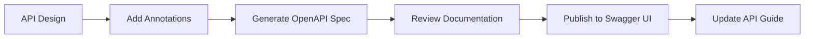

# Documentation Architect

## Overview

This skill establishes comprehensive documentation standards and information architecture for the MSDS laboratory management system, ensuring all technical documentation is well-organized, consistent, and maintainable.

## When to Invoke

- Creating new technical documentation
- Reorganizing existing documentation
- Establishing documentation standards
- Writing API documentation
- Creating user manuals
- Setting up documentation workflows
- Migrating documentation between platforms
- Reviewing documentation quality

## Documentation Structure

### Project Documentation Hierarchy
```
aboutproject/
├── TechnicalManual/           # Core technical documentation
│   ├── PC_PRD.md             # Product Requirements Document
│   ├── PC_Roadmap.md         # Product Roadmap
│   ├── PC_User_Story_Map.md  # User stories
│   ├── PC_Metrics_Framework.md # Metrics and KPIs
│   └── Technical_Architecture.md # System architecture
├── PCUIUX/                   # UI/UX design documentation
├── ProgressPlan/             # Project progress tracking
├── ProjectOk/                # Completed project records
├── msdsdatabases/            # Database documentation
├── 接口文档/                  # API documentation
├── 部署实施/                  # Deployment guides
└── 运营模式/                  # Operations documentation
```

### Code Documentation Standards

#### Java Documentation (JavaDoc)
```java
/**
 * MSDS主信息服务类
 * 
 * <p>提供MSDS主信息的CRUD操作，包括：</p>
 * <ul>
 *   <li>查询MSDS列表（支持分页和筛选）</li>
 *   <li>获取MSDS详情</li>
 *   <li>创建/更新/删除MSDS记录</li>
 * </ul>
 *
 * @author MSDS Team
 * @since 1.0.0
 * @see MsdsMainMapper
 * @see MsdsMain
 */
@Service
public class MsdsMainServiceImpl implements IMsdsMainService {
    
    /**
     * 根据ID查询MSDS详情
     *
     * @param id MSDS记录ID，必须大于0
     * @return MSDS详情对象，如果不存在返回null
     * @throws IllegalArgumentException 当id为null或小于等于0时
     * @example
     * <pre>
     * MsdsMain msds = msdsService.selectById(1L);
     * if (msds != null) {
     *     System.out.println(msds.getProductName());
     * }
     * </pre>
     */
    @Override
    public MsdsMain selectById(Long id) {
        // Implementation
    }
}
```

#### TypeScript/React Documentation (TSDoc)
```typescript
/**
 * MSDS列表组件
 * 
 * @remarks
 * 该组件显示MSDS化学品列表，支持：
 * - 分页浏览
 * - 按名称/CAS号搜索
 * - 排序功能
 * - 批量操作
 *
 * @example
 * ```tsx
 * <MsdsList 
 *   pageSize={20}
 *   enableSearch={true}
 *   onItemClick={handleMsdsClick}
 * />
 * ```
 */
export interface MsdsListProps {
  /** 每页显示数量，默认10 */
  pageSize?: number;
  /** 是否启用搜索功能 */
  enableSearch?: boolean;
  /** 点击MSDS项的回调 */
  onItemClick?: (msds: MsdsMain) => void;
}

/**
 * MSDS列表组件
 * @param props - 组件属性
 * @returns React组件
 */
export const MsdsList: React.FC<MsdsListProps> = (props) => {
  // Implementation
};
```

## API Documentation (OpenAPI/Swagger)

### OpenAPI Annotations
```java
@Tag(name = "MSDS主信息管理", description = "MSDS主信息的增删改查接口")
@RestController
@RequestMapping("/api/msds/main")
public class MsdsMainController {
    
    @Operation(
        summary = "获取MSDS列表",
        description = "分页查询MSDS主信息列表，支持按名称、CAS号筛选",
        parameters = {
            @Parameter(name = "pageNum", description = "页码", example = "1"),
            @Parameter(name = "pageSize", description = "每页数量", example = "10"),
            @Parameter(name = "productName", description = "产品名称（模糊查询）")
        },
        responses = {
            @ApiResponse(
                responseCode = "200",
                description = "查询成功",
                content = @Content(
                    mediaType = "application/json",
                    schema = @Schema(implementation = TableDataInfo.class)
                )
            ),
            @ApiResponse(
                responseCode = "401",
                description = "未授权"
            )
        }
    )
    @GetMapping("/list")
    public TableDataInfo list(
            @RequestParam(defaultValue = "1") Integer pageNum,
            @RequestParam(defaultValue = "10") Integer pageSize,
            @RequestParam(required = false) String productName) {
        // Implementation
    }
}
```

### API Documentation Template
```markdown
## API Endpoint: /api/msds/main/{id}

### Description
获取MSDS详细信息

### Method
GET

### Parameters
| Name | Type | Required | Description |
|------|------|----------|-------------|
| id   | Long | Yes      | MSDS记录ID  |

### Response
```json
{
  "code": 200,
  "msg": "操作成功",
  "data": {
    "id": 1,
    "productName": "硫酸",
    "casNumber": "7664-93-9",
    "productEnglishName": "Sulfuric acid",
    "createTime": "2024-01-15 10:30:00"
  }
}
```

### Error Codes
| Code | Description |
|------|-------------|
| 200  | Success     |
| 401  | Unauthorized |
| 404  | Not Found   |
| 500  | Server Error |

### Example
```bash
curl -X GET http://localhost:18080/api/msds/main/1 \
  -H "Authorization: Bearer <token>"
```
```

## Documentation Standards

### Markdown Style Guide

#### Headers
```markdown
# 一级标题 - 文档主标题
## 二级标题 - 主要章节
### 三级标题 - 子章节
#### 四级标题 - 具体内容
```

#### Code Blocks
```markdown
指定语言以获得语法高亮
```java
public class Example {
    // Java code
}
```

```json
{
  "key": "value"
}
```
```

#### Tables
```markdown
| Column 1 | Column 2 | Column 3 |
|----------|----------|----------|
| Data 1   | Data 2   | Data 3   |
| Data 4   | Data 5   | Data 6   |
```

#### Links and References
```markdown
[Link Text](file:///absolute/path/to/file)
[External Link](https://example.com)
[Section Link](#section-name)
```

### Version Control for Documentation

#### Document Header Template
```markdown
---
title: "文档标题"
version: "1.0.0"
lastUpdated: "2024-01-15"
author: "MSDS Team"
status: "draft|review|published"
tags: ["api", "backend", "msds"]
---

# 文档标题

## 变更历史

| Version | Date       | Author      | Changes           |
|---------|------------|-------------|-------------------|
| 1.0.0   | 2024-01-15 | MSDS Team   | Initial version   |
| 1.0.1   | 2024-01-20 | John Doe    | Updated API specs |
```

## Documentation Workflows

### Feature Documentation Workflow
1. **Feature Design**
   - Create/Update PRD
   - Document user stories
   - Define acceptance criteria

2. **Technical Design**
   - Update Technical Architecture
   - Document API contracts
   - Create database schema docs

3. **Implementation**
   - Add inline code comments
   - Update API documentation
   - Write implementation notes

4. **Review**
   - Technical review
   - Documentation review
   - Update based on feedback

5. **Publication**
   - Merge to main branch
   - Deploy to documentation site
   - Notify stakeholders

### API Documentation Workflow


## Documentation Tools

### Automated Documentation Generation

#### Java (SpringDoc)
```xml
<!-- pom.xml -->
<dependency>
    <groupId>org.springdoc</groupId>
    <artifactId>springdoc-openapi-starter-webmvc-ui</artifactId>
    <version>2.5.0</version>
</dependency>
```

Configuration:
```yaml
springdoc:
  api-docs:
    path: /api-docs
  swagger-ui:
    path: /swagger-ui.html
    enabled: true
```

#### TypeScript (TypeDoc)
```json
// typedoc.json
{
  "entryPoints": ["src/index.ts"],
  "out": "docs",
  "theme": "default",
  "excludePrivate": true,
  "excludeProtected": true
}
```

### Documentation Site Generation

#### Using VitePress
```javascript
// docs/.vitepress/config.js
export default {
  title: 'MSDS Documentation',
  description: 'MSDS Laboratory Management System Documentation',
  themeConfig: {
    nav: [
      { text: 'Home', link: '/' },
      { text: 'API', link: '/api/' },
      { text: 'Guide', link: '/guide/' }
    ],
    sidebar: {
      '/api/': [
        {
          text: 'API Reference',
          items: [
            { text: 'MSDS API', link: '/api/msds' },
            { text: 'System API', link: '/api/system' }
          ]
        }
      ]
    }
  }
}
```

## Documentation Checklist

### Before Publishing
- [ ] Content is accurate and up-to-date
- [ ] All code examples are tested
- [ ] Links are working
- [ ] Formatting is consistent
- [ ] Screenshots are current (if applicable)
- [ ] Version information is correct
- [ ] Change log is updated

### Code Documentation
- [ ] All public APIs are documented
- [ ] Complex logic has inline comments
- [ ] Examples are provided for key features
- [ ] Parameters and return values are documented
- [ ] Exceptions are documented

### API Documentation
- [ ] All endpoints are documented
- [ ] Request/response schemas are defined
- [ ] Error codes are listed
- [ ] Authentication requirements are specified
- [ ] Rate limits are documented

## Integration with MSDS Project

### Specific Documentation Needs

#### Chemical Safety Data Sheets (MSDS)
- Document data structure for each MSDS section
- Define validation rules
- Document import/export formats

#### Laboratory Workflow
- Document chemical inventory management
- Document safety procedures
- Document audit requirements

#### Regulatory Compliance
- Document data retention policies
- Document access control requirements
- Document reporting capabilities

### Documentation Maintenance

#### Regular Reviews
- Monthly: Review and update API docs
- Quarterly: Review technical architecture docs
- Annually: Complete documentation audit

#### Feedback Collection
- Track documentation issues
- Collect user feedback
- Monitor documentation analytics
