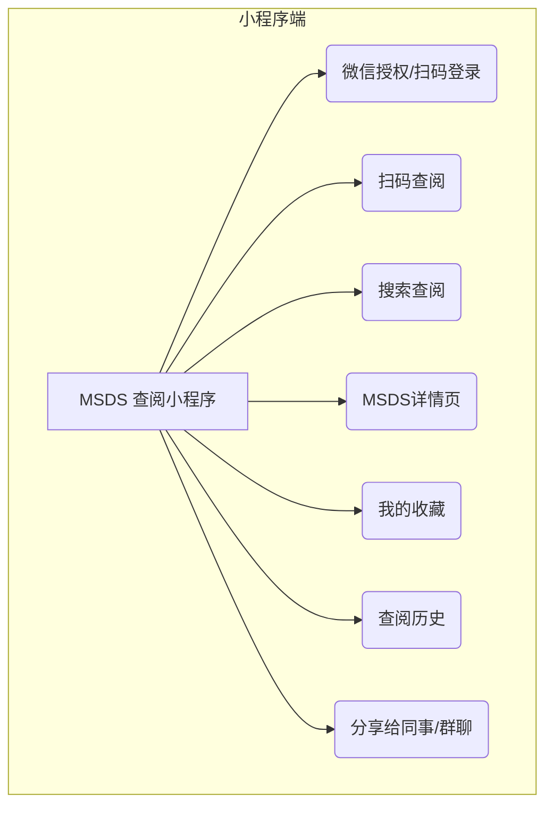
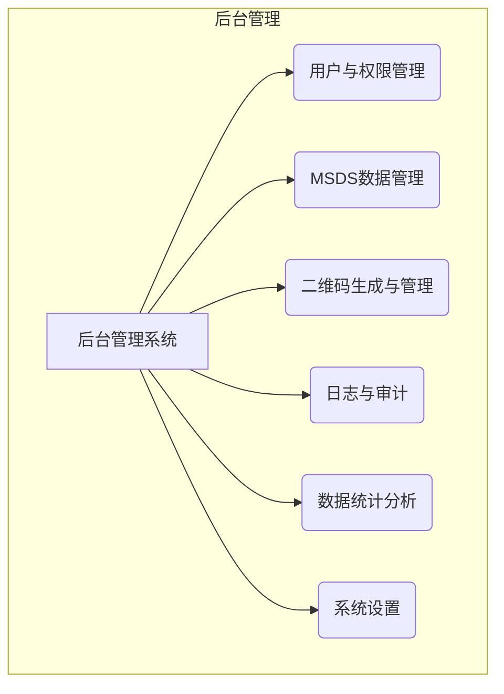
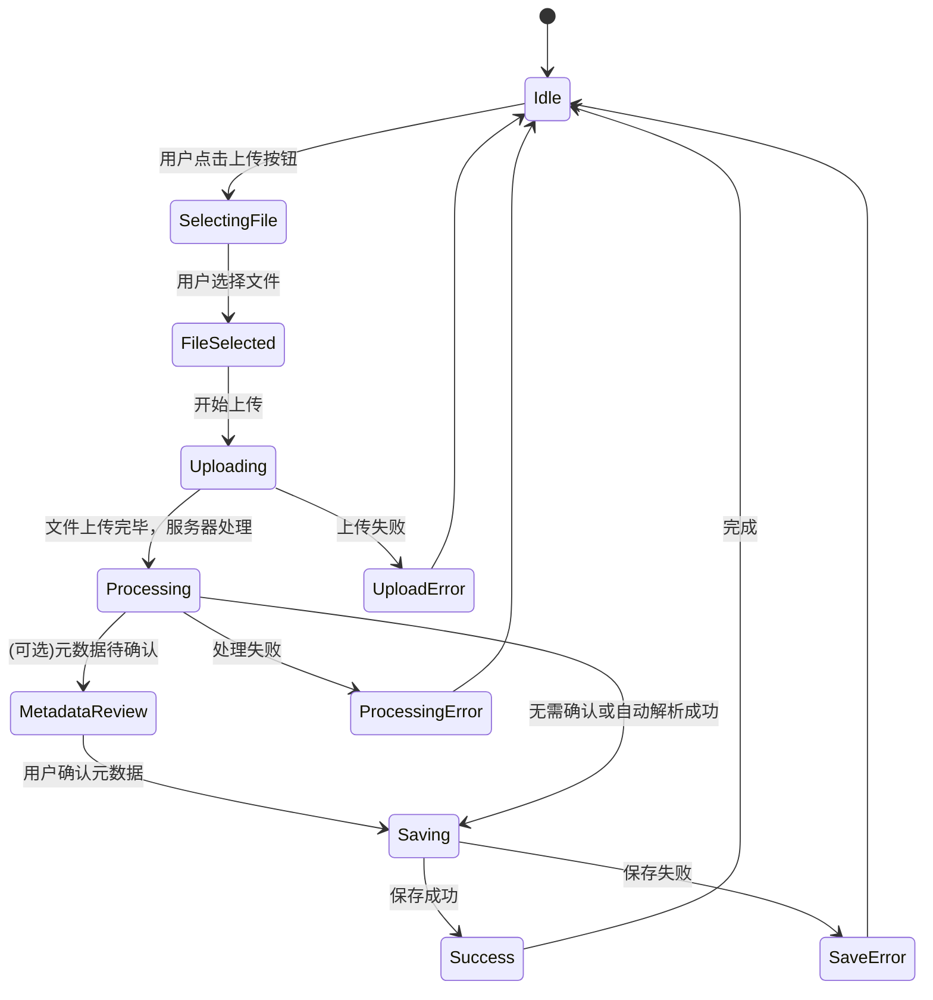
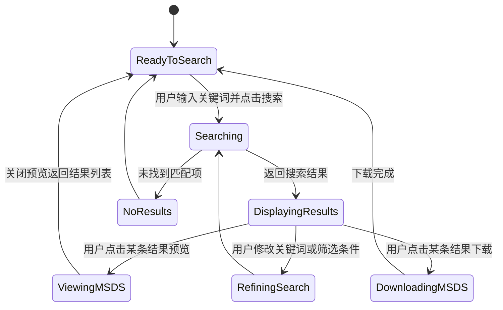

# 产品需求文档 (PRD) - MSDS 管理文件系统

## 1. 文档信息

### 1.1 版本历史
| 版本 | 日期       | 作者 | 说明                     |
|------|------------|------|--------------------------|
| v1.0 | YYYY-MM-DD | AI PM | 初稿，基于初始产品构想 |

### 1.2 文档目的
本文档旨在详细定义“MSDS (化学品安全技术说明书) 管理文件系统”的产品需求、目标用户、核心功能、非功能性需求及成功衡量指标。它是产品设计、开发、测试和迭代的依据。

### 1.3 相关文档引用
- [产品路线图 (Roadmap.md)](Roadmap.md)
- [用户故事地图 (User_Story_Map.md)](User_Story_Map.md)
- [产品评估指标框架 (Metrics_Framework.md)](Metrics_Framework.md)

## 2. 产品概述

### 2.1 产品名称与定位
- **产品名称**: MSDS 管理文件系统 - 微信小程序端
- **产品定位**: 一款专为实验室科研机构设计的，以微信小程序为核心查阅工具、Web端为后台管理中心的化学品安全技术说明书 (MSDS) 电子化、集中化管理与便捷查阅解决方案。

### 2.2 产品愿景与使命
- **产品愿景**: 成为全球科研实验室首选的智能化MSDS管理解决方案，让化学品信息触手可及，全面提升实验室安全标准。
- **产品使命**: 通过提供高效、可靠、易用的MSDS管理工具，赋能科研人员安全、合规地进行科学研究，最大限度降低化学品使用风险。

### 2.3 价值主张与独特卖点 (USP)
- **高效管理**: 实现MSDS文档的集中存储、版本控制、快速检索和动态更新，替代繁琐的纸质管理。
- **便捷查阅**: 支持多维度关键词搜索，提供清晰的在线预览和下载功能，确保科研人员随时随地获取准确的MSDS信息。
- **合规遵从**: 辅助实验室满足安全法规对MSDS管理的要求，如记录查阅日志、提醒MSDS更新等。
- **安全保障**: 快速提供化学品危害信息、应急处置措施和个体防护建议，直接提升实验室操作安全性和应急响应能力。
- **专为实验室设计**: 深入理解科研场景需求，提供贴合实验室工作流程的功能和用户体验。

### 2.4 目标平台列表
- **核心用户端 - 微信小程序**: 科研人员日常扫码、搜索、查阅MSDS的主要入口。基于UniApp框架开发，支持微信小程序生态。
- **管理后台 - Web端**: 管理员进行MSDS上传、编辑、用户管理、系统配置等复杂操作的主要平台。基于React + TypeScript + Ant Design构建。
- **开发环境**: 
    - 小程序：HBuilderX开发，编译运行到微信开发者工具
    - 后端：Docker容器化部署，运行在Windows 11 + WSL2环境

### 2.5 产品核心假设
- 实验室科研机构普遍存在MSDS管理效率低下、查阅不便的问题。
- 科研人员对快速、准确获取MSDS信息有强烈需求。
- 电子化、智能化的安全智库能显著提升实验室的安全管理水平和科研效率。
- 用户愿意为解决MSDS管理痛点的专用软件付费或投入资源。

### 2.6 商业模式概述 (如适用)
- **初步设想**: 
    - **软件许可模式**: 针对机构的一次性购买或年度许可。
    - **SaaS订阅模式**: (未来Web版) 按用户数或存储空间提供不同层级的订阅服务。
    - **私有化部署服务**: 为有特殊数据安全需求的大型机构提供本地部署方案。

## 3. 用户研究

### 3.1 目标用户画像

#### 3.1.1 科研人员 (主要用户)
- **人口统计特征**: 年龄22-55岁，硕士及以上学历居多，专业背景为化学、生物、医药、材料科学等。
- **行为习惯与偏好**: 
    - 每日或频繁接触多种化学试剂。
    - 工作严谨，注重实验安全和数据准确性。
    - 习惯使用电脑进行文献检索、数据分析和信息查询。
    - 对效率有较高要求，希望快速获取所需信息。
- **核心需求与痛点**:
    - **需求**: 实验前快速了解所用化学品的物理性质、化学性质、毒性、健康危害、燃爆风险、操作注意事项、个体防护要求、存储条件、泄漏应急处理、急救措施等。
    - **痛点**: 
        - 纸质MSDS查找费时费力，易丢失、损坏、版本陈旧。
        - 不同供应商提供的MSDS格式不一，信息查找困难。
        - 紧急情况下难以快速定位关键安全信息。
- **动机与目标**: 
    - 确保自身和他人安全。
    - 遵守实验室安全规定和操作规程。
    - 高效、顺利地完成科研实验任务。

#### 3.1.2 实验室管理员/安全负责人 (关键用户)
- **人口统计特征**: 年龄30-60岁，通常具有相关专业背景和管理经验，熟悉实验室安全法规和标准。
- **行为习惯与偏好**: 
    - 负责实验室化学品的采购、入库、存储、使用、废弃等全生命周期管理中的安全监督。
    - 关注实验室的整体安全状况和合规性。
    - 需要定期进行安全检查、组织安全培训。
- **核心需求与痛点**:
    - **需求**: 统一管理实验室所有化学品的MSDS；确保MSDS文件齐全、版本最新、易于取用；追踪MSDS的更新与查阅情况；应对内外部安全审计和检查。
    - **痛点**: 
        - MSDS收集、整理、更新工作量大，易疏漏。
        - 难以确保所有人员都能方便获取到最新版MSDS。
        - 缺乏有效的MSDS培训和查阅记录机制。
- **动机与目标**: 
    - 提升实验室整体安全管理水平，预防安全事故。
    - 确保实验室运营符合相关法律法规要求。
    - 降低管理成本，提高管理效率。

### 3.2 用户场景分析

#### 3.2.1 核心使用场景详述
1.  **场景一: 科研人员通过扫码快速查阅MSDS (小程序核心场景)**
    *   **用户**: 科研人员李研究员
    *   **情景**: 李研究员在实验台上看到一瓶不熟悉的化学试剂，试剂瓶上贴有系统生成的二维码。
    *   **需求**: 他需要立即了解该化学品的核心安全信息，以决定如何操作和存放。
    *   **当前做法 (痛点)**: 如果没有二维码，他需要记住化学品名称，然后回到电脑前搜索，过程繁琐且容易中断实验思路。
    *   **期望系统支持**: 李研究员拿出手机，打开微信小程序，使用扫一扫功能扫描试剂瓶上的二维码。小程序立即跳转到该化学品的MSDS详情页，优先展示GHS危险性象形图、核心危害、防护建议和应急措施等关键信息。他可以继续滚动查看完整的MSDS内容。

2.  **场景二: 科研人员实验前常规查阅MSDS**
    *   **用户**: 科研人员张工
    *   **情景**: 张工计划明天使用一种名为“丙酮”的化学试剂进行一项新的有机合成实验。
    *   **需求**: 他需要详细了解丙酮的闪点、爆炸极限、毒性、所需个人防护装备等。
    *   **期望系统支持**: 打开微信小程序，在顶部的搜索框输入“丙酮”或其CAS号，系统快速列出匹配的MSDS。点击查看，在线预览MSDS全文，特别是关注“危险性概述”、“急救措施”、“消防措施”、“泄漏应急处理”和“操作处置与储存”等章节。

2.  **场景二: 实验室管理员更新与分发MSDS**
    *   **用户**: 实验室安全管理员王老师
    *   **情景**: 实验室新采购了一批化学品，同时收到了供应商提供的最新版MSDS文件 (PDF格式)。
    *   **需求**: 王老师需要将这些新的MSDS录入系统，并替换掉系统中可能存在的旧版本，确保所有科研人员都能获取到最新信息。
    *   **当前做法 (痛点)**: 可能需要手动打印多份，分发到各个实验台，或者通过邮件群发，难以追踪是否所有人都收到并阅读。
    *   **期望系统支持**: 登录安全智库，进入管理模块。选择“上传MSDS”功能，批量或单个上传新的PDF文件。系统能够智能识别或允许手动关联化学品名称/CAS号。如果系统中已存在该化学品的旧版MSDS，系统提示更新并自动归档旧版本。王老师还可以选择向特定用户组发送更新通知。

4.  **场景四: 发生化学品意外泄漏时的应急响应 (小程序优势场景)**
    *   **用户**: 任何在场的实验室人员
    *   **情景**: 实验过程中，一个装有“浓硫酸”的试剂瓶意外打翻，少量液体溅出。
    *   **需求**: 现场人员需要立即知道浓硫酸的腐蚀性、正确的泄漏处理方法（如用何种吸收材料）、以及皮肤接触后的急救措施。
    *   **当前做法 (痛点)**: 慌乱中可能找不到纸质MSDS，或需要跑回办公室电脑查询，浪费宝贵的应急时间。
    *   **期望系统支持**: 现场任何人员立即拿出手机，打开小程序，通过扫描试剂瓶二维码或直接搜索“浓硫酸”，立即获取其MSDS。小程序页面应将“急救措施”和“泄漏应急处理”等应急关键信息置顶或通过醒目按钮一键直达，指导现场人员正确、安全地进行处置。

#### 3.2.2 边缘使用场景考量
-   **批量导入历史MSDS**: 对于已有大量存量MSDS的实验室，需要支持批量导入功能。
-   **MSDS定期审查与过期提醒**: 系统可根据MSDS的有效期或设定的审查周期，提醒管理员进行更新。
-   **多语言MSDS支持**: 对于国际化实验室，可能需要管理不同语言版本的MSDS。
-   **生成化学品安全标签辅助信息**: 系统可提取MSDS核心信息，辅助生成符合GHS规范的简易安全标签。
-   **离线访问需求**: 在网络条件不佳或断网情况下，小程序应能访问已缓存的MSDS数据（通过微信小程序的本地存储机制）。

### 3.3 用户调研洞察 (如适用)
*(注: 此处为占位，实际项目中应基于真实的用户访谈、问卷调研等结果填写)*
-   初步访谈表明，科研人员普遍认为现有MSDS管理方式效率低下，对电子化系统有较高期待。
-   安全管理员对MSDS的版本控制和更新通知功能表示出强烈兴趣。
-   用户期望系统界面简洁直观，搜索功能强大且精准。

## 4. 市场与竞品分析
*(注: 此处为通用框架，实际项目中需进行详细市场调研和竞品分析)*

### 4.1 市场规模与增长预测
-   实验室信息管理系统 (LIMS) 市场持续增长，其中安全管理是重要组成部分。
-   随着对实验室安全的日益重视和法规要求的提高，专业的MSDS管理软件市场潜力巨大。
-   目标市场主要为高等院校、科研院所、企业研发中心、第三方检测机构等的化学、生物、医药、材料实验室。

### 4.2 行业趋势分析
-   **数字化转型**: 实验室管理从传统纸质向数字化、信息化、智能化方向发展。
-   **安全与合规**: 全球范围内对实验室安全的法规要求趋严，合规性成为刚需。
-   **数据集成**: 安全智库有与LIMS、库存管理、采购系统等集成的趋势，形成一体化实验室管理平台。
-   **云计算与移动化**: SaaS模式和移动端应用逐渐普及，提升可访问性和便捷性。

### 4.3 竞争格局分析

#### 4.3.1 直接竞争对手详析
-   **商业MSDS数据库及管理软件**: 如 Chemwatch, Verisk 3E (原MSDSonline), SiteHawk 等。
    -   **优势**: 通常拥有庞大的MSDS数据库，功能全面，服务成熟，品牌知名度高。
    -   **劣势**: 价格昂贵，系统可能较为复杂，定制化程度不高，可能不完全贴合国内科研实验室的特定需求。
-   **通用文档管理系统**: 如 SharePoint, Confluence 等，被部分实验室用于管理MSDS。
    -   **优势**: 灵活性高，机构可能已有部署。
    -   **劣势**: 缺乏针对MSDS的专业功能（如CAS号检索、危险特性解析、版本控制、合规提醒等），管理效率和专业性不足。
-   **小型或开源MSDS管理工具**: 一些小型软件公司或开源社区提供的解决方案。
    -   **优势**: 可能价格较低或免费，轻量化。
    -   **劣势**: 功能相对简单，技术支持和持续更新可能不足，数据安全性存疑。

#### 4.3.2 间接竞争对手概述
-   **纸质管理方式**: 仍是许多实验室的主要管理手段，是本产品需要替代的主要对象。
-   **实验室自建的简单数据库/表格**: 部分有开发能力的实验室可能会用Access、Excel等自建简易管理工具。

### 4.4 竞品功能对比矩阵
| 特性/功能         | 本产品 (预期) | Chemwatch | Verisk 3E | 通用文档系统 | 开源工具 | 
|-------------------|---------------|-----------|-----------|--------------|----------|
| **核心MSDS管理**  |               |           |           |              |          |
| MSDS上传/存储     | ✅ (多种格式) | ✅         | ✅         | ✅ (通用)    | ✅ (部分) |
| 版本控制          | ✅             | ✅         | ✅         | 弱/无        | 部分     |
| 元数据编辑        | ✅             | ✅         | ✅         | 弱/自定义    | 部分     |
| **检索与查阅**    |               |           |           |              |          |
| CAS号/名称搜索    | ✅ (精准/模糊)| ✅         | ✅         | 弱/无        | 部分     |
| 全文检索          | ✅ (计划)     | ✅         | ✅         | ✅ (通用)    | 弱/无    |
| 在线预览          | ✅             | ✅         | ✅         | ✅ (通用)    | 部分     |
| **合规与安全**    |               |           |           |              |          |
| GHS信息展示       | ✅             | ✅         | ✅         | 无           | 弱/无    |
| 查阅日志          | ✅             | ✅         | ✅         | 弱/自定义    | 弱/无    |
| 更新提醒          | ✅             | ✅         | ✅         | 无           | 无       |
| **用户体验**      |               |           |           |              |          |
| 专为实验室设计    | ✅             | 较通用     | 较通用     | 通用         | 不一定   |
| PC客户端          | ✅             | Web       | Web       | Web/客户端   | 不一定   |
| 易用性            | 高             | 中-高     | 中-高     | 中           | 中-低    |
| **成本**          |               |           |           |              |          |
| 初始投入          | 中-低          | 高         | 高         | 中 (若已有)  | 低/无    |
| 维护成本          | 低             | 中-高     | 中-高     | 中           | 低/中    |

*(注: 此矩阵为初步预估，需详细调研确认)*

### 4.5 市场差异化策略
-   **专注科研场景**: 深度契合中国科研实验室的工作流程和管理习惯，提供更贴心的用户体验。
-   **移动优先策略**: 以微信小程序为核心，满足科研人员现场即时查阅的需求，同时提供功能完备的Web管理后台。
-   **易用性与性价比**: 提供简洁直观的操作界面，降低学习成本；制定有竞争力的价格策略，特别是针对预算有限的高校和中小型科研机构。
-   **本地化服务与支持**: 提供中文界面和及时的本地技术支持。
-   **数据安全与私有化部署**: 支持Docker容器化私有部署，允许机构自主管理MSDS数据，解决数据敏感性问题。

## 5. 产品功能需求

### 5.1 功能架构与模块划分

**小程序端 (用户侧)**

**后台管理系统 (Web/PC端)**

### 5.2 核心功能详述

#### 5.2.1 MSDS 数据管理模块

##### 5.2.1.1 MSDS 文件上传
-   **用户故事**: 作为实验室管理员，我想要上传单个或批量的MSDS文件（如PDF, DOCX, TXT, JPG/PNG图片格式），以便将化学品安全信息录入系统进行统一管理。
-   **用户价值**: 方便快捷地将MSDS文档电子化并集中存储。
-   **功能逻辑与规则**: 
    -   支持拖拽上传和选择文件上传两种方式。
    -   系统应能处理常见文档格式，对图片格式的MSDS，可考虑OCR识别（高级功能）。
    -   上传时，系统可尝试从文件名或文档内容中提取化学品名称、CAS号等关键信息供用户确认或编辑。
    -   对已存在的化学品，上传新MSDS时应提示是否覆盖或作为新版本。
    -   显示上传进度，对大文件上传有友好提示。
-   **交互要求**: 清晰的上传界面，明确的指引，实时的进度反馈。
-   **数据需求**: MSDS文件本身，关联的化学品信息。
-   **技术依赖**: 文件存储服务，可能的后台处理队列（针对大文件或OCR）。
-   **验收标准**:
    1.  成功上传至少三种不同格式 (PDF, DOCX, TXT) 的MSDS文件。
    2.  批量上传功能至少能一次成功上传5个文件。
    3.  上传过程中有明确的进度条显示。
    4.  上传同名化学品的新MSDS时，系统能提示版本处理选项。

##### 5.2.1.2 MSDS 元数据编辑
-   **用户故事**: 作为实验室管理员，我想要编辑MSDS的关键元数据，如化学品中英文名称、CAS号、供应商、生产日期、有效期、版本号、自定义分类、标签等，以便于精确检索、分类管理和信息追溯。
-   **用户价值**: 确保MSDS信息的准确性、完整性和规范性，提高管理效率。
-   **功能逻辑与规则**: 
    -   提供结构化的表单用于编辑元数据。
    -   CAS号应有格式校验。
    -   支持自定义分类和标签，方便用户按需组织。
    -   修改历史应有记录（高级功能）。
-   **交互要求**: 直观的表单界面，便捷的分类和标签选择器。
-   **数据需求**: 化学品名称（中/英）、CAS号、别名、分子式、供应商信息、生产日期、有效期、版本号、自定义分类、标签、危险性类别（GHS）等。
-   **验收标准**:
    1.  成功编辑MSDS条目的至少5项元数据，包括名称、CAS号、供应商、自定义分类和标签。
    2.  CAS号输入不符合规范格式时，系统给出提示。
    3.  自定义分类和标签能够成功创建、应用和移除。

##### 5.2.1.3 MSDS 版本控制
-   **用户故事**: 作为实验室管理员，当MSDS更新时，我希望能上传新版本并保留旧版本记录，以便追踪MSDS的变更历史，并确保使用的是最新有效版本。
-   **用户价值**: 保证MSDS信息的时效性，满足合规审计对历史记录的要求。
-   **功能逻辑与规则**: 
    -   同一化学品可以存在多个版本的MSDS。
    -   系统默认显示和使用最新版本的MSDS。
    -   用户可以查看历史版本列表，并预览或下载历史版本。
    -   版本信息应包含版本号、生效日期、上传时间、上传人等。
-   **交互要求**: 清晰的版本历史列表，易于区分当前版本和历史版本。
-   **数据需求**: 版本号，生效日期，上传时间，操作人，版本状态（当前/历史）。
-   **验收标准**:
    1.  为一个MSDS条目成功上传3个不同版本的文件。
    2.  系统能正确将最新上传的标记为当前版本。
    3.  用户可以查看并访问该MSDS的所有历史版本。

#### 5.2.2 MSDS 检索与查阅模块

##### 5.2.2.1 关键词搜索
-   **用户故事**: 作为科研人员或管理员，我想要通过化学品中英文名称、CAS号、别名、供应商、或自定义标签等关键词快速搜索到目标MSDS，以便获取安全信息或进行管理操作。
-   **用户价值**: 快速、准确地定位到所需的MSDS文档。
-   **功能逻辑与规则**: 
    -   支持单一关键词搜索和多关键词组合搜索（AND/OR逻辑，高级功能）。
    -   搜索范围应包括MSDS的元数据及可能的全文内容（全文检索为高级功能）。
    -   支持模糊匹配和精确匹配选项。
    -   搜索结果应分页显示，并按相关性或更新时间排序。
-   **交互要求**: 简洁易用的搜索框，智能的搜索建议（可选），清晰的搜索结果展示。
-   **数据需求**: 建立MSDS元数据和内容的索引。
-   **技术依赖**: 数据库索引优化，或引入全文搜索引擎 (如 Elasticsearch, Lucene)。
-   **验收标准**:
    1.  输入化学品中文名（如“丙酮”），能搜到匹配的MSDS。
    2.  输入CAS号（如“67-64-1”），能精确匹配到MSDS。
    3.  输入自定义标签，能筛选出包含该标签的MSDS。
    4.  搜索结果列表清晰展示化学品名、CAS号、版本号、更新日期等关键信息。
    5.  搜索响应时间在可接受范围内（如平均<2秒）。

##### 5.2.2.2 MSDS 在线预览 (小程序优化)
-   **用户故事**: 作为科研人员，我想要在小程序中打开MSDS后，能快速看到关键安全信息摘要，并能流畅地查看全文。
-   **用户价值**: 在移动端快速获取核心信息，提升应急响应和日常查阅效率。
-   **功能逻辑与规则**: 
    -   小程序详情页顶部应优先展示从MSDS解析出的核心信息：GHS象形图、危险性概述、防护建议、急救措施等。
    -   下方嵌入PDF或图片格式的MSDS全文，支持手势缩放、滑动翻页。
    -   加载速度进行优化，保证快速响应。
-   **交互要求**: 关键信息突出，全文阅读流畅，符合移动端操作习惯。
-   **验收标准**:
    1.  小程序端成功打开MSDS，并优先展示关键安全信息摘要。
    2.  嵌入的全文预览支持手势缩放和翻页。

##### 5.2.2.3 MSDS 分享 (小程序)
-   **用户故事**: 作为科研人员，当我发现一个重要的MSDS信息时，我希望能方便地分享给同组的同事或在工作群里提醒大家注意。
-   **用户价值**: 促进团队内的安全信息同步，提高协作效率。
-   **功能逻辑与规则**: 
    -   提供“分享”按钮，可生成小程序卡片。
    -   分享卡片应包含化学品名称和核心危险性提示。
    -   用户点击卡片后可直接进入该MSDS的详情页。
-   **验收标准**:
    1.  成功将一个MSDS通过微信分享给好友或群聊。
    2.  接收方能通过点击分享卡片正常打开MSDS详情页。

#### 5.2.3 用户管理与权限模块 (简化描述，后续可细化)
-   **功能描述**: 管理员可以创建、编辑、禁用用户账户；可以定义用户角色（如管理员、普通查阅者、部门管理员）；为角色分配不同的操作权限（如MSDS上传、编辑、删除权限，用户管理权限等）。用户需凭账户密码登录系统。
-   **用户价值**:保障系统安全，实现不同用户职责分离。
-   **验收标准**: 
    1.  管理员能成功创建新用户并分配角色。
    2.  不同角色的用户登录后，其操作界面和权限符合设定。
    3.  未授权用户无法执行受限操作。

### 5.3 次要功能描述 (可简化结构)
-   **MSDS收藏/常用列表**: 用户可以将常用的MSDS添加到个人收藏夹，方便快速访问。
-   **MSDS分享**: 用户可以将特定MSDS通过邮件或生成链接的方式分享给其他授权用户（需考虑权限）。
-   **操作日志记录**: 系统记录用户的关键操作（登录、MSDS上传、编辑、删除、下载等），便于审计和问题追踪。
-   **MSDS过期/复审提醒**: 管理员可设置MSDS的有效期或复审周期，系统在临近时发出提醒。

### 5.4 未来功能储备 (Backlog)
-   **移动端支持**: 开发响应式Web界面或独立的移动App (iOS/Android)，方便移动查阅。
-   **GHS标签与象形图**: 根据MSDS信息自动生成或辅助生成GHS标签和危险性象形图。
-   **化学品库存关联**: 与实验室化学品库存管理系统集成，实现MSDS与实际库存的联动。
-   **多语言支持**: 系统界面和MSDS内容支持多种语言切换。
-   **API接口**: 提供API接口，方便与其他实验室信息系统 (LIMS, ELN) 集成。
-   **风险评估辅助**: 基于MSDS信息，提供初步的化学品风险评估辅助工具。
-   **培训管理模块**: 记录用户MSDS培训情况。

## 6. 用户流程与交互设计指导

### 6.1 核心用户旅程地图

1.  **科研人员查阅MSDS**: 
    *   打开系统 -> (登录) -> 输入搜索关键词 -> 查看搜索结果 -> (筛选/排序) -> 点击目标MSDS -> 在线预览内容 / 下载MSDS -> 获取所需安全信息。
2.  **管理员上传新MSDS**: 
    *   打开系统 -> 登录 -> 进入MSDS管理模块 -> 点击“上传”按钮 -> 选择文件/拖拽文件 -> (系统尝试解析元数据) -> 管理员确认/编辑元数据 -> 保存 -> (系统进行版本处理) -> 上传完成。

### 6.2 关键流程详述与状态转换图

#### MSDS上传流程

#### MSDS检索流程

### 6.3 对设计师 (UI/UX Agent) 的界面原型参考说明和要求
-   **整体风格**: 专业、简洁、现代化，符合科研环境的严谨性。避免不必要的装饰，突出信息本身。
-   **布局**: 
    -   **主界面/仪表盘**: 显著的搜索框是核心；可考虑展示最近查阅、最近更新、或收藏的MSDS列表；管理员视图可包含待办事项（如过期提醒）。
    -   **搜索结果页**: 列表形式展示，每条结果应清晰显示化学品名称、CAS号、版本、更新日期、危险性摘要（如GHS小图标）。提供有效的筛选器（按分类、标签、供应商等）和排序选项（按相关度、更新日期等）。
    -   **MSDS详情/预览页**: 文档预览区域占据主要空间；侧边栏或顶部显示关键元数据、版本信息、操作按钮（下载、打印、分享、收藏、编辑（管理员权限））。
    -   **管理后台界面 (针对管理员)**: 左侧导航栏组织各管理模块（用户管理、MSDS管理、系统设置等）；右侧为具体操作区域，表单设计应清晰、分组合理，批量操作应便捷。
-   **色彩与字体**: 
    -   色彩方案应考虑可访问性，确保足够的对比度。可使用警示色（黄、橙、红）来突出危险信息，但需谨慎使用，避免视觉疲劳。
    -   字体选择清晰易读的无衬线字体。
-   **交互反馈**: 
    -   操作应有及时反馈（如加载提示、成功提示、错误提示）。
    -   复杂操作（如批量上传）应有进度指示。
-   **关键信息高亮**: 在MSDS预览或摘要中，对于如“危险性”、“急救措施”等关键安全信息，应考虑通过视觉手段（如特殊图标、背景色块、加粗）使其易于被用户快速识别。
-   **移动端优化设计**: 小程序界面针对移动端触摸操作优化，确保在4.7-6.7英寸屏幕上都有良好的阅读和交互体验。

### 6.4 交互设计规范与原则建议
-   **一致性**: 界面元素、术语、操作方式在整个系统中保持一致。
-   **效率优先**: 减少用户操作步骤，优化高频任务的交互路径。
-   **容错性**: 提供撤销操作（如适用），对可能产生严重后果的操作（如删除）进行二次确认。
-   **易学性**: 新用户能够快速上手，无需复杂培训。
-   **可访问性 (Accessibility)**: 遵循WCAG等可访问性标准，确保残障用户也能使用。

## 7. 非功能需求

### 7.1 性能需求
-   **小程序端**: 
    -   **启动性能**: 小程序首次加载时间应小于3秒，后续启动应小于2秒。
    -   **页面跳转**: 页面切换和数据加载的平均响应时间应小于1.5秒。
    -   **渲染性能**: 长列表滚动不应有明显卡顿。
-   **后台系统**:
    -   **并发量**: 系统应能支持至少100个小程序用户同时在线，以及20个后台管理员同时操作。
    -   **API响应时间**: 95%的API请求应在500ms内返回。
-   **稳定性**: 系统整体应保证7x24小时可用，可用性不低于99.9%。

### 7.2 安全需求
-   **数据存储安全**: MSDS文件及元数据在服务器端应加密存储（至少静态加密）。数据库访问应受严格控制。
-   **传输安全**: 客户端与服务器之间所有数据传输必须使用HTTPS/TLS加密。
-   **用户认证与授权**: 
    -   采用强密码策略，密码应哈希存储。
    -   严格的权限控制，确保用户只能访问其被授权的资源和功能。
    -   防止越权访问。
-   **防常见Web攻击**: (若有Web界面) 应用OWASP Top 10等安全实践，防范XSS, CSRF, SQL注入等攻击。
-   **操作审计**: 记录所有敏感操作（如登录、数据修改、删除、权限变更）的日志，包括操作人、时间、IP地址、操作内容。
-   **数据备份与恢复**: 提供可靠的数据备份机制和灾难恢复计划。

### 7.3 可用性与可访问性标准
-   **易用性**: 
    -   用户完成核心任务（搜索、预览、上传MSDS）的平均操作步骤数应尽可能少。
    -   首次使用的用户在无指导情况下，完成核心任务的成功率 > 80%。
    -   提供清晰的错误提示和用户引导。
-   **可访问性**: 
    -   界面设计应符合WCAG 2.1 AA级别标准。
    -   支持键盘导航。
    -   确保足够的色彩对比度，方便色弱用户。
    -   为图片和非文本内容提供替代文本（如适用）。
-   **兼容性**: 
    -   **微信小程序**: 兼容微信7.0+版本，支持iOS 10+和Android 5.0+系统。
    -   **Web管理后台**: 支持主流浏览器最新版本（Chrome 90+, Firefox 88+, Edge 90+, Safari 14+）。
    -   **响应式设计**: Web界面支持1920x1080及以上分辨率，最小支持1366x768。
    -   **移动设备**: 小程序支持屏幕尺寸320px至750px宽度的设备。

### 7.4 合规性要求
-   系统设计应能辅助用户机构满足其所在国家/地区关于化学品安全管理的法律法规要求，如中国的《危险化学品安全管理条例》等对MSDS内容、更新、培训的要求。
-   (若涉及个人信息) 需符合GDPR、CCPA或中国《个人信息保护法》等数据隐私法规。

### 7.5 数据统计与分析需求
-   **MSDS查阅统计**: 按化学品、按用户/部门、按时间段统计MSDS的查阅次数、下载次数。
-   **MSDS库统计**: 统计当前库中MSDS总数、各分类占比、过期MSDS数量等。
-   **用户行为分析**: 热门搜索词、零结果搜索词、用户平均会话时长、功能使用频率等。
-   **系统性能监控**: 服务器响应时间、错误率、资源使用率等。
-   **数据导出**: 允许管理员导出统计报告（如CSV, Excel格式）。

## 8. 技术架构考量

### 8.1 技术架构考量

-   **技术栈说明（基于RuoYi框架二次开发）**

    > **核心说明**: 本项目完全基于开源**RuoYi框架**进行二次开发：
    > - 后端使用RuoYi-Vue后端框架
    > - Web前端使用RuoYi-React前端框架
    > - 移动端使用RuoYi-App移动端框架
    > - 复用RuoYi的用户管理、权限系统、代码生成等核心功能
    > - 在RuoYi基础上扩展MSDS业务模块
    
    -   **小程序端**: 
        -   **基于**: RuoYi-App移动端框架（官方UniApp解决方案）
        -   **框架**: UniApp多端框架（基于Vue.js）
        -   **UI组件库**: uView UI + ColorUI
        -   **开发工具**: HBuilderX（官方IDE）
        -   **调试工具**: 微信开发者工具
        -   **开发环境**: 在Windows主机上运行，不在Docker容器中
        -   **后端连接**: 通过配置的API地址连接Docker容器中的RuoYi后端服务
        -   **RuoYi集成**: 
            - 登录认证（JWT + 微信授权）
            - Token自动管理
            - 权限验证（hasPermi方法）
            - 字典数据缓存
    
    -   **后台管理端 (Web)**: 
        -   **基于**: RuoYi-React前端框架
        -   **技术栈**: React + TypeScript + Ant Design Pro
        -   **框架工具**: Umi + ahooks
        -   **运行环境**: 在Docker容器内编译和运行
        -   **RuoYi集成**:
            - 布局组件（ProLayout）
            - 菜单管理（动态路由）
            - 权限控制（路由守卫）
            - 用户状态管理
    
    -   **后端服务**: 
        -   **基于**: RuoYi-Vue后端框架
        -   **技术栈**: Java Spring Boot + RuoYi框架
        -   **数据访问**: MyBatis Plus
        -   **架构**: 前后端分离，RESTful API
        -   **运行环境**: 必须在Docker容器内编译和运行
        -   **RuoYi核心功能**:
            - 用户管理、角色管理、菜单管理
            - 部门管理、岗位管理、字典管理
            - 参数配置、通知公告、日志管理
            - 定时任务、代码生成、系统监控
            - 在线用户、服务监控、缓存监控
        -   **MSDS业务扩展**:
            - 化学品信息管理
            - MSDS文档管理
            - 二维码生成与管理
            - MSDS查阅日志
            - 化学品别名管理
    
    -   **数据库**: 
        -   MySQL 8.0，支持utf8mb4字符集
        -   运行在Docker容器中
        -   数据持久化使用Docker命名卷
        -   **RuoYi标准表**: sys_user、sys_role、sys_menu、sys_dept、sys_dict_data等
        -   **MSDS业务表**: msds_chemical、msds_document、msds_qrcode等扩展表
    
    -   **容器化部署**: 
        -   Docker Compose进行容器编排
        -   运行环境：Windows 11 + WSL2 + Docker Desktop
        -   网络采用bridge模式，支持容器间通信
        -   配置文件：[msdsdocker/docker-compose.yml](mdc:../../../../msdsdocker/docker-compose.yml)
    
    -   **文件存储**: 
        -   Docker卷挂载方式存储MSDS文件
        -   确保数据持久化和高可用性

-   **小程序开发环境架构**
    -   **Windows主机**:
        -   HBuilderX：编写UniApp代码
        -   微信开发者工具：运行和调试小程序
    -   **API配置**:
        -   开发环境：使用WSL2的局域网IP（如：`http://192.168.x.x:8080`）
        -   生产环境：使用域名（如：`https://api.flymsds.cn`）
    -   **网络连接**:
        -   确保移动端设备能访问到Docker容器的后端服务
        -   同一局域网或通过端口映射

-   **后端服务环境架构**
    -   **WSL2 Docker容器**:
        -   Java Spring Boot后端服务
        -   MySQL数据库服务
        -   Nginx前端静态文件服务和反向代理
    -   **容器间通信**:
        -   使用容器名称（如：`mysql:3306`, `backend:8080`）
    -   **主机访问**:
        -   通过localhost映射端口

### 8.2 系统集成需求
-   **身份认证集成**: 可能需要与机构现有的统一身份认证系统 (如LDAP, OAuth2, SAML) 集成。
-   **邮件服务集成**: 用于发送通知和提醒。
-   **(未来) LIMS/ELN集成**: 通过API与实验室信息管理系统 (LIMS) 或电子实验记录本 (ELN) 集成，实现数据共享。

### 8.3 技术依赖与约束
-   **小程序平台兼容性**: 
    -   微信小程序：兼容微信7.0+版本
    -   UniApp编译目标：微信小程序、H5（可选）
-   **Web管理后台兼容性**: 
    -   浏览器：Chrome 90+, Firefox 88+, Edge 90+, Safari 14+
    -   分辨率：最小支持1366x768，推荐1920x1080
-   **开发环境要求**:
    -   小程序开发：Windows 11 + HBuilderX + 微信开发者工具
    -   后端开发：Windows 11 + WSL2 + Docker Desktop
-   **第三方库/组件许可**: 使用的开源库或商业组件需注意其许可协议，避免法律风险。
-   **性能与资源限制**: 
    -   Docker容器资源配置：建议8GB+内存，4核CPU
    -   MySQL数据库：建议预留2GB内存
    -   小程序包大小：主包不超过2MB，总包不超过20MB

### 8.4 数据模型建议 (关键实体)

#### RuoYi框架标准表（直接复用）
-   **sys_user**: 用户信息表
-   **sys_role**: 角色信息表
-   **sys_menu**: 菜单权限表
-   **sys_dept**: 部门表
-   **sys_dict_type / sys_dict_data**: 字典表
-   **sys_oper_log / sys_logininfor**: 日志表

#### MSDS业务扩展表（新建）
-   **msds_chemical (化学品表)**: `chemical_id`, `name_cn`, `name_en`, `cas_number`, `molecular_formula`, `synonyms`, `supplier`, `ghs_classification`, `create_by`, `create_time`, `update_by`, `update_time`
-   **msds_document (MSDS文档表)**: `msds_id`, `chemical_id`, `version`, `file_path`, `file_type`, `status`, `create_time`
-   **msds_qrcode (二维码表)**: `qrcode_id`, `chemical_id`, `qrcode_content`, `qrcode_url`, `create_time`
-   **msds_view_log (查阅日志表)**: `log_id`, `user_id`, `msds_id`, `view_type`, `view_time`, `ip_address`

**说明**: 所有业务表继承RuoYi的BaseEntity，自动拥有创建人、创建时间、更新人、更新时间等审计字段。

## 9. 验收标准汇总

### 9.1 功能验收标准矩阵
| 功能模块         | 功能点                     | 优先级 | 验收标准 (简述)                                                                 | 负责人 (占位) | 状态 (占位) |
|------------------|----------------------------|--------|---------------------------------------------------------------------------------|---------------|-------------|
| **MSDS数据管理** | MSDS文件上传               | P0     | 支持PDF/DOCX/TXT上传；批量上传；版本提示                                          | 开发团队      | 未开始      |
|                  | MSDS元数据编辑             | P0     | 编辑名称/CAS/供应商等；CAS校验；自定义分类/标签                                   | 开发团队      | 未开始      |
|                  | MSDS版本控制               | P0     | 保留历史版本；默认最新；可查历史版本                                              | 开发团队      | 未开始      |
| **MSDS检索查阅** | 关键词搜索                 | P0     | 按名称/CAS/标签搜索；结果准确；响应快                                             | 开发团队      | 未开始      |
|                  | MSDS在线预览               | P0     | PDF/DOCX预览；缩放/翻页/内容搜索                                                  | 开发团队      | 未开始      |
|                  | MSDS文件下载               | P0     | 下载原始文件                                                                    | 开发团队      | 未开始      |
| **用户与权限**   | 用户账户管理               | P1     | 创建/编辑/禁用用户；密码策略                                                      | 开发团队      | 未开始      |
|                  | 角色与权限分配             | P1     | 定义角色；为角色分配操作权限；权限控制生效                                        | 开发团队      | 未开始      |
| **通知与提醒**   | MSDS更新通知               | P2     | 管理员上传新版后，可选择通知相关用户                                              | 开发团队      | 未开始      |
|                  | MSDS过期提醒               | P2     | 系统能根据设定提醒管理员复审或更新MSDS                                            | 开发团队      | 未开始      |
| **日志与审计**   | 操作日志记录               | P1     | 记录用户登录、MSDS增删改查等关键操作                                              | 开发团队      | 未开始      |
| **数据导入导出** | 批量导入MSDS               | P1     | 支持从指定格式（如CSV+文件路径）批量导入MSDS                                      | 开发团队      | 未开始      |

*(注: 此处为部分核心功能，完整矩阵应包含所有功能点)*

### 9.2 性能验收标准
-   搜索响应时间: 95% < 2s (10万数据量)
-   预览加载时间: 5MB PDF < 3s
-   并发用户: 50查阅 + 10管理
-   客户端启动时间: < 10s

### 9.3 质量验收标准
-   **Bug密度**: 严重Bug < 0.1个/KLOC；主要Bug < 0.5个/KLOC。
-   **代码覆盖率**: 单元测试覆盖率 > 70%；核心模块 > 80%。
-   **系统稳定性**: 平均无故障运行时间 (MTBF) > 99.9%。
-   **文档完整性**: 用户手册、管理员手册、API文档（如适用）齐全准确。

## 10. 产品成功指标

### 10.1 关键绩效指标 (KPIs) 定义与目标
-   **用户激活率 (Activation Rate)**: (完成首次MSDS查阅的用户数 / 总注册用户数) * 100%。目标: > 70% (上线后3个月)。
-   **日活跃用户数 (DAU) / 月活跃用户数 (MAU)**: 衡量用户粘性。目标: DAU/MAU > 20% (上线后6个月)。
-   **MSDS查阅频率**: 平均每活跃用户每日/每周查阅MSDS次数。目标: 根据用户调研设定基线并持续提升。
-   **MSDS覆盖率**: (系统中管理的MSDS数量 / 实验室应管理的MSDS总数估算) * 100%。目标: > 90% (上线后1年，针对单个机构)。
-   **任务完成时长**: 用户完成核心任务（如查找并预览特定MSDS）的平均时长。目标: < 30秒。
-   **用户满意度 (CSAT/NPS)**: 通过问卷调研或应用内反馈收集。目标: CSAT > 4.0/5.0; NPS > 30。
-   **系统错误率**: (发生错误的请求数 / 总请求数) * 100%。目标: < 0.1%。

### 10.2 北极星指标定义与选择依据
-   **北极星指标 (North Star Metric)**: **有效MSDS查阅次数** (指用户成功找到并打开了其所需的、且为最新版本的MSDS文档的次数)。
-   **选择依据**: 
    -   该指标直接反映了产品核心价值的传递——帮助用户安全、高效地获取化学品安全信息。
    -   它结合了“用户活跃度”（查阅行为）和“产品有效性”（找到所需、最新版本）。
    -   提升此指标意味着用户更频繁地依赖系统来保障实验安全和合规，从而驱动用户增长和留存。

### 10.3 指标监测计划
-   **数据收集**: 
    -   前端埋点: 跟踪用户在客户端/Web界面的关键行为（点击、搜索、预览、下载等）。
    -   后端日志: 记录API调用、系统事件、错误信息。
    -   数据库记录: 用户信息、MSDS元数据、操作日志等。
-   **监测工具**: 
    -   自建数据看板 (使用如 Grafana, Kibana 等工具)。
    -   第三方数据分析平台 (如 Google Analytics (Web), Mixpanel, Amplitude)。
-   **报告频率**: 
    -   核心KPIs: 每日/每周自动生成报告。
    -   用户行为分析: 每周/每双周进行深入分析。
    -   用户满意度: 每季度进行一次调研。
-   **负责人**: 产品经理、数据分析师 (若有)。

---
**文档结束**