# MSDS管理系统 - 用户操作流程图

## 1. 流程图概述

本文档描述了MSDS管理系统中用户的主要操作流程，包括微信小程序端的用户流程和Web管理后台的管理员流程。

## 2. 微信小程序端用户流程

### 2.1 用户注册/登录流程

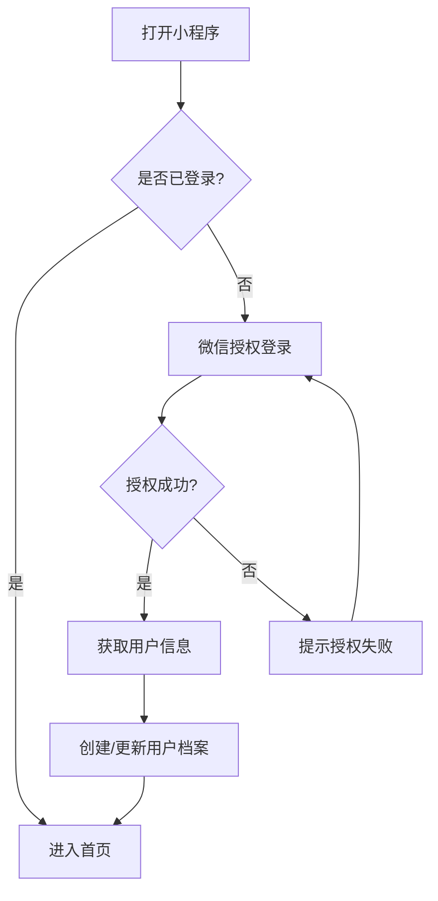

### 2.2 MSDS查阅主流程

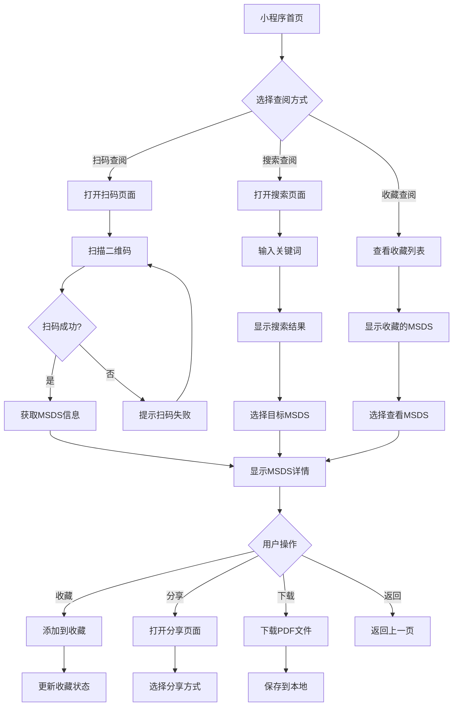

### 2.3 扫码查阅详细流程

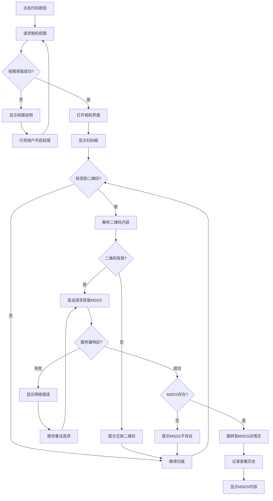

### 2.4 搜索查阅详细流程

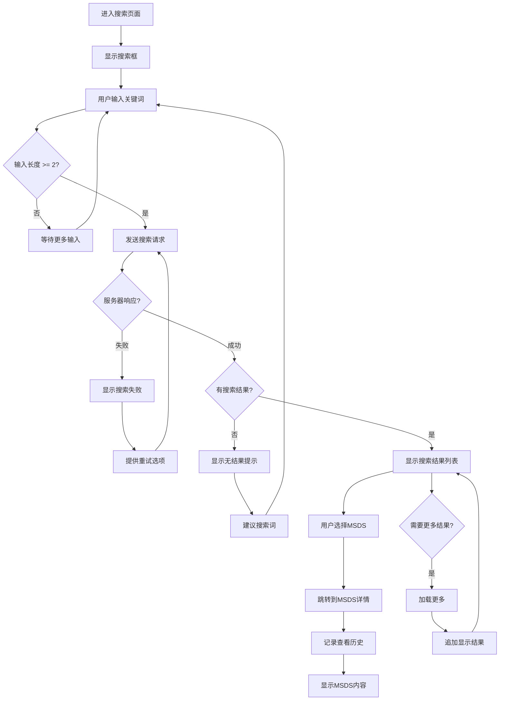

### 2.5 分享功能流程

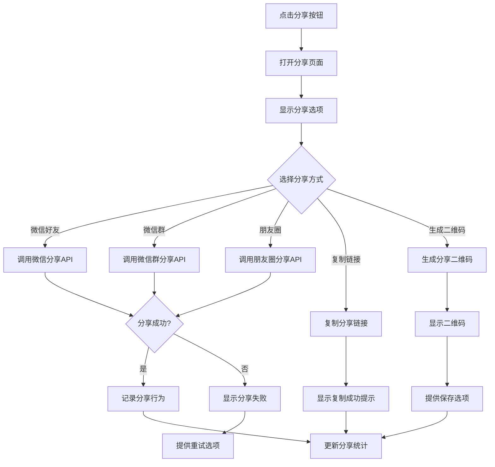

## 3. Web管理后台流程

### 3.1 管理员登录流程

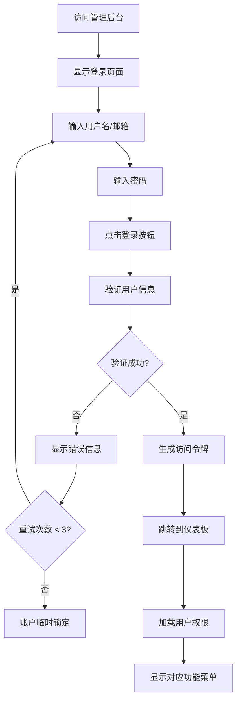

### 3.2 MSDS数据管理流程

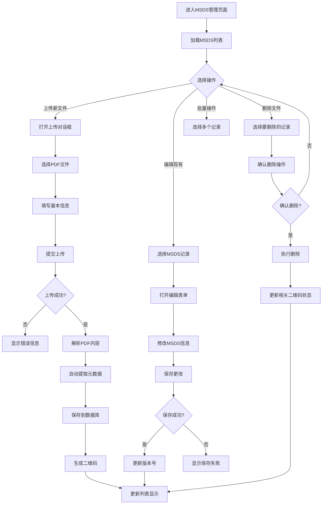

### 3.3 用户权限管理流程

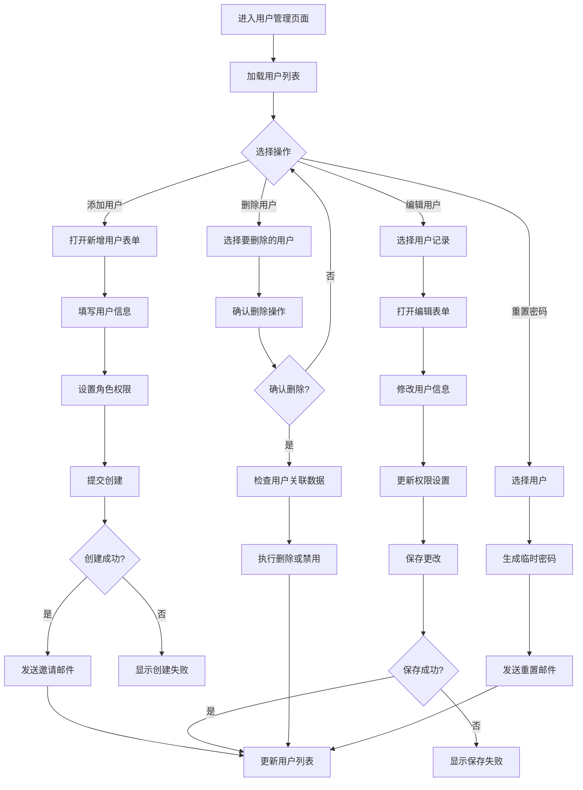

### 3.4 二维码管理流程

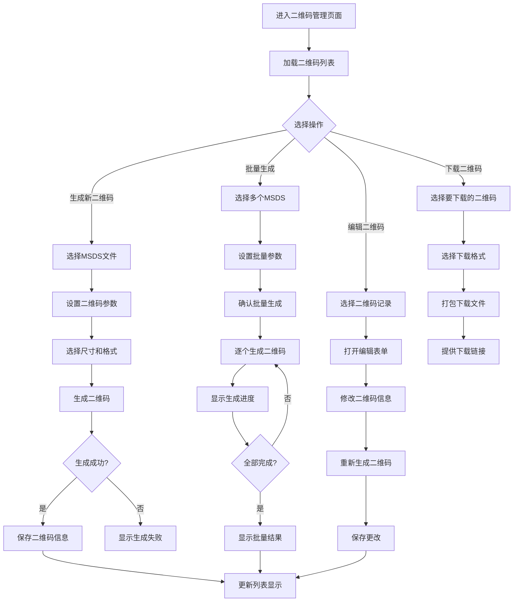

## 4. 异常处理流程

### 4.1 网络异常处理

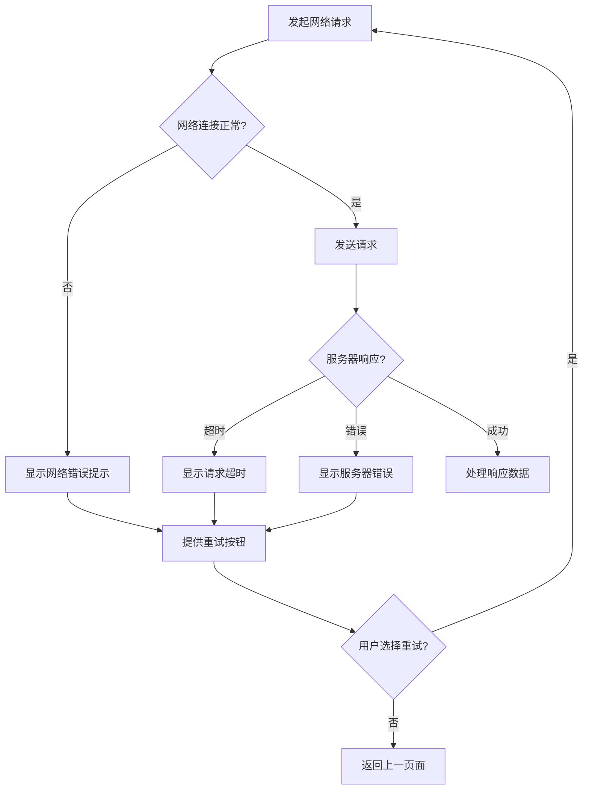

### 4.2 权限异常处理

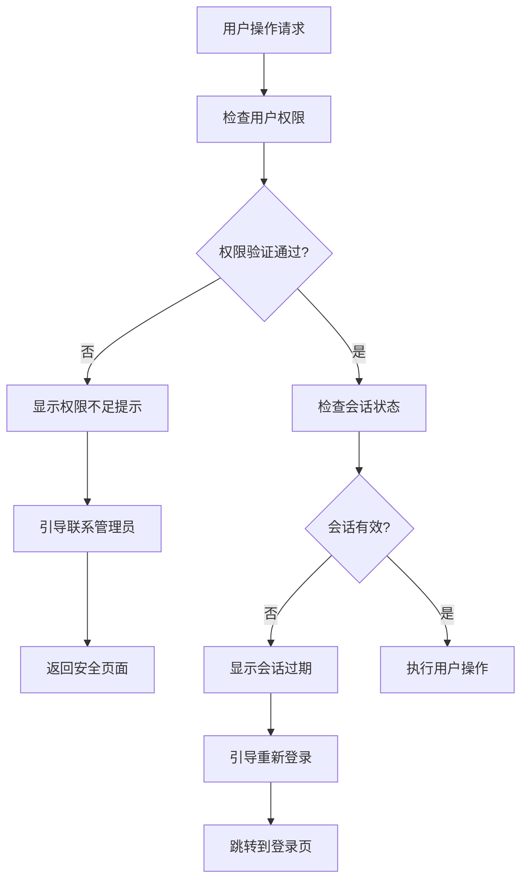

### 4.3 数据异常处理

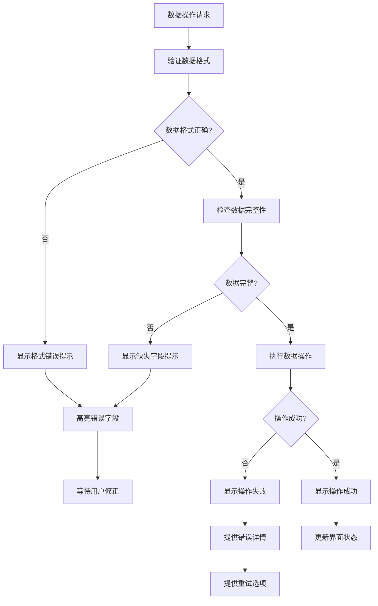

## 5. 性能优化流程

### 5.1 数据加载优化

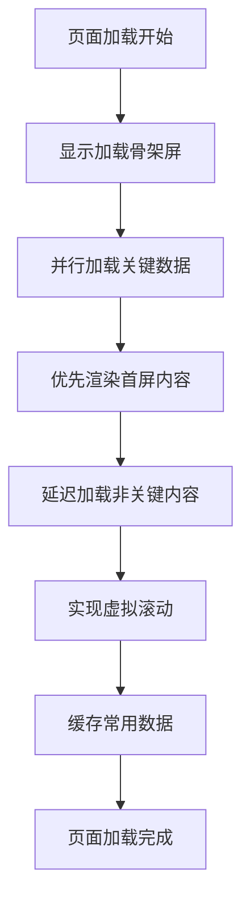

### 5.2 图片加载优化

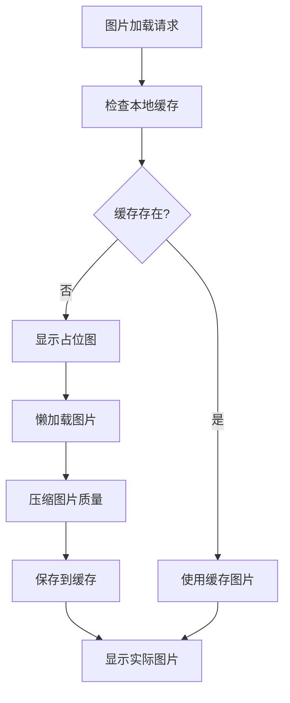

---

**文档版本**: v1.0  
**创建日期**: 2024年  
**维护团队**: 产品设计团队  
**审核状态**: 已审核