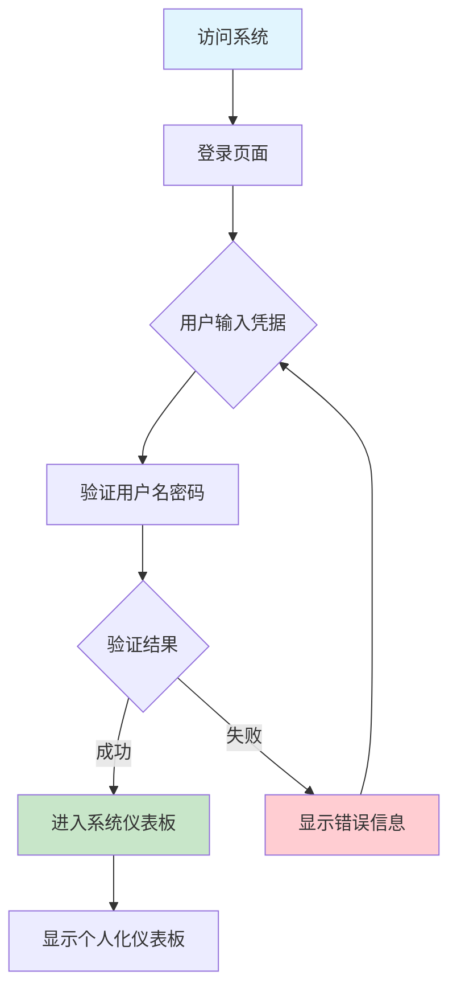
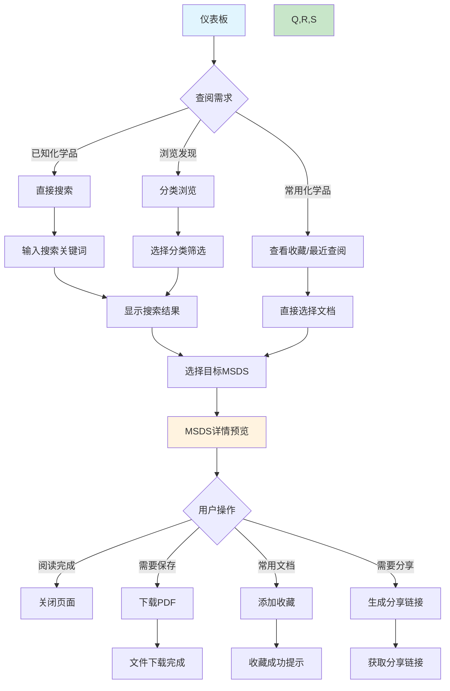
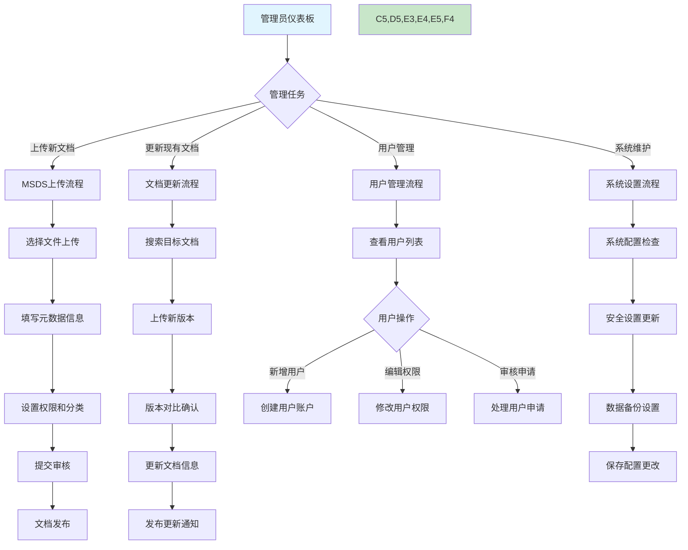
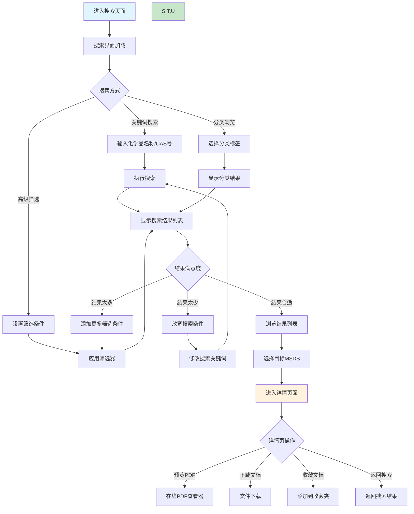
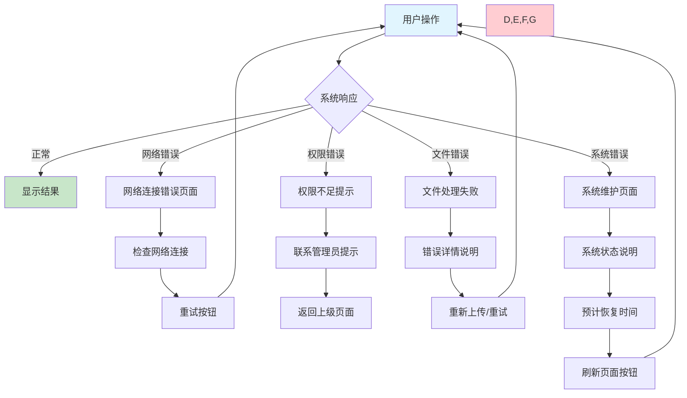
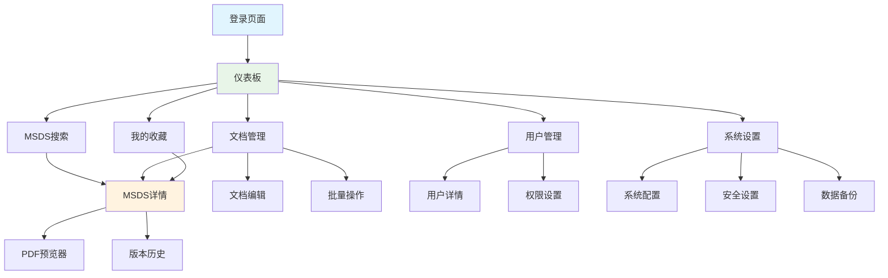
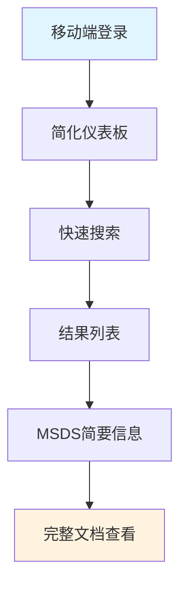

# MSDS 管理文件系统 - 用户操作流程图

## 1. 流程图概述

本文档描述了MSDS管理文件系统的主要用户操作流程，包括科研人员和实验室管理员的核心使用路径。通过流程图的方式，清晰展示用户从登录到完成目标任务的完整操作路径。

**版本**: v1.0  
**创建日期**: 2024年1月  
**设计师**: 高级UI/UX设计师

---

## 2. 主要用户角色

### 2.1 科研人员 (Researcher)
- **主要目标**: 快速查找和获取MSDS信息，确保实验安全
- **核心流程**: 登录 → 搜索 → 查阅 → 下载/收藏

### 2.2 实验室管理员 (Lab Admin)
- **主要目标**: 管理MSDS文档库，维护系统用户和权限
- **核心流程**: 登录 → 管理文档 → 用户管理 → 系统维护

---

## 3. 核心用户流程

### 3.1 用户登录流程



**关键设计点:**
- 登录失败时提供明确的错误提示
- 支持"记住我"功能提升用户体验
- 提供密码重置和企业域登录选项

### 3.2 科研人员 - MSDS查阅流程



**关键设计点:**
- 支持多种搜索方式满足不同查阅需求
- 预览页面突出显示安全关键信息
- 提供快速操作按钮提升效率

### 3.3 实验室管理员 - MSDS管理流程



**关键设计点:**
- 管理流程具有清晰的步骤指引
- 关键操作提供确认机制防止误操作
- 批量操作提升管理效率

### 3.4 MSDS搜索与筛选详细流程



**关键设计点:**
- 搜索结果实时更新，支持增量筛选
- 高亮显示搜索关键词匹配部分
- 提供搜索历史和建议功能

### 3.5 系统错误处理流程



**关键设计点:**
- 错误信息清晰明确，提供解决建议
- 关键错误页面提供返回路径
- 系统维护时提供预期恢复时间

---

## 4. 页面间导航流程

### 4.1 主要页面关系图



### 4.2 面包屑导航示例

```
首页 > MSDS搜索 > 搜索结果 > 丙酮详情
首页 > 文档管理 > 编辑文档 > 保存确认
首页 > 用户管理 > 用户详情 > 权限设置
首页 > 系统设置 > 安全设置 > 密码策略
```

---

## 5. 关键交互节点

### 5.1 搜索体验优化
- **自动完成**: 输入时显示匹配建议
- **搜索历史**: 保存用户搜索记录
- **热门搜索**: 显示常用化学品
- **拼写检查**: 自动纠正输入错误

### 5.2 文档预览体验
- **快速加载**: PDF预览支持分页加载
- **搜索高亮**: 在PDF中高亮搜索关键词
- **章节导航**: 提供MSDS章节快速跳转
- **缩放控制**: 支持文档缩放和适应屏幕

### 5.3 批量操作体验
- **选择反馈**: 清晰显示已选择项目数量
- **操作确认**: 批量操作前提供确认对话框
- **进度指示**: 批量处理时显示进度状态
- **结果反馈**: 操作完成后显示成功/失败统计

---

## 6. 移动端适配流程 (未来版本)

### 6.1 移动端简化流程


**关键适配点:**
- 简化导航菜单为汉堡菜单
- 优化搜索体验为全屏搜索
- MSDS预览适配移动端PDF查看器
- 关键信息优先显示，次要信息折叠

---

## 7. 性能优化流程

### 7.1 页面加载优化
- **首屏渲染**: 优先加载可见内容
- **懒加载**: 非关键图片和内容延迟加载
- **缓存策略**: 静态资源和搜索结果缓存
- **预加载**: 预测用户需求提前加载

### 7.2 搜索性能优化
- **防抖处理**: 避免频繁搜索请求
- **结果缓存**: 缓存搜索结果减少请求
- **分页加载**: 大量结果分页显示
- **索引优化**: 后端搜索索引优化

---

## 8. 可访问性流程

### 8.1 键盘导航流程
```
Tab键顺序: 主导航 → 搜索框 → 筛选器 → 结果列表 → 操作按钮
快捷键: Alt+S(搜索) → Alt+H(首页) → Alt+M(我的收藏)
```

### 8.2 屏幕阅读器支持
- **语义化标签**: 使用正确的HTML标签
- **ARIA标签**: 为复杂组件提供可访问性标签
- **图片描述**: 所有图片提供有意义的alt文本
- **状态通知**: 动态内容变化通过screen reader通知

---

## 9. 流程图使用说明

### 9.1 开发团队使用
- **前端开发**: 参考流程图实现页面跳转逻辑
- **后端开发**: 理解API调用时机和数据流
- **测试团队**: 基于流程图设计测试用例
- **产品经理**: 验证用户体验路径完整性

### 9.2 用户培训材料
- 新用户引导流程设计
- 操作手册编写参考
- 培训材料制作依据
- 常见问题解答流程

---

## 10. 版本记录

| 版本 | 日期 | 更新内容 | 更新人 |
|------|------|----------|--------|
| v1.0 | 2024-01-15 | 初始版本创建，包含主要用户流程 | 高级UI/UX设计师 |

---

**文档结束** 