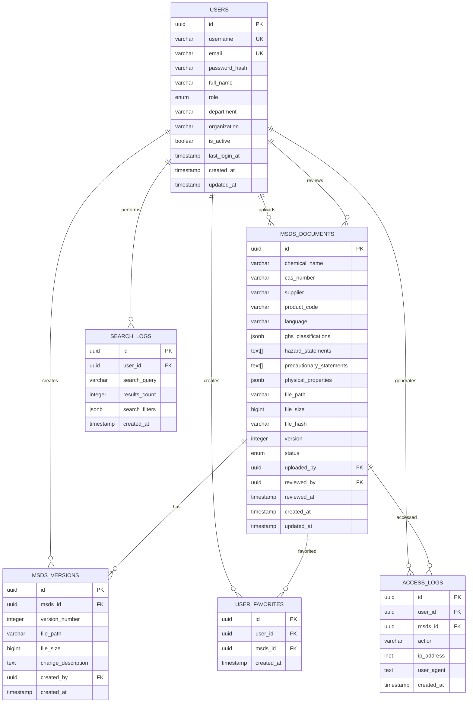

# MSDS 管理文件系统 - 数据库设计文档

## 1. 文档概述

本文档详细阐述了MSDS管理文件系统的数据库设计，包括数据模型、表结构、索引策略等。

**版本**: v1.0  
**创建日期**: 2024年1月  
**架构师**: 高级系统架构师

---

## 2. 数据库架构设计

### 2.1 数据库选择

#### 主数据库：PostgreSQL 14+
- 强大的关系型数据库特性
- 优秀的JSON支持（存储MSDS元数据）
- 全文搜索能力
- 丰富的数据类型支持

#### 搜索引擎：Elasticsearch 8.x
- 专业的全文搜索能力
- 复杂查询和聚合支持
- 中文分词支持

#### 缓存层：Redis 7.x
- 高性能键值存储
- 会话管理和缓存支持

---

## 3. 核心数据模型

### 3.1 实体关系图



---

## 4. 表结构详细设计

### 4.1 用户表 (users)

```sql
CREATE TABLE users (
    id UUID PRIMARY KEY DEFAULT gen_random_uuid(),
    username VARCHAR(50) UNIQUE NOT NULL,
    email VARCHAR(255) UNIQUE NOT NULL,
    password_hash VARCHAR(255) NOT NULL,
    full_name VARCHAR(100) NOT NULL,
    role user_role NOT NULL DEFAULT 'researcher',
    department VARCHAR(100),
    organization VARCHAR(200),
    is_active BOOLEAN DEFAULT true,
    last_login_at TIMESTAMP WITH TIME ZONE,
    created_at TIMESTAMP WITH TIME ZONE DEFAULT NOW(),
    updated_at TIMESTAMP WITH TIME ZONE DEFAULT NOW(),
    
    CONSTRAINT users_username_check CHECK (length(username) >= 3),
    CONSTRAINT users_email_check CHECK (email ~* '^[A-Za-z0-9._%+-]+@[A-Za-z0-9.-]+\.[A-Za-z]{2,}$')
);

-- 用户角色枚举
CREATE TYPE user_role AS ENUM ('admin', 'lab_manager', 'researcher');

-- 触发器：自动更新updated_at
CREATE OR REPLACE FUNCTION update_updated_at_column()
RETURNS TRIGGER AS $$
BEGIN
    NEW.updated_at = NOW();
    RETURN NEW;
END;
$$ language 'plpgsql';

CREATE TRIGGER update_users_updated_at BEFORE UPDATE ON users
FOR EACH ROW EXECUTE FUNCTION update_updated_at_column();
```

### 4.2 MSDS文档表 (msds_documents)

```sql
CREATE TABLE msds_documents (
    id UUID PRIMARY KEY DEFAULT gen_random_uuid(),
    chemical_name VARCHAR(255) NOT NULL,
    cas_number VARCHAR(20),
    supplier VARCHAR(200),
    product_code VARCHAR(100),
    language VARCHAR(10) DEFAULT 'zh-CN',
    ghs_classifications JSONB,
    hazard_statements TEXT[],
    precautionary_statements TEXT[],
    physical_properties JSONB,
    file_path VARCHAR(500) NOT NULL,
    file_size BIGINT NOT NULL,
    file_hash VARCHAR(64) NOT NULL,
    version INTEGER DEFAULT 1,
    status document_status DEFAULT 'active',
    uploaded_by UUID REFERENCES users(id),
    reviewed_by UUID REFERENCES users(id),
    reviewed_at TIMESTAMP WITH TIME ZONE,
    created_at TIMESTAMP WITH TIME ZONE DEFAULT NOW(),
    updated_at TIMESTAMP WITH TIME ZONE DEFAULT NOW(),
    
    CONSTRAINT msds_chemical_name_check CHECK (length(chemical_name) >= 2),
    CONSTRAINT msds_cas_number_format CHECK (cas_number IS NULL OR cas_number ~ '^\d{2,7}-\d{2}-\d$'),
    CONSTRAINT msds_file_size_check CHECK (file_size > 0),
    CONSTRAINT msds_version_check CHECK (version > 0)
);

-- 文档状态枚举
CREATE TYPE document_status AS ENUM ('active', 'archived', 'pending_review');

-- 触发器：自动更新updated_at
CREATE TRIGGER update_msds_documents_updated_at BEFORE UPDATE ON msds_documents
FOR EACH ROW EXECUTE FUNCTION update_updated_at_column();
```

### 4.3 MSDS版本历史表 (msds_versions)

```sql
CREATE TABLE msds_versions (
    id UUID PRIMARY KEY DEFAULT gen_random_uuid(),
    msds_id UUID NOT NULL REFERENCES msds_documents(id) ON DELETE CASCADE,
    version_number INTEGER NOT NULL,
    file_path VARCHAR(500) NOT NULL,
    file_size BIGINT NOT NULL,
    change_description TEXT,
    created_by UUID REFERENCES users(id),
    created_at TIMESTAMP WITH TIME ZONE DEFAULT NOW(),
    
    CONSTRAINT msds_versions_version_check CHECK (version_number > 0),
    CONSTRAINT msds_versions_file_size_check CHECK (file_size > 0),
    UNIQUE(msds_id, version_number)
);
```

### 4.4 用户收藏表 (user_favorites)

```sql
CREATE TABLE user_favorites (
    id UUID PRIMARY KEY DEFAULT gen_random_uuid(),
    user_id UUID NOT NULL REFERENCES users(id) ON DELETE CASCADE,
    msds_id UUID NOT NULL REFERENCES msds_documents(id) ON DELETE CASCADE,
    created_at TIMESTAMP WITH TIME ZONE DEFAULT NOW(),
    
    UNIQUE(user_id, msds_id)
);
```

### 4.5 访问日志表 (access_logs)

```sql
CREATE TABLE access_logs (
    id UUID PRIMARY KEY DEFAULT gen_random_uuid(),
    user_id UUID REFERENCES users(id),
    msds_id UUID REFERENCES msds_documents(id),
    action VARCHAR(50) NOT NULL,
    ip_address INET,
    user_agent TEXT,
    created_at TIMESTAMP WITH TIME ZONE DEFAULT NOW(),
    
    CONSTRAINT access_logs_action_check CHECK (action IN ('view', 'download', 'search', 'favorite', 'unfavorite'))
);
```

### 4.6 搜索记录表 (search_logs)

```sql
CREATE TABLE search_logs (
    id UUID PRIMARY KEY DEFAULT gen_random_uuid(),
    user_id UUID REFERENCES users(id),
    search_query VARCHAR(500) NOT NULL,
    results_count INTEGER DEFAULT 0,
    search_filters JSONB,
    created_at TIMESTAMP WITH TIME ZONE DEFAULT NOW(),
    
    CONSTRAINT search_logs_query_check CHECK (length(search_query) >= 1),
    CONSTRAINT search_logs_results_check CHECK (results_count >= 0)
);
```

---

## 5. 索引优化策略

### 5.1 性能优化索引

```sql
-- MSDS文档表核心索引
CREATE INDEX idx_msds_chemical_name ON msds_documents USING GIN (chemical_name gin_trgm_ops);
CREATE INDEX idx_msds_cas_number ON msds_documents (cas_number) WHERE cas_number IS NOT NULL;
CREATE INDEX idx_msds_supplier ON msds_documents (supplier) WHERE supplier IS NOT NULL;
CREATE INDEX idx_msds_status ON msds_documents (status);
CREATE INDEX idx_msds_created_at ON msds_documents (created_at DESC);
CREATE INDEX idx_msds_file_hash ON msds_documents (file_hash);

-- 复合索引
CREATE INDEX idx_msds_active_documents ON msds_documents (status, created_at DESC) 
WHERE status = 'active';

CREATE INDEX idx_msds_by_uploader ON msds_documents (uploaded_by, created_at DESC)
WHERE uploaded_by IS NOT NULL;

-- 用户表索引
CREATE INDEX idx_users_role ON users (role);
CREATE INDEX idx_users_organization ON users (organization) WHERE organization IS NOT NULL;
CREATE INDEX idx_users_active ON users (is_active) WHERE is_active = true;

-- 版本历史索引
CREATE INDEX idx_msds_versions_msds_id ON msds_versions (msds_id, version_number DESC);
CREATE INDEX idx_msds_versions_created_by ON msds_versions (created_by, created_at DESC);

-- 收藏表索引
CREATE INDEX idx_user_favorites_user_id ON user_favorites (user_id, created_at DESC);
CREATE INDEX idx_user_favorites_msds_id ON user_favorites (msds_id);

-- 日志表索引
CREATE INDEX idx_access_logs_user_created ON access_logs (user_id, created_at DESC);
CREATE INDEX idx_access_logs_msds_created ON access_logs (msds_id, created_at DESC);
CREATE INDEX idx_access_logs_action ON access_logs (action, created_at DESC);

CREATE INDEX idx_search_logs_user_created ON search_logs (user_id, created_at DESC);
CREATE INDEX idx_search_logs_query ON search_logs USING GIN (search_query gin_trgm_ops);
```

### 5.2 全文搜索索引

```sql
-- 安装pg_trgm扩展（三元组匹配）
CREATE EXTENSION IF NOT EXISTS pg_trgm;

-- 创建全文搜索索引
CREATE INDEX idx_msds_fulltext_search ON msds_documents 
USING GIN (to_tsvector('simple', chemical_name || ' ' || COALESCE(supplier, '') || ' ' || COALESCE(product_code, '')));

-- 创建化学品名称的三元组索引
CREATE INDEX idx_msds_chemical_name_trgm ON msds_documents 
USING GIN (chemical_name gin_trgm_ops);
```

---

## 6. 数据完整性约束

### 6.1 外键约束

```sql
-- 确保数据引用完整性
ALTER TABLE msds_documents 
ADD CONSTRAINT fk_msds_uploaded_by 
FOREIGN KEY (uploaded_by) REFERENCES users(id) ON DELETE SET NULL;

ALTER TABLE msds_documents 
ADD CONSTRAINT fk_msds_reviewed_by 
FOREIGN KEY (reviewed_by) REFERENCES users(id) ON DELETE SET NULL;

ALTER TABLE msds_versions 
ADD CONSTRAINT fk_versions_msds_id 
FOREIGN KEY (msds_id) REFERENCES msds_documents(id) ON DELETE CASCADE;

ALTER TABLE msds_versions 
ADD CONSTRAINT fk_versions_created_by 
FOREIGN KEY (created_by) REFERENCES users(id) ON DELETE SET NULL;
```

### 6.2 数据验证约束

```sql
-- 化学品名称不能为空或纯空格
ALTER TABLE msds_documents 
ADD CONSTRAINT chk_chemical_name_not_empty 
CHECK (trim(chemical_name) != '');

-- 文件路径必须是有效格式
ALTER TABLE msds_documents 
ADD CONSTRAINT chk_file_path_format 
CHECK (file_path ~ '^[a-zA-Z0-9/_.-]+\.(pdf|PDF)$');

-- 确保版本号与文档版本一致
CREATE OR REPLACE FUNCTION check_version_consistency()
RETURNS TRIGGER AS $$
BEGIN
    IF NOT EXISTS (
        SELECT 1 FROM msds_documents 
        WHERE id = NEW.msds_id AND version >= NEW.version_number
    ) THEN
        RAISE EXCEPTION 'Version number must not exceed document version';
    END IF;
    RETURN NEW;
END;
$$ LANGUAGE plpgsql;

CREATE TRIGGER trigger_check_version_consistency
BEFORE INSERT OR UPDATE ON msds_versions
FOR EACH ROW EXECUTE FUNCTION check_version_consistency();
```

---

## 7. 数据迁移策略

### 7.1 初始数据种子

```sql
-- 插入默认管理员用户
INSERT INTO users (username, email, password_hash, full_name, role, organization) 
VALUES ('admin', 'admin@example.com', '$2b$12$...', '系统管理员', 'admin', '系统');

-- 插入测试数据（开发环境）
INSERT INTO users (username, email, password_hash, full_name, role, department, organization) 
VALUES 
('researcher01', 'researcher01@lab.com', '$2b$12$...', '张三', 'researcher', '有机化学', '实验室A'),
('labmanager01', 'manager01@lab.com', '$2b$12$...', '李四', 'lab_manager', '实验室管理', '实验室A');
```

### 7.2 数据迁移脚本

```sql
-- 创建迁移版本表
CREATE TABLE schema_migrations (
    version VARCHAR(255) PRIMARY KEY,
    applied_at TIMESTAMP WITH TIME ZONE DEFAULT NOW()
);

-- 插入初始迁移记录
INSERT INTO schema_migrations (version) VALUES ('20240115_001_initial_schema');
```

---

## 8. 查询优化示例

### 8.1 常用查询模式

```sql
-- 1. 搜索化学品（支持模糊匹配）
SELECT id, chemical_name, cas_number, supplier, created_at
FROM msds_documents 
WHERE status = 'active' 
AND (
    chemical_name ILIKE '%acetone%' 
    OR cas_number ILIKE '%67-64-1%'
    OR supplier ILIKE '%Sigma%'
)
ORDER BY created_at DESC
LIMIT 20;

-- 2. 用户收藏的文档
SELECT d.id, d.chemical_name, d.cas_number, d.supplier, f.created_at as favorited_at
FROM user_favorites f
JOIN msds_documents d ON f.msds_id = d.id
WHERE f.user_id = $1 AND d.status = 'active'
ORDER BY f.created_at DESC;

-- 3. 最近访问的文档
SELECT DISTINCT d.id, d.chemical_name, d.cas_number, MAX(a.created_at) as last_accessed
FROM access_logs a
JOIN msds_documents d ON a.msds_id = d.id
WHERE a.user_id = $1 AND a.action = 'view' AND d.status = 'active'
GROUP BY d.id, d.chemical_name, d.cas_number
ORDER BY last_accessed DESC
LIMIT 10;

-- 4. 文档版本历史
SELECT v.version_number, v.file_size, v.change_description, v.created_at, u.full_name as created_by_name
FROM msds_versions v
LEFT JOIN users u ON v.created_by = u.id
WHERE v.msds_id = $1
ORDER BY v.version_number DESC;
```

### 8.2 性能监控查询

```sql
-- 监控慢查询
SELECT query, calls, total_time, mean_time, rows
FROM pg_stat_statements 
WHERE mean_time > 100  -- 平均执行时间超过100ms
ORDER BY mean_time DESC;

-- 监控索引使用情况
SELECT schemaname, tablename, indexname, idx_tup_read, idx_tup_fetch
FROM pg_stat_user_indexes
WHERE idx_tup_read > 0
ORDER BY idx_tup_read DESC;
```

---

## 9. 备份与恢复策略

### 9.1 备份策略

```bash
#!/bin/bash
# 日常备份脚本
BACKUP_DIR="/var/backups/msds"
DATE=$(date +%Y%m%d_%H%M%S)

# 创建完整备份
pg_dump -h localhost -U msds_user -d msds_prod \
  --format=custom \
  --compress=9 \
  --file="${BACKUP_DIR}/msds_backup_${DATE}.dump"

# 仅备份模式（不含数据）
pg_dump -h localhost -U msds_user -d msds_prod \
  --schema-only \
  --format=custom \
  --file="${BACKUP_DIR}/msds_schema_${DATE}.dump"
```

### 9.2 恢复策略

```bash
#!/bin/bash
# 数据恢复脚本
BACKUP_FILE=$1

# 恢复到新数据库
createdb msds_restore
pg_restore -h localhost -U msds_user \
  --dbname=msds_restore \
  --clean --if-exists \
  --verbose \
  "${BACKUP_FILE}"
```

---

## 10. 监控与维护

### 10.1 数据库监控指标

```sql
-- 表大小监控
SELECT 
    schemaname,
    tablename,
    pg_size_pretty(pg_total_relation_size(schemaname||'.'||tablename)) as size,
    pg_total_relation_size(schemaname||'.'||tablename) as size_bytes
FROM pg_tables 
WHERE schemaname = 'public'
ORDER BY size_bytes DESC;

-- 连接数监控
SELECT 
    count(*) as total_connections,
    count(*) FILTER (WHERE state = 'active') as active_connections,
    count(*) FILTER (WHERE state = 'idle') as idle_connections
FROM pg_stat_activity;
```

### 10.2 定期维护任务

```sql
-- 定期清理过期会话
DELETE FROM access_logs 
WHERE created_at < NOW() - INTERVAL '90 days';

-- 定期更新表统计信息
ANALYZE msds_documents;
ANALYZE users;
ANALYZE search_logs;

-- 定期重建索引（如果需要）
REINDEX INDEX CONCURRENTLY idx_msds_chemical_name;
```

---

## 11. 版本记录

| 版本 | 日期 | 更新内容 | 更新人 |
|------|------|----------|--------|
| v1.0 | 2024-01-15 | 初始版本创建，完整数据库设计 | 高级系统架构师 |

---

**文档结束** 