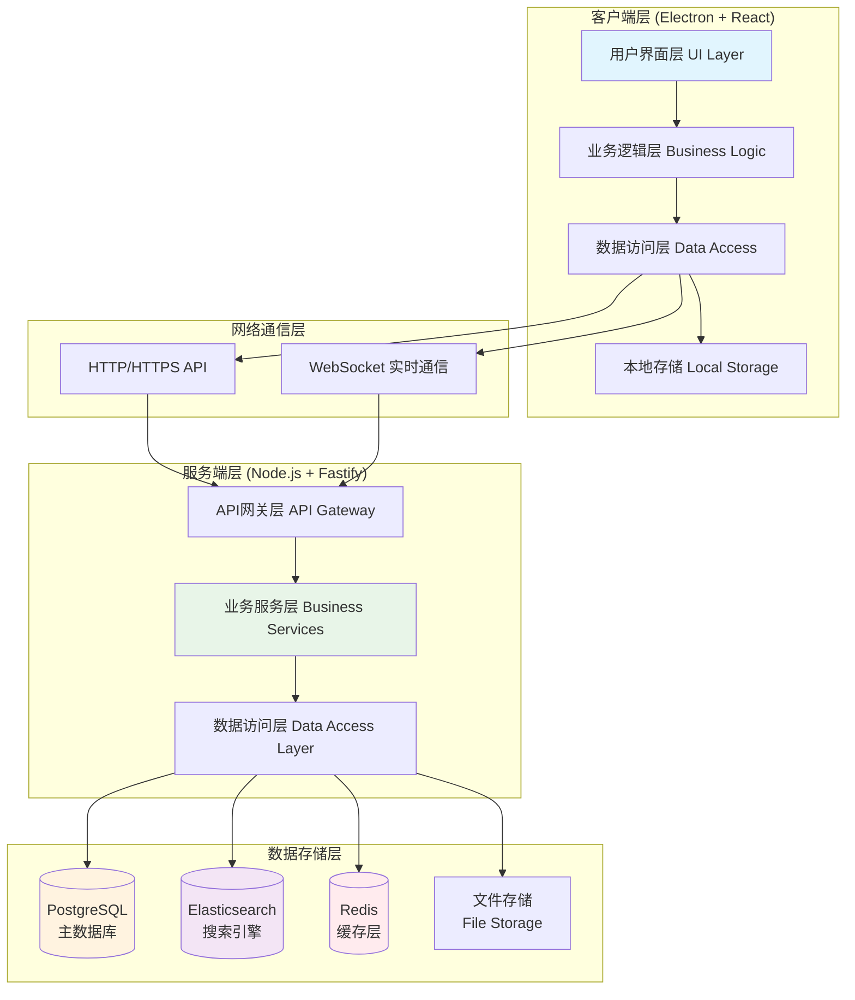

# MSDS 管理文件系统 - 技术架构设计文档

## 1. 文档概述

本文档详细阐述了MSDS管理文件系统的技术架构设计，包括技术选型、系统架构、数据库设计等核心技术方案。

**版本**: v1.0  
**创建日期**: 2024年1月  
**架构师**: 高级系统架构师

---

## 2. 技术选型

### 2.1 PC客户端技术栈

考虑到MSDS管理系统主要面向实验室PC端使用，且需要良好的跨平台支持和丰富的UI交互，我们选择以下技术栈：

#### 主要框架选择：Electron + React + TypeScript

**选择理由:**
- **Electron**: 
  - 跨平台支持 (Windows/macOS/Linux)
  - 原生桌面应用体验
  - 丰富的系统API访问能力
  - 便于打包分发和自动更新
- **React**: 
  - 成熟的组件化开发模式
  - 丰富的生态系统和UI组件库
  - 与设计原型的HTML/CSS结构高度契合
- **TypeScript**: 
  - 强类型支持，提升代码质量
  - 优秀的IDE支持和重构能力
  - 便于大型项目维护

#### 核心技术栈详细配置

```typescript
// 主要依赖包配置
{
  "framework": {
    "electron": "^28.0.0",
    "react": "^18.2.0",
    "typescript": "^5.0.0"
  },
  "ui_library": {
    "antd": "^5.12.0",           // 企业级UI组件库
    "tailwindcss": "^3.3.0",    // CSS框架，与原型保持一致
    "lucide-react": "^0.294.0"  // 图标库
  },
  "state_management": {
    "zustand": "^4.4.0",        // 轻量级状态管理
    "react-query": "^3.39.0"    // 服务端状态管理
  },
  "routing": {
    "react-router-dom": "^6.8.0" // 客户端路由
  },
  "pdf_handling": {
    "react-pdf": "^7.5.0",      // PDF预览组件
    "pdf-lib": "^1.17.0"        // PDF处理库
  }
}
```

### 2.2 后端服务技术栈

#### 主要框架选择：Node.js + Fastify + TypeScript

**选择理由:**
- **Node.js**: 
  - 与前端技术栈统一，降低开发复杂度
  - 优秀的异步处理能力
  - 丰富的第三方库生态
- **Fastify**: 
  - 高性能HTTP服务器框架
  - 良好的TypeScript支持
  - 优秀的插件生态系统
- **TypeScript**: 
  - 前后端类型定义共享
  - 减少接口对接错误

#### 后端技术栈详细配置

```typescript
// 服务端依赖包配置
{
  "framework": {
    "fastify": "^4.24.0",
    "typescript": "^5.0.0"
  },
  "database": {
    "prisma": "^5.7.0",         // ORM框架
    "postgresql": "^14.0.0"     // 主数据库
  },
  "authentication": {
    "jsonwebtoken": "^9.0.0",   // JWT认证
    "bcryptjs": "^2.4.0"        // 密码加密
  },
  "file_handling": {
    "multer": "^1.4.0",         // 文件上传
    "sharp": "^0.32.0",         // 图片处理
    "pdf-parse": "^1.1.0"       // PDF解析
  },
  "search": {
    "elasticsearch": "^8.11.0"  // 全文搜索引擎
  },
  "validation": {
    "joi": "^17.11.0"           // 数据验证
  }
}
```

### 2.3 数据库选择

#### 主数据库：PostgreSQL

**选择理由:**
- 强大的关系型数据库特性
- 优秀的JSON支持（存储MSDS元数据）
- 全文搜索能力
- 丰富的数据类型支持

#### 搜索引擎：Elasticsearch

**选择理由:**
- 专业的全文搜索能力
- 复杂查询和聚合支持
- 高性能的分布式搜索
- 中文分词支持

#### 缓存层：Redis

**选择理由:**
- 高性能键值存储
- 支持多种数据结构
- 会话管理和缓存支持

---

## 3. 系统架构设计

### 3.1 整体架构图



### 3.2 客户端架构设计

#### 3.2.1 分层架构

```typescript
// 客户端架构分层
src/
├── main/                    # Electron主进程
│   ├── main.ts
│   ├── menu.ts
│   └── auto-updater.ts
├── renderer/                # React渲染进程
│   ├── components/          # UI组件层
│   │   ├── common/          # 通用组件
│   │   ├── layouts/         # 布局组件
│   │   └── pages/           # 页面组件
│   ├── hooks/               # React Hooks
│   ├── services/            # 业务服务层
│   │   ├── api/             # API调用服务
│   │   ├── auth/            # 认证服务
│   │   └── msds/            # MSDS业务服务
│   ├── stores/              # 状态管理
│   │   ├── auth.store.ts
│   │   ├── msds.store.ts
│   │   └── ui.store.ts
│   ├── types/               # TypeScript类型定义
│   └── utils/               # 工具函数
└── shared/                  # 主进程和渲染进程共享代码
    ├── constants/
    ├── types/
    └── utils/
```

#### 3.2.2 核心模块设计

**1. 认证模块 (Auth Module)**
```typescript
// src/renderer/services/auth/auth.service.ts
export class AuthService {
  async login(credentials: LoginCredentials): Promise<AuthResult>
  async logout(): Promise<void>
  async refreshToken(): Promise<string>
  async getCurrentUser(): Promise<User>
  
  // 自动登录和token管理
  private setupTokenRefresh(): void
  private handleTokenExpiry(): void
}
```

**2. MSDS业务模块 (MSDS Module)**
```typescript
// src/renderer/services/msds/msds.service.ts
export class MSDSService {
  // 搜索功能
  async searchMSDS(query: SearchQuery): Promise<SearchResult>
  async getAdvancedFilters(): Promise<FilterOptions>
  
  // 文档管理
  async getMSDSDetail(id: string): Promise<MSDSDetail>
  async downloadMSDS(id: string): Promise<Blob>
  async uploadMSDS(file: File, metadata: MSDSMetadata): Promise<UploadResult>
  
  // 收藏和历史
  async addToFavorites(id: string): Promise<void>
  async getRecentViews(): Promise<MSDSItem[]>
}
```

**3. 文件处理模块 (File Module)**
```typescript
// src/renderer/services/file/file.service.ts
export class FileService {
  // PDF处理
  async previewPDF(fileUrl: string): Promise<PDFDocument>
  async downloadFile(url: string, filename: string): Promise<void>
  
  // 本地缓存
  async cacheFile(id: string, file: Blob): Promise<void>
  async getCachedFile(id: string): Promise<Blob | null>
}
```

### 3.3 服务端架构设计

#### 3.3.1 微服务架构

```typescript
// 服务端模块划分
src/
├── api/                     # API层
│   ├── routes/              # 路由定义
│   │   ├── auth.routes.ts
│   │   ├── msds.routes.ts
│   │   ├── users.routes.ts
│   │   └── admin.routes.ts
│   ├── middlewares/         # 中间件
│   │   ├── auth.middleware.ts
│   │   ├── validation.middleware.ts
│   │   └── error.middleware.ts
│   └── controllers/         # 控制器
├── services/                # 业务服务层
│   ├── auth.service.ts
│   ├── msds.service.ts
│   ├── user.service.ts
│   └── search.service.ts
├── repositories/            # 数据访问层
│   ├── msds.repository.ts
│   ├── user.repository.ts
│   └── audit.repository.ts
├── models/                  # 数据模型
│   ├── prisma/             # Prisma schema
│   └── types/              # TypeScript类型
├── utils/                   # 工具函数
│   ├── crypto.util.ts
│   ├── pdf.util.ts
│   └── validation.util.ts
└── config/                  # 配置文件
    ├── database.config.ts
    ├── elasticsearch.config.ts
    └── app.config.ts
```

#### 3.3.2 核心服务设计

**1. MSDS服务 (MSDS Service)**
```typescript
// src/services/msds.service.ts
export class MSDSService {
  // 文档管理
  async createMSDS(data: CreateMSDSDTO): Promise<MSDS>
  async updateMSDS(id: string, data: UpdateMSDSDTO): Promise<MSDS>
  async deleteMSDS(id: string): Promise<void>
  
  // 搜索功能
  async searchMSDS(query: SearchQueryDTO): Promise<SearchResultDTO>
  async getSearchSuggestions(term: string): Promise<string[]>
  
  // 版本管理
  async getVersionHistory(id: string): Promise<MSDSVersion[]>
  async createNewVersion(id: string, file: Buffer): Promise<MSDSVersion>
}
```

**2. 搜索服务 (Search Service)**
```typescript
// src/services/search.service.ts
export class SearchService {
  // Elasticsearch集成
  async indexDocument(doc: MSDSDocument): Promise<void>
  async searchDocuments(query: ElasticQuery): Promise<SearchHits>
  async updateIndex(id: string, doc: Partial<MSDSDocument>): Promise<void>
  
  // 搜索优化
  async getPopularSearches(): Promise<string[]>
  async logSearchQuery(query: string, userId: string): Promise<void>
}
```

**3. 文件服务 (File Service)**
```typescript
// src/services/file.service.ts
export class FileService {
  // 文件上传和处理
  async uploadFile(file: Express.Multer.File): Promise<FileUploadResult>
  async processePDFMetadata(buffer: Buffer): Promise<PDFMetadata>
  
  // 文件存储
  async storeFile(id: string, buffer: Buffer): Promise<string>
  async getFileStream(id: string): Promise<NodeJS.ReadableStream>
  
  // 安全检查
  async scanFileForVirus(buffer: Buffer): Promise<ScanResult>
  async validatePDFStructure(buffer: Buffer): Promise<ValidationResult>
}
```

---

## 4. 数据库设计

### 4.1 数据库架构

#### 4.1.1 PostgreSQL主数据库设计

```sql
-- 用户表
CREATE TABLE users (
    id UUID PRIMARY KEY DEFAULT gen_random_uuid(),
    username VARCHAR(50) UNIQUE NOT NULL,
    email VARCHAR(255) UNIQUE NOT NULL,
    password_hash VARCHAR(255) NOT NULL,
    full_name VARCHAR(100) NOT NULL,
    role user_role NOT NULL DEFAULT 'researcher',
    department VARCHAR(100),
    organization VARCHAR(200),
    is_active BOOLEAN DEFAULT true,
    last_login_at TIMESTAMP WITH TIME ZONE,
    created_at TIMESTAMP WITH TIME ZONE DEFAULT NOW(),
    updated_at TIMESTAMP WITH TIME ZONE DEFAULT NOW()
);

-- MSDS文档表
CREATE TABLE msds_documents (
    id UUID PRIMARY KEY DEFAULT gen_random_uuid(),
    chemical_name VARCHAR(255) NOT NULL,
    cas_number VARCHAR(20),
    supplier VARCHAR(200),
    product_code VARCHAR(100),
    language VARCHAR(10) DEFAULT 'zh-CN',
    ghs_classifications JSONB,
    hazard_statements TEXT[],
    precautionary_statements TEXT[],
    physical_properties JSONB,
    file_path VARCHAR(500) NOT NULL,
    file_size BIGINT NOT NULL,
    file_hash VARCHAR(64) NOT NULL,
    version INTEGER DEFAULT 1,
    status document_status DEFAULT 'active',
    uploaded_by UUID REFERENCES users(id),
    reviewed_by UUID REFERENCES users(id),
    reviewed_at TIMESTAMP WITH TIME ZONE,
    created_at TIMESTAMP WITH TIME ZONE DEFAULT NOW(),
    updated_at TIMESTAMP WITH TIME ZONE DEFAULT NOW()
);

-- MSDS版本历史表
CREATE TABLE msds_versions (
    id UUID PRIMARY KEY DEFAULT gen_random_uuid(),
    msds_id UUID REFERENCES msds_documents(id) ON DELETE CASCADE,
    version_number INTEGER NOT NULL,
    file_path VARCHAR(500) NOT NULL,
    file_size BIGINT NOT NULL,
    change_description TEXT,
    created_by UUID REFERENCES users(id),
    created_at TIMESTAMP WITH TIME ZONE DEFAULT NOW()
);

-- 用户收藏表
CREATE TABLE user_favorites (
    id UUID PRIMARY KEY DEFAULT gen_random_uuid(),
    user_id UUID REFERENCES users(id) ON DELETE CASCADE,
    msds_id UUID REFERENCES msds_documents(id) ON DELETE CASCADE,
    created_at TIMESTAMP WITH TIME ZONE DEFAULT NOW(),
    UNIQUE(user_id, msds_id)
);

-- 访问日志表
CREATE TABLE access_logs (
    id UUID PRIMARY KEY DEFAULT gen_random_uuid(),
    user_id UUID REFERENCES users(id),
    msds_id UUID REFERENCES msds_documents(id),
    action VARCHAR(50) NOT NULL,
    ip_address INET,
    user_agent TEXT,
    created_at TIMESTAMP WITH TIME ZONE DEFAULT NOW()
);

-- 搜索记录表
CREATE TABLE search_logs (
    id UUID PRIMARY KEY DEFAULT gen_random_uuid(),
    user_id UUID REFERENCES users(id),
    search_query VARCHAR(500) NOT NULL,
    results_count INTEGER,
    search_filters JSONB,
    created_at TIMESTAMP WITH TIME ZONE DEFAULT NOW()
);

-- 枚举类型定义
CREATE TYPE user_role AS ENUM ('admin', 'lab_manager', 'researcher');
CREATE TYPE document_status AS ENUM ('active', 'archived', 'pending_review');
```

#### 4.1.2 索引优化策略

```sql
-- 性能优化索引
CREATE INDEX idx_msds_chemical_name ON msds_documents USING GIN (chemical_name gin_trgm_ops);
CREATE INDEX idx_msds_cas_number ON msds_documents (cas_number);
CREATE INDEX idx_msds_supplier ON msds_documents (supplier);
CREATE INDEX idx_msds_status ON msds_documents (status);
CREATE INDEX idx_msds_created_at ON msds_documents (created_at DESC);

-- 复合索引
CREATE INDEX idx_msds_active_documents ON msds_documents (status, created_at DESC) 
WHERE status = 'active';

-- 用户相关索引
CREATE INDEX idx_users_role ON users (role);
CREATE INDEX idx_users_organization ON users (organization);

-- 日志表索引
CREATE INDEX idx_access_logs_user_created ON access_logs (user_id, created_at DESC);
CREATE INDEX idx_search_logs_user_created ON search_logs (user_id, created_at DESC);
```

### 4.2 Elasticsearch搜索索引设计

#### 4.2.1 MSDS文档索引映射

```json
{
  "mappings": {
    "properties": {
      "id": { "type": "keyword" },
      "chemical_name": {
        "type": "text",
        "analyzer": "ik_max_word",
        "search_analyzer": "ik_smart",
        "fields": {
          "keyword": { "type": "keyword" },
          "suggest": {
            "type": "completion",
            "analyzer": "simple"
          }
        }
      },
      "cas_number": { "type": "keyword" },
      "supplier": {
        "type": "text",
        "analyzer": "ik_max_word",
        "fields": { "keyword": { "type": "keyword" } }
      },
      "product_code": { "type": "keyword" },
      "ghs_classifications": {
        "type": "nested",
        "properties": {
          "hazard_class": { "type": "keyword" },
          "category": { "type": "keyword" },
          "signal_word": { "type": "keyword" }
        }
      },
      "hazard_statements": { "type": "keyword" },
      "precautionary_statements": { "type": "keyword" },
      "physical_properties": {
        "type": "nested",
        "properties": {
          "property": { "type": "keyword" },
          "value": { "type": "text" },
          "unit": { "type": "keyword" }
        }
      },
      "pdf_content": {
        "type": "text",
        "analyzer": "ik_max_word"
      },
      "language": { "type": "keyword" },
      "created_at": { "type": "date" },
      "updated_at": { "type": "date" }
    }
  },
  "settings": {
    "analysis": {
      "analyzer": {
        "ik_max_word": {
          "type": "ik_max_word"
        },
        "ik_smart": {
          "type": "ik_smart"
        }
      }
    }
  }
}
```

### 4.3 数据访问层设计

#### 4.3.1 Prisma Schema定义

```prisma
// prisma/schema.prisma
generator client {
  provider = "prisma-client-js"
}

datasource db {
  provider = "postgresql"
  url      = env("DATABASE_URL")
}

model User {
  id           String   @id @default(cuid())
  username     String   @unique
  email        String   @unique
  passwordHash String   @map("password_hash")
  fullName     String   @map("full_name")
  role         UserRole @default(RESEARCHER)
  department   String?
  organization String?
  isActive     Boolean  @default(true) @map("is_active")
  lastLoginAt  DateTime? @map("last_login_at")
  createdAt    DateTime @default(now()) @map("created_at")
  updatedAt    DateTime @updatedAt @map("updated_at")

  // Relations
  uploadedDocuments MsdsDocument[] @relation("UploadedBy")
  reviewedDocuments MsdsDocument[] @relation("ReviewedBy")
  favorites         UserFavorite[]
  accessLogs        AccessLog[]
  searchLogs        SearchLog[]
  versions          MsdsVersion[]

  @@map("users")
}

model MsdsDocument {
  id                       String           @id @default(cuid())
  chemicalName             String           @map("chemical_name")
  casNumber                String?          @map("cas_number")
  supplier                 String?
  productCode              String?          @map("product_code")
  language                 String           @default("zh-CN")
  ghsClassifications       Json?            @map("ghs_classifications")
  hazardStatements         String[]         @map("hazard_statements")
  precautionaryStatements  String[]         @map("precautionary_statements")
  physicalProperties       Json?            @map("physical_properties")
  filePath                 String           @map("file_path")
  fileSize                 BigInt           @map("file_size")
  fileHash                 String           @map("file_hash")
  version                  Int              @default(1)
  status                   DocumentStatus   @default(ACTIVE)
  uploadedById             String?          @map("uploaded_by")
  reviewedById             String?          @map("reviewed_by")
  reviewedAt               DateTime?        @map("reviewed_at")
  createdAt                DateTime         @default(now()) @map("created_at")
  updatedAt                DateTime         @updatedAt @map("updated_at")

  // Relations
  uploadedBy    User?          @relation("UploadedBy", fields: [uploadedById], references: [id])
  reviewedBy    User?          @relation("ReviewedBy", fields: [reviewedById], references: [id])
  versions      MsdsVersion[]
  favorites     UserFavorite[]
  accessLogs    AccessLog[]

  @@map("msds_documents")
}

enum UserRole {
  ADMIN
  LAB_MANAGER
  RESEARCHER
}

enum DocumentStatus {
  ACTIVE
  ARCHIVED
  PENDING_REVIEW
}
```

---

## 5. 安全架构设计

### 5.1 客户端安全

**1. 代码保护**
- 代码混淆和压缩
- 关键逻辑服务端验证
- 防止逆向工程

**2. 数据安全**
- 本地数据加密存储
- 内存敏感数据清理
- 安全的文件下载和缓存

**3. 通信安全**
- HTTPS/TLS加密通信
- 证书验证和固定
- API请求签名验证

### 5.2 服务端安全

**1. 认证授权**
- JWT token认证
- 角色基础访问控制(RBAC)
- 会话管理和超时

**2. 数据保护**
- 数据库连接加密
- 敏感字段加密存储
- 定期备份和恢复

**3. API安全**
- 请求频率限制
- 输入验证和SQL注入防护
- CORS配置

---

## 6. 性能优化策略

### 6.1 客户端性能

**1. 应用启动优化**
- 延迟加载非关键模块
- 预编译和代码分割
- 启动画面和进度反馈

**2. 界面响应优化**
- 虚拟滚动处理大列表
- 图片懒加载和缩略图
- PDF分页渲染

**3. 内存管理**
- 组件卸载时清理资源
- 大文件流式处理
- 缓存策略优化

### 6.2 服务端性能

**1. 数据库优化**
- 查询优化和索引策略
- 连接池配置
- 读写分离

**2. 搜索性能**
- Elasticsearch集群配置
- 搜索结果缓存
- 分页和聚合优化

**3. 文件处理**
- 异步文件上传处理
- CDN文件分发
- 文件压缩和格式转换

---

## 7. 部署架构

### 7.1 开发环境

```yaml
# docker-compose.dev.yml
version: '3.8'
services:
  postgres:
    image: postgres:14
    environment:
      POSTGRES_DB: msds_dev
      POSTGRES_USER: dev_user
      POSTGRES_PASSWORD: dev_password
    ports:
      - "5432:5432"
    volumes:
      - postgres_data:/var/lib/postgresql/data

  elasticsearch:
    image: elasticsearch:8.11.0
    environment:
      - discovery.type=single-node
      - xpack.security.enabled=false
    ports:
      - "9200:9200"
    volumes:
      - es_data:/usr/share/elasticsearch/data

  redis:
    image: redis:7-alpine
    ports:
      - "6379:6379"
    volumes:
      - redis_data:/data

volumes:
  postgres_data:
  es_data:
  redis_data:
```

### 7.2 生产环境

**1. 服务器架构**
- Web服务器: Nginx反向代理
- 应用服务器: Node.js集群
- 数据库: PostgreSQL主从复制
- 搜索: Elasticsearch集群

**2. 监控和日志**
- 应用监控: PM2/Supervisor
- 系统监控: Prometheus + Grafana
- 日志收集: ELK Stack

---

## 8. 开发工具和流程

### 8.1 开发工具配置

**代码质量工具**
```json
{
  "eslint": "^8.55.0",
  "prettier": "^3.1.0",
  "husky": "^8.0.0",
  "lint-staged": "^15.2.0",
  "commitizen": "^4.3.0"
}
```

**测试工具**
```json
{
  "jest": "^29.7.0",
  "@testing-library/react": "^13.4.0",
  "playwright": "^1.40.0",
  "supertest": "^6.3.0"
}
```

### 8.2 CI/CD流程

```yaml
# .github/workflows/main.yml
name: CI/CD Pipeline
on: [push, pull_request]

jobs:
  test:
    runs-on: ubuntu-latest
    steps:
      - uses: actions/checkout@v3
      - uses: actions/setup-node@v3
        with:
          node-version: '18'
      - run: npm ci
      - run: npm run test
      - run: npm run e2e

  build:
    needs: test
    runs-on: ubuntu-latest
    steps:
      - uses: actions/checkout@v3
      - run: npm ci
      - run: npm run build
      - run: npm run package
```

---

## 9. 版本记录

| 版本 | 日期 | 更新内容 | 更新人 |
|------|------|----------|--------|
| v1.0 | 2024-01-15 | 初始版本创建，完整技术架构设计 | 高级系统架构师 |

---

**文档结束** 