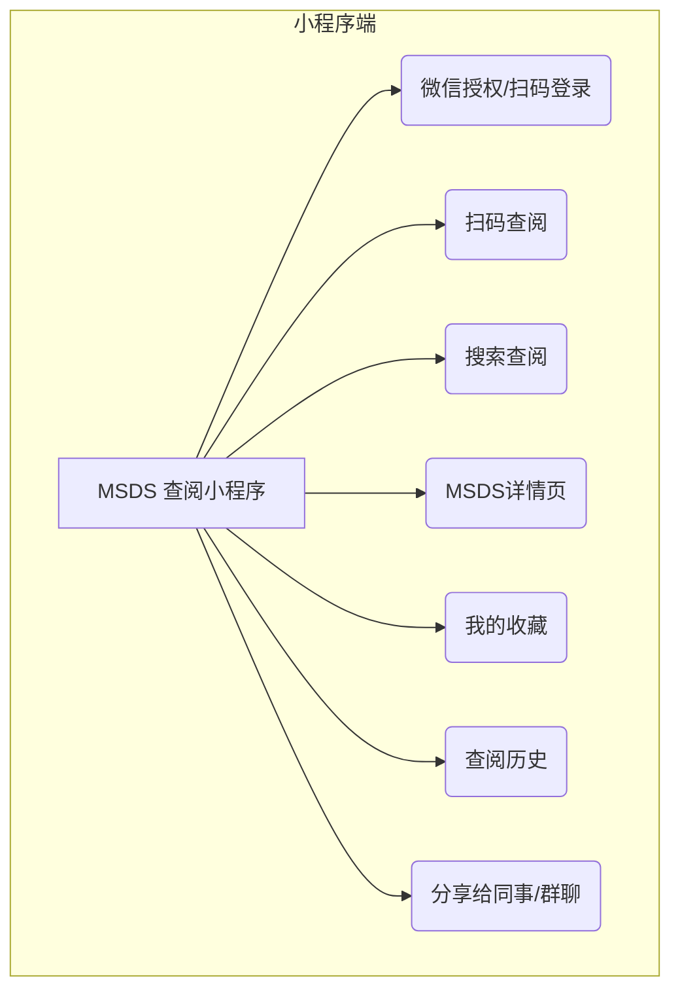
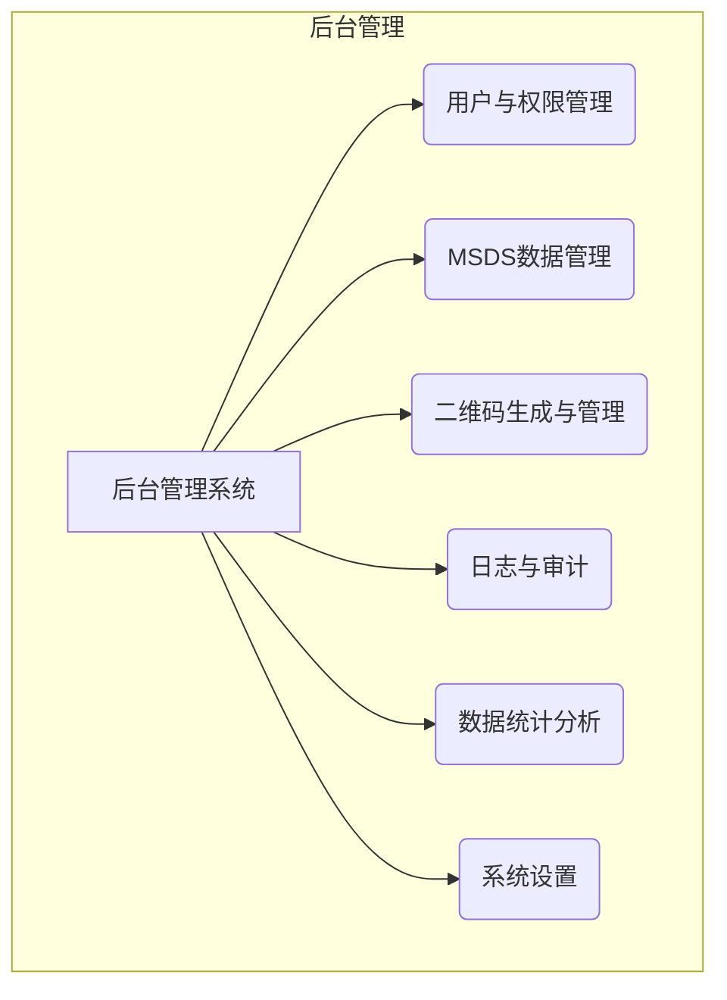
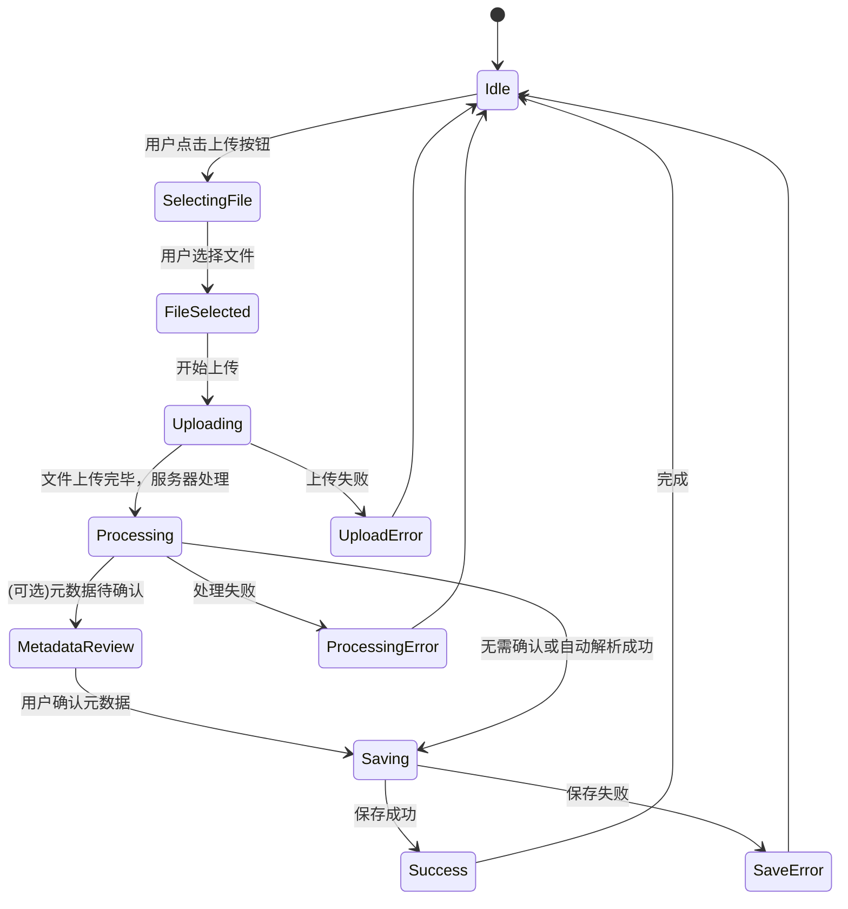
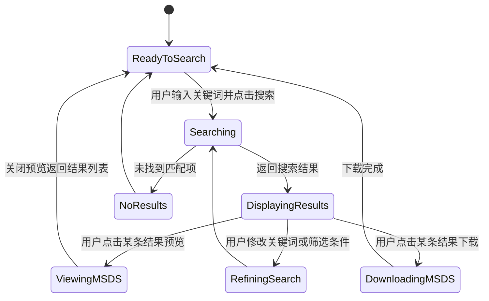

# 产品需求文档 (PRD) - MSDS实验室管理系统

## 1. 文档信息

### 1.1 版本历史
| 版本 | 日期       | 作者 | 说明                     |
|------|------------|------|--------------------------|
| v1.0 | 2025-01-27 | AI PM | 初稿，基于初始产品构想 |
| v1.1 | 2026-03-17 | AI PM | 结合当前系统实现状态完成商业化增强与验收矩阵修订 |
| v1.2 | 2026-03-18 | AI PM | 合并移动端PRD细节，补充小程序演进场景 |
| v1.3 | 2026-03-18 | AI PM | 补充已实现功能清单与页面/模块索引 |

### 1.2 文档目的
本文档旨在详细定义“MSDS (化学品安全技术说明书) 管理文件系统”的产品需求、目标用户、核心功能、非功能性需求及成功衡量指标。它是产品设计、开发、测试和迭代的依据。

### 1.3 相关文档引用
- [产品路线图 (Roadmap.md)](Roadmap.md)
- [用户故事地图 (User_Story_Map.md)](User_Story_Map.md)
- [产品评估指标框架 (Metrics_Framework.md)](Metrics_Framework.md)
- [技术架构文档 (Technical_Architecture.md)](Technical_Architecture.md)

## 2. 产品概述

### 2.1 产品名称与定位
- **产品名称**: MSDS实验室管理系统
- **产品定位**: 一款专为实验室科研机构设计的，以微信小程序为核心查阅工具、PC/Web端为后台管理中心的化学品安全技术说明书 (MSDS) 电子化、集中化管理与便捷查阅解决方案。

### 2.2 产品愿景与使命
- **产品愿景**: 成为全球科研实验室首选的智能化MSDS管理解决方案，让化学品信息触手可及，全面提升实验室安全标准。
- **产品使命**: 通过提供高效、可靠、易用的MSDS管理工具，赋能科研人员安全、合规地进行科学研究，最大限度降低化学品使用风险。

### 2.3 价值主张与独特卖点 (USP)
- **高效管理**: 实现MSDS文档的集中存储、版本控制、快速检索和动态更新，替代繁琐的纸质管理。
- **便捷查阅**: 支持多维度关键词搜索，提供清晰的在线预览和下载功能，确保科研人员随时随地获取准确的MSDS信息。
- **合规遵从**: 辅助实验室满足安全法规对MSDS管理的要求，如记录查阅日志、提醒MSDS更新等。
- **安全保障**: 快速提供化学品危害信息、应急处置措施和个体防护建议，直接提升实验室操作安全性和应急响应能力。
- **专为实验室设计**: 深入理解科研场景需求，提供贴合实验室工作流程的功能和用户体验。

### 2.4 目标平台列表
- **核心用户端 - 微信小程序**: 
  - 微信版本: 7.0+
  - iOS系统: 10.0+
  - Android系统: 5.0+ (API Level 21+)
  - 开发框架: UniApp (Vue.js生态)
  - 包大小限制: 主包<2MB, 总包<20MB
  - 功能定位: 科研人员日常扫码、搜索、查阅MSDS的主要入口
- **管理后台 - Web端**: 
  - Chrome: 90+ (推荐)
  - Firefox: 88+
  - Microsoft Edge: 90+
  - Safari: 14+
  - 分辨率: 1366x768+ (推荐1920x1080)
  - 技术栈: React 18.3.0 + Ant Design 5.21.1 + TypeScript
  - 功能定位: 管理员进行MSDS上传、编辑、用户管理、系统配置等复杂操作的主要平台
- **服务器部署平台**:
  - Windows 11 + WSL2 (开发环境)
  - Docker Desktop for Windows
  - Linux服务器 (生产环境推荐)
  - 容器编排: Docker Compose
- **数据库平台**:
  - MySQL 8.0.42+
  - Redis 7.0+
  - 字符集: utf8mb4

### 2.5 产品核心假设
- 实验室科研机构普遍存在MSDS管理效率低下、查阅不便的问题。
- 科研人员对快速、准确获取MSDS信息有强烈需求。
- 电子化、智能化的安全智库能显著提升实验室的安全管理水平和科研效率。
- 用户愿意为解决MSDS管理痛点的专用软件付费或投入资源。

### 2.6 商业模式概述 (如适用)
- **初步设想**: 
    - **软件许可模式**: 针对机构的一次性购买或年度许可。
    - **SaaS订阅模式**: (未来Web版) 按用户数或存储空间提供不同层级的订阅服务。
    - **私有化部署服务**: 为有特殊数据安全需求的大型机构提供本地部署方案。

## 3. 用户研究

### 3.1 目标用户画像

#### 3.1.1 科研人员 (主要用户)
- **人口统计特征**: 年龄22-55岁，硕士及以上学历居多，专业背景为化学、生物、医药、材料科学等。
- **行为习惯与偏好**: 
    - 每日或频繁接触多种化学试剂。
    - 工作严谨，注重实验安全和数据准确性。
    - 习惯使用电脑进行文献检索、数据分析和信息查询。
    - 对效率有较高要求，希望快速获取所需信息。
- **核心需求与痛点**:
    - **需求**: 实验前快速了解所用化学品的物理性质、化学性质、毒性、健康危害、燃爆风险、操作注意事项、个体防护要求、存储条件、泄漏应急处理、急救措施等。
    - **痛点**: 
        - 纸质MSDS查找费时费力，易丢失、损坏、版本陈旧。
        - 不同供应商提供的MSDS格式不一，信息查找困难。
        - 紧急情况下难以快速定位关键安全信息。
- **动机与目标**: 
    - 确保自身和他人安全。
    - 遵守实验室安全规定和操作规程。
    - 高效、顺利地完成科研实验任务。

#### 3.1.2 实验室管理员/安全负责人 (关键用户)
- **人口统计特征**: 年龄30-60岁，通常具有相关专业背景和管理经验，熟悉实验室安全法规和标准。
- **行为习惯与偏好**: 
    - 负责实验室化学品的采购、入库、存储、使用、废弃等全生命周期管理中的安全监督。
    - 关注实验室的整体安全状况和合规性。
    - 需要定期进行安全检查、组织安全培训。
- **核心需求与痛点**:
    - **需求**: 统一管理实验室所有化学品的MSDS；确保MSDS文件齐全、版本最新、易于取用；追踪MSDS的更新与查阅情况；应对内外部安全审计和检查。
    - **痛点**: 
        - MSDS收集、整理、更新工作量大，易疏漏。
        - 难以确保所有人员都能方便获取到最新版MSDS。
        - 缺乏有效的MSDS培训和查阅记录机制。
- **动机与目标**: 
    - 提升实验室整体安全管理水平，预防安全事故。
    - 确保实验室运营符合相关法律法规要求。
    - 降低管理成本，提高管理效率。

### 3.2 用户场景分析

#### 3.2.1 核心使用场景详述
1.  **场景一: 科研人员通过扫码快速查阅MSDS (小程序核心场景)**
    *   **用户**: 科研人员李研究员
    *   **情景**: 李研究员在实验台上看到一瓶不熟悉的化学试剂，试剂瓶上贴有系统生成的二维码。
    *   **需求**: 他需要立即了解该化学品的核心安全信息，以决定如何操作和存放。
    *   **当前做法 (痛点)**: 如果没有二维码，他需要记住化学品名称，然后回到电脑前搜索，过程繁琐且容易中断实验思路。
    *   **期望系统支持**: 李研究员拿出手机，打开微信小程序，使用扫一扫功能扫描试剂瓶上的二维码。小程序立即跳转到该化学品的MSDS详情页，优先展示GHS危险性象形图、核心危害、防护建议和应急措施等关键信息。他可以继续滚动查看完整的MSDS内容。

2.  **场景二: 科研人员实验前常规查阅MSDS**
    *   **用户**: 科研人员张工
    *   **情景**: 张工计划明天使用一种名为“丙酮”的化学试剂进行一项新的有机合成实验。
    *   **需求**: 他需要详细了解丙酮的闪点、爆炸极限、毒性、所需个人防护装备等。
    *   **期望系统支持**: 打开微信小程序，在顶部的搜索框输入“丙酮”或其CAS号，系统快速列出匹配的MSDS。点击查看，在线预览MSDS全文，特别是关注“危险性概述”、“急救措施”、“消防措施”、“泄漏应急处理”和“操作处置与储存”等章节。

3.  **场景三: 实验室管理员更新与分发MSDS**
    *   **用户**: 实验室安全管理员王老师
    *   **情景**: 实验室新采购了一批化学品，同时收到了供应商提供的最新版MSDS文件 (PDF格式)。
    *   **需求**: 王老师需要将这些新的MSDS录入系统，并替换掉系统中可能存在的旧版本，确保所有科研人员都能获取到最新信息。
    *   **当前做法 (痛点)**: 可能需要手动打印多份，分发到各个实验台，或者通过邮件群发，难以追踪是否所有人都收到并阅读。
    *   **期望系统支持**: 登录安全智库，进入管理模块。选择“上传MSDS”功能，批量或单个上传新的PDF文件。系统能够智能识别或允许手动关联化学品名称/CAS号。如果系统中已存在该化学品的旧版MSDS，系统提示更新并自动归档旧版本。王老师还可以选择向特定用户组发送更新通知。

4.  **场景四: 发生化学品意外泄漏时的应急响应 (小程序优势场景)**
    *   **用户**: 任何在场的实验室人员
    *   **情景**: 实验过程中，一个装有“浓硫酸”的试剂瓶意外打翻，少量液体溅出。
    *   **需求**: 现场人员需要立即知道浓硫酸的腐蚀性、正确的泄漏处理方法（如用何种吸收材料）、以及皮肤接触后的急救措施。
    *   **当前做法 (痛点)**: 慌乱中可能找不到纸质MSDS，或需要跑回办公室电脑查询，浪费宝贵的应急时间。
    *   **期望系统支持**: 现场任何人员立即拿出手机，打开小程序，通过扫描试剂瓶二维码或直接搜索“浓硫酸”，立即获取其MSDS。小程序页面应将“急救措施”和“泄漏应急处理”等应急关键信息置顶或通过醒目按钮一键直达，指导现场人员正确、安全地进行处置。

#### 3.2.2 边缘使用场景考量
-   **批量导入历史MSDS**: 对于已有大量存量MSDS的实验室，需要支持批量导入功能。
-   **MSDS定期审查与过期提醒**: 系统可根据MSDS的有效期或设定的审查周期，提醒管理员进行更新。
-   **多语言MSDS支持**: 对于国际化实验室，可能需要管理不同语言版本的MSDS。
-   **生成化学品安全标签辅助信息**: 系统可提取MSDS核心信息，辅助生成符合GHS规范的简易安全标签。
-   **离线访问需求**: 在网络条件不佳或断网情况下，Web后台应能访问缓存数据，小程序可访问已缓存的MSDS数据（通过微信小程序本地存储机制）。

### 3.3 用户调研洞察 (如适用)
*(注: 此处为占位，实际项目中应基于真实的用户访谈、问卷调研等结果填写)*
-   初步访谈表明，科研人员普遍认为现有MSDS管理方式效率低下，对电子化系统有较高期待。
-   安全管理员对MSDS的版本控制和更新通知功能表示出强烈兴趣。
-   用户期望系统界面简洁直观，搜索功能强大且精准。

## 4. 市场与竞品分析
*(注: 此处为通用框架，实际项目中需进行详细市场调研和竞品分析)*

### 4.1 市场规模与增长预测
-   实验室信息管理系统 (LIMS) 市场持续增长，其中安全管理是重要组成部分。
-   随着对实验室安全的日益重视和法规要求的提高，专业的MSDS管理软件市场潜力巨大。
-   目标市场主要为高等院校、科研院所、企业研发中心、第三方检测机构等的化学、生物、医药、材料实验室。

### 4.2 行业趋势分析
-   **数字化转型**: 实验室管理从传统纸质向数字化、信息化、智能化方向发展。
-   **安全与合规**: 全球范围内对实验室安全的法规要求趋严，合规性成为刚需。
-   **数据集成**: 安全智库有与LIMS、库存管理、采购系统等集成的趋势，形成一体化实验室管理平台。
-   **云计算与移动化**: SaaS模式和移动端应用逐渐普及，提升可访问性和便捷性。

### 4.3 竞争格局分析

#### 4.3.1 直接竞争对手详析
-   **商业MSDS数据库及管理软件**: 如 Chemwatch, Verisk 3E (原MSDSonline), SiteHawk 等。
    -   **优势**: 通常拥有庞大的MSDS数据库，功能全面，服务成熟，品牌知名度高。
    -   **劣势**: 价格昂贵，系统可能较为复杂，定制化程度不高，可能不完全贴合国内科研实验室的特定需求。
-   **通用文档管理系统**: 如 SharePoint, Confluence 等，被部分实验室用于管理MSDS。
    -   **优势**: 灵活性高，机构可能已有部署。
    -   **劣势**: 缺乏针对MSDS的专业功能（如CAS号检索、危险特性解析、版本控制、合规提醒等），管理效率和专业性不足。
-   **小型或开源MSDS管理工具**: 一些小型软件公司或开源社区提供的解决方案。
    -   **优势**: 可能价格较低或免费，轻量化。
    -   **劣势**: 功能相对简单，技术支持和持续更新可能不足，数据安全性存疑。

#### 4.3.2 间接竞争对手概述
-   **纸质管理方式**: 仍是许多实验室的主要管理手段，是本产品需要替代的主要对象。
-   **实验室自建的简单数据库/表格**: 部分有开发能力的实验室可能会用Access、Excel等自建简易管理工具。

### 4.4 竞品功能对比矩阵
| 特性/功能         | 本产品 (预期) | Chemwatch | Verisk 3E | 通用文档系统 | 开源工具 | 
|-------------------|---------------|-----------|-----------|--------------|----------|
| **核心MSDS管理**  |               |           |           |              |          |
| MSDS上传/存储     | ✅ (多种格式) | ✅         | ✅         | ✅ (通用)    | ✅ (部分) |
| 版本控制          | ✅             | ✅         | ✅         | 弱/无        | 部分     |
| 元数据编辑        | ✅             | ✅         | ✅         | 弱/自定义    | 部分     |
| **检索与查阅**    |               |           |           |              |          |
| CAS号/名称搜索    | ✅ (精准/模糊)| ✅         | ✅         | 弱/无        | 部分     |
| 全文检索          | ✅ (计划)     | ✅         | ✅         | ✅ (通用)    | 弱/无    |
| 在线预览          | ✅             | ✅         | ✅         | ✅ (通用)    | 部分     |
| **合规与安全**    |               |           |           |              |          |
| GHS信息展示       | ✅             | ✅         | ✅         | 无           | 弱/无    |
| 查阅日志          | ✅             | ✅         | ✅         | 弱/自定义    | 弱/无    |
| 更新提醒          | ✅             | ✅         | ✅         | 无           | 无       |
| **用户体验**      |               |           |           |              |          |
| 专为实验室设计    | ✅             | 较通用     | 较通用     | 通用         | 不一定   |
| 小程序+Web后台    | ✅             | Web       | Web       | Web/客户端   | 不一定   |
| 易用性            | 高             | 中-高     | 中-高     | 中           | 中-低    |
| **成本**          |               |           |           |              |          |
| 初始投入          | 中-低          | 高         | 高         | 中 (若已有)  | 低/无    |
| 维护成本          | 低             | 中-高     | 中-高     | 中           | 低/中    |

*(注: 此矩阵为初步预估，需详细调研确认)*

### 4.5 市场差异化策略
-   **专注科研场景**: 深度契合中国科研实验室的工作流程和管理习惯，提供更贴心的用户体验。
-   **移动+Web双端协同**: 微信小程序满足现场即时查阅需求，Web管理后台提供强大的数据管理能力，形成完整的使用闭环。
-   **易用性与性价比**: 提供简洁直观的操作界面，降低学习成本；制定有竞争力的价格策略，特别是针对预算有限的高校和中小型科研机构。
-   **本地化服务与支持**: 提供中文界面和及时的本地技术支持。
-   **数据安全与私有化部署**: 支持Docker容器化私有部署，允许机构自主管理MSDS数据，解决数据敏感性问题。

## 5. 产品功能需求

### 5.1 功能架构与模块划分

**小程序端 (用户侧)**

**后台管理系统 (Web/PC端)**

### 5.2 核心功能详述

#### 5.2.1 MSDS 数据管理模块

##### 5.2.1.1 MSDS 文件上传
-   **用户故事**: 作为实验室管理员，我想要上传单个或批量的MSDS文件（如PDF, DOCX, TXT, JPG/PNG图片格式），以便将化学品安全信息录入系统进行统一管理。
-   **用户价值**: 方便快捷地将MSDS文档电子化并集中存储。
-   **功能逻辑与规则**: 
    -   支持拖拽上传和选择文件上传两种方式。
    -   系统应能处理常见文档格式，对图片格式的MSDS，可考虑OCR识别（高级功能）。
    -   上传时，系统可尝试从文件名或文档内容中提取化学品名称、CAS号等关键信息供用户确认或编辑。
    -   对已存在的化学品，上传新MSDS时应提示是否覆盖或作为新版本。
    -   显示上传进度，对大文件上传有友好提示。
-   **交互要求**: 清晰的上传界面，明确的指引，实时的进度反馈。
-   **数据需求**: MSDS文件本身，关联的化学品信息。
-   **技术依赖**: 文件存储服务，可能的后台处理队列（针对大文件或OCR）。
-   **验收标准**:
    1.  成功上传至少三种不同格式 (PDF, DOCX, TXT) 的MSDS文件。
    2.  批量上传功能至少能一次成功上传5个文件。
    3.  上传过程中有明确的进度条显示。
    4.  上传同名化学品的新MSDS时，系统能提示版本处理选项。

##### 5.2.1.2 MSDS 元数据编辑
-   **用户故事**: 作为实验室管理员，我想要编辑MSDS的关键元数据，如化学品中英文名称、CAS号、供应商、生产日期、有效期、版本号、自定义分类、标签等，以便于精确检索、分类管理和信息追溯。
-   **用户价值**: 确保MSDS信息的准确性、完整性和规范性，提高管理效率。
-   **功能逻辑与规则**: 
    -   提供结构化的表单用于编辑元数据。
    -   CAS号应有格式校验。
    -   支持自定义分类和标签，方便用户按需组织。
    -   修改历史应有记录（高级功能）。
-   **交互要求**: 直观的表单界面，便捷的分类和标签选择器。
-   **数据需求**: 化学品名称（中/英）、CAS号、别名、分子式、供应商信息、生产日期、有效期、版本号、自定义分类、标签、危险性类别（GHS）等。
-   **验收标准**:
    1.  成功编辑MSDS条目的至少5项元数据，包括名称、CAS号、供应商、自定义分类和标签。
    2.  CAS号输入不符合规范格式时，系统给出提示。
    3.  自定义分类和标签能够成功创建、应用和移除。

##### 5.2.1.3 MSDS 版本控制
-   **用户故事**: 作为实验室管理员，当MSDS更新时，我希望能上传新版本并保留旧版本记录，以便追踪MSDS的变更历史，并确保使用的是最新有效版本。
-   **用户价值**: 保证MSDS信息的时效性，满足合规审计对历史记录的要求。
-   **功能逻辑与规则**: 
    -   同一化学品可以存在多个版本的MSDS。
    -   系统默认显示和使用最新版本的MSDS。
    -   用户可以查看历史版本列表，并预览或下载历史版本。
    -   版本信息应包含版本号、生效日期、上传时间、上传人等。
-   **交互要求**: 清晰的版本历史列表，易于区分当前版本和历史版本。
-   **数据需求**: 版本号，生效日期，上传时间，操作人，版本状态（当前/历史）。
-   **验收标准**:
    1.  为一个MSDS条目成功上传3个不同版本的文件。
    2.  系统能正确将最新上传的标记为当前版本。
    3.  用户可以查看并访问该MSDS的所有历史版本。

#### 5.2.2 MSDS 检索与查阅模块

##### 5.2.2.1 关键词搜索
-   **用户故事**: 作为科研人员或管理员，我想要通过化学品中英文名称、CAS号、别名、供应商、或自定义标签等关键词快速搜索到目标MSDS，以便获取安全信息或进行管理操作。
-   **用户价值**: 快速、准确地定位到所需的MSDS文档。
-   **功能逻辑与规则**: 
    -   支持单一关键词搜索和多关键词组合搜索（AND/OR逻辑，高级功能）。
    -   搜索范围应包括MSDS的元数据及可能的全文内容（全文检索为高级功能）。
    -   支持模糊匹配和精确匹配选项。
    -   搜索结果应分页显示，并按相关性或更新时间排序。
-   **交互要求**: 简洁易用的搜索框，智能的搜索建议（可选），清晰的搜索结果展示。
-   **数据需求**: 建立MSDS元数据和内容的索引。
-   **技术依赖**: 数据库索引优化，或引入全文搜索引擎 (如 Elasticsearch, Lucene)。
-   **验收标准**:
    1.  输入化学品中文名（如“丙酮”），能搜到匹配的MSDS。
    2.  输入CAS号（如“67-64-1”），能精确匹配到MSDS。
    3.  输入自定义标签，能筛选出包含该标签的MSDS。
    4.  搜索结果列表清晰展示化学品名、CAS号、版本号、更新日期等关键信息。
    5.  搜索响应时间在可接受范围内（如平均<2秒）。

##### 5.2.2.2 MSDS 在线预览 (小程序优化)
-   **用户故事**: 作为科研人员，我想要在小程序中打开MSDS后，能快速看到关键安全信息摘要，并能流畅地查看全文。
-   **用户价值**: 在移动端快速获取核心信息，提升应急响应和日常查阅效率。
-   **功能逻辑与规则**: 
    -   小程序详情页顶部应优先展示从MSDS解析出的核心信息：GHS象形图、危险性概述、防护建议、急救措施等。
    -   下方嵌入PDF或图片格式的MSDS全文，支持手势缩放、滑动翻页。
    -   加载速度进行优化，保证快速响应。
-   **交互要求**: 关键信息突出，全文阅读流畅，符合移动端操作习惯。
-   **验收标准**:
    1.  小程序端成功打开MSDS，并优先展示关键安全信息摘要。
    2.  嵌入的全文预览支持手势缩放和翻页。

##### 5.2.2.3 MSDS 分享 (小程序)
-   **用户故事**: 作为科研人员，当我发现一个重要的MSDS信息时，我希望能方便地分享给同组的同事或在工作群里提醒大家注意。
-   **用户价值**: 促进团队内的安全信息同步，提高协作效率。
-   **功能逻辑与规则**: 
    -   提供“分享”按钮，可生成小程序卡片。
    -   分享卡片应包含化学品名称和核心危险性提示。
    -   用户点击卡片后可直接进入该MSDS的详情页。
-   **验收标准**:
    1.  成功将一个MSDS通过微信分享给好友或群聊。
    2.  接收方能通过点击分享卡片正常打开MSDS详情页。

#### 5.2.3 用户管理与权限模块 (简化描述，后续可细化)
-   **功能描述**: 管理员可以创建、编辑、禁用用户账户；可以定义用户角色（如管理员、普通查阅者、部门管理员）；为角色分配不同的操作权限（如MSDS上传、编辑、删除权限，用户管理权限等）。用户需凭账户密码登录系统。
-   **用户价值**:保障系统安全，实现不同用户职责分离。
-   **验收标准**: 
    1.  管理员能成功创建新用户并分配角色。
    2.  不同角色的用户登录后，其操作界面和权限符合设定。
    3.  未授权用户无法执行受限操作。

### 5.3 次要功能描述 (可简化结构)
-   **MSDS收藏/常用列表**: 用户可以将常用的MSDS添加到个人收藏夹，方便快速访问。
-   **MSDS分享**: 用户可以将特定MSDS通过邮件或生成链接的方式分享给其他授权用户（需考虑权限）。
-   **操作日志记录**: 系统记录用户的关键操作（登录、MSDS上传、编辑、删除、下载等），便于审计和问题追踪。
-   **MSDS过期/复审提醒**: 管理员可设置MSDS的有效期或复审周期，系统在临近时发出提醒。

### 5.4 未来功能储备 (Backlog)
-   **移动端支持**: 开发响应式Web界面或独立的移动App (iOS/Android)，方便移动查阅。
-   **GHS标签与象形图**: 根据MSDS信息自动生成或辅助生成GHS标签和危险性象形图。
-   **化学品库存关联**: 与实验室化学品库存管理系统集成，实现MSDS与实际库存的联动。
-   **多语言支持**: 系统界面和MSDS内容支持多种语言切换。
-   **API接口**: 提供API接口，方便与其他实验室信息系统 (LIMS, ELN) 集成。
-   **风险评估辅助**: 基于MSDS信息，提供初步的化学品风险评估辅助工具。
-   **培训管理模块**: 记录用户MSDS培训情况。

## 6. 用户流程与交互设计指导

### 6.1 核心用户旅程地图

1.  **科研人员查阅MSDS**: 
    *   打开系统 -> (登录) -> 输入搜索关键词 -> 查看搜索结果 -> (筛选/排序) -> 点击目标MSDS -> 在线预览内容 / 下载MSDS -> 获取所需安全信息。
2.  **管理员上传新MSDS**: 
    *   打开系统 -> 登录 -> 进入MSDS管理模块 -> 点击“上传”按钮 -> 选择文件/拖拽文件 -> (系统尝试解析元数据) -> 管理员确认/编辑元数据 -> 保存 -> (系统进行版本处理) -> 上传完成。

### 6.2 关键流程详述与状态转换图

#### MSDS上传流程

#### MSDS检索流程

### 6.3 对设计师 (UI/UX Agent) 的界面原型参考说明和要求
-   **整体风格**: 专业、简洁、现代化，符合科研环境的严谨性。避免不必要的装饰，突出信息本身。
-   **布局**: 
    -   **主界面/仪表盘**: 显著的搜索框是核心；可考虑展示最近查阅、最近更新、或收藏的MSDS列表；管理员视图可包含待办事项（如过期提醒）。
    -   **搜索结果页**: 列表形式展示，每条结果应清晰显示化学品名称、CAS号、版本、更新日期、危险性摘要（如GHS小图标）。提供有效的筛选器（按分类、标签、供应商等）和排序选项（按相关度、更新日期等）。
    -   **MSDS详情/预览页**: 文档预览区域占据主要空间；侧边栏或顶部显示关键元数据、版本信息、操作按钮（下载、打印、分享、收藏、编辑（管理员权限））。
    -   **管理后台界面 (针对管理员)**: 左侧导航栏组织各管理模块（用户管理、MSDS管理、系统设置等）；右侧为具体操作区域，表单设计应清晰、分组合理，批量操作应便捷。
-   **色彩与字体**: 
    -   色彩方案应考虑可访问性，确保足够的对比度。可使用警示色（黄、橙、红）来突出危险信息，但需谨慎使用，避免视觉疲劳。
    -   字体选择清晰易读的无衬线字体。
-   **交互反馈**: 
    -   操作应有及时反馈（如加载提示、成功提示、错误提示）。
    -   复杂操作（如批量上传）应有进度指示。
-   **关键信息高亮**: 在MSDS预览或摘要中，对于如“危险性”、“急救措施”等关键安全信息，应考虑通过视觉手段（如特殊图标、背景色块、加粗）使其易于被用户快速识别。
-   **响应式设计考虑**: Web管理后台应采用响应式设计，支持不同分辨率屏幕。小程序界面需针对移动端触摸操作优化。

### 6.4 交互设计规范与原则建议
-   **一致性**: 界面元素、术语、操作方式在整个系统中保持一致。
-   **效率优先**: 减少用户操作步骤，优化高频任务的交互路径。
-   **容错性**: 提供撤销操作（如适用），对可能产生严重后果的操作（如删除）进行二次确认。
-   **易学性**: 新用户能够快速上手，无需复杂培训。
-   **可访问性 (Accessibility)**: 遵循WCAG等可访问性标准，确保残障用户也能使用。

## 7. 非功能需求

### 7.1 性能需求

**响应时间要求**:
-   **Web管理后台**:
    -   页面首次加载: ≤3秒 (基于React 18 + UmiJS优化)
    -   页面切换: ≤500ms (SPA路由)
    -   API响应时间: ≤500ms (Spring Boot + MyBatis Plus)
    -   大数据量查询: ≤2秒 (分页查询，每页20条)
-   **微信小程序**:
    -   小程序启动: ≤2秒 (UniApp框架优化)
    -   页面跳转: ≤300ms
    -   二维码扫描识别: ≤1秒
    -   MSDS文档加载: ≤3秒
-   **文件处理**:
    -   MSDS文件上传: 支持≤10MB，上传时间≤30秒
    -   二维码生成: ≤1秒
    -   PDF文档预览: ≤2秒

**并发性能** (基于Docker容器资源配置):
-   **后端服务** (msdsbackend):
    -   JVM配置: -Xms512m -Xmx1024m
    -   支持并发用户: 100个
    -   Tomcat线程池: 最大200线程
-   **数据库** (msdsmysql):
    -   连接池配置: 初始5个，最大50个连接
    -   查询缓存: 启用MySQL查询缓存
-   **缓存** (msdsredis):
    -   内存配置: 256MB
    -   缓存命中率: ≥80%
-   **系统可用性**: 99.5% (Docker健康检查 + 自动重启)

**存储需求**:
-   **数据库存储** (MySQL): 预计50GB（3年），使用Docker命名卷持久化
-   **文件存储**: 预计200GB（MSDS文档），Docker卷挂载
-   **备份策略**: 
    -   数据库全量备份: 每日凌晨执行1次，保留30天。
    -   数据库增量备份: 每4小时执行1次，保留7天。
    -   文档文件备份: 文件卷每日快照，保留15天。
    -   备份有效性校验: 每周执行1次恢复演练并输出报告。
    -   备份存放策略: 同机房与异地各保留1份，防止单点灾难。

### 7.2 安全需求

**身份认证与授权** (基于RuoYi + Spring Security):
-   **JWT Token认证**:
    -   Token有效期: 120分钟 (可配置)
    -   自动刷新机制: 支持
    -   Token存储: Redis缓存
    -   多端登录控制: 支持单点登录
-   **基于角色的权限控制(RBAC)**:
    -   角色管理: sys_role表
    -   权限控制: sys_menu表 (菜单权限)
    -   数据权限: 支持部门数据权限控制
    -   接口权限: @PreAuthorize注解控制
-   **密码安全策略**:
    -   密码加密: BCrypt算法
    -   密码强度: 最少8位，包含字母数字
    -   登录失败锁定: 5次失败锁定30分钟
    -   密码有效期: 90天 (可配置)

**数据安全** (基于MySQL + Docker):
-   **数据库安全**:
    -   连接加密: SSL连接 (可选)
    -   用户权限: 专用数据库用户 (msds_user)
    -   访问控制: 仅容器内网络访问
    -   数据备份: 每日自动备份到Docker卷
-   **敏感数据保护**:
    -   字段加密: 使用AES-256加密敏感字段
    -   数据脱敏: 日志中敏感信息脱敏
    -   软删除: 使用del_flag，数据不物理删除
    -   审计日志: sys_oper_log记录所有操作

**网络安全** (基于Docker + Nginx):
-   **传输加密**:
    -   HTTPS: SSL/TLS 1.2+ (Nginx配置)
    -   证书管理: 自签名证书 (开发) / Let's Encrypt (生产)
    -   HTTP重定向: 强制HTTPS访问
-   **API安全防护**:
    -   接口限流: 基于IP和用户的限流策略
    -   参数验证: @Valid注解 + 自定义验证器
    -   SQL注入防护: MyBatis Plus预编译语句
    -   XSS防护: Spring Security XSS过滤器
    -   CSRF防护: CSRF Token验证
-   **容器安全**:
    -   非root用户: 容器以非特权用户运行
    -   网络隔离: Docker bridge网络隔离
    -   资源限制: 容器CPU和内存限制
    -   镜像安全: 定期更新基础镜像

### 7.3 可用性与可访问性标准
-   **易用性**: 
    -   用户完成核心任务（搜索、预览、上传MSDS）的平均操作步骤数应尽可能少。
    -   首次使用的用户在无指导情况下，完成核心任务的成功率 > 80%。
    -   提供清晰的错误提示和用户引导。
-   **可访问性**: 
    -   界面设计应符合WCAG 2.1 AA级别标准。
    -   支持键盘导航。
    -   确保足够的色彩对比度，方便色弱用户。
    -   为图片和非文本内容提供替代文本（如适用）。
-   **兼容性**: 
    -   **Web管理后台**: 支持主流浏览器最新版本（Chrome 90+, Firefox 88+, Edge 90+, Safari 14+）。
    -   **微信小程序**: 兼容微信7.0+版本。
    -   **响应式设计**: Web界面支持1920x1080及以上分辨率，最小支持1366x768。

### 7.4 合规性要求
-   系统设计应能辅助用户机构满足其所在国家/地区关于化学品安全管理的法律法规要求，如中国的《危险化学品安全管理条例》等对MSDS内容、更新、培训的要求。
-   (若涉及个人信息) 需符合GDPR、CCPA或中国《个人信息保护法》等数据隐私法规。

### 7.5 容器化部署要求
-   **Docker环境要求**: 
    -   Docker Engine 20.10+
    -   Docker Compose 2.0+
    -   支持Windows 11 + WSL2环境
-   **容器资源配置**:
    -   MySQL容器: 最小2GB内存，推荐4GB
    -   Redis容器: 最小512MB内存，推荐1GB
    -   后端应用容器: 最小1GB内存，推荐2GB
    -   前端容器: 最小512MB内存，推荐1GB
    -   Nginx容器: 最小256MB内存，推荐512MB
-   **容器健康检查**: 所有服务容器必须配置健康检查机制，确保服务可用性
-   **数据持久化**: 
    -   MySQL数据目录必须挂载到宿主机持久化存储
    -   Redis数据目录必须配置持久化策略
    -   应用日志目录必须挂载到宿主机便于监控
-   **容器网络**: 使用Docker自定义网络，确保容器间通信安全性和隔离性
-   **容器安全**: 
    -   容器以非root用户运行
    -   限制容器资源使用上限
    -   定期更新基础镜像安全补丁

### 7.6 数据统计与分析需求
-   **MSDS查阅统计**: 按化学品、按用户/部门、按时间段统计MSDS的查阅次数、下载次数。
-   **MSDS库统计**: 统计当前库中MSDS总数、各分类占比、过期MSDS数量等。
-   **用户行为分析**: 热门搜索词、零结果搜索词、用户平均会话时长、功能使用频率等。
-   **系统性能监控**: 服务器响应时间、错误率、资源使用率等。
-   **数据导出**: 允许管理员导出统计报告（如CSV, Excel格式）。

## 8. 技术架构考量

### 8.1 技术栈详细规范

-   **技术栈说明（基于RuoYi框架二次开发）**

    > **重要说明**: 本项目基于开源RuoYi框架进行二次开发，充分利用RuoYi提供的用户管理、权限控制、代码生成、系统监控等基础功能，在此基础上扩展MSDS业务模块。
    
    -   **小程序端技术栈**: 
        -   框架: UniApp (Vue.js生态)
        -   UI组件: uView UI + ColorUI
        -   状态管理: Vuex
        -   网络请求: RuoYi封装的request模块
        -   开发工具: HBuilderX + 微信开发者工具
        -   运行环境: Windows 11主机（非Docker）
        -   兼容性: 微信7.0+, iOS 10+, Android 5.0+
        -   包大小限制: 主包<2MB, 总包<20MB
        -   **RuoYi集成**: 登录认证、Token管理、权限验证
    
    -   **Web管理后台技术栈**: 
        -   前端框架: React 18.3.0
        -   UI组件库: Ant Design 5.21.1 + Ant Design Pro 2.7.19
        -   路由框架: UmiJS 4.0.7
        -   状态管理: 内置状态管理
        -   构建工具: UmiJS内置构建工具
        -   开发语言: TypeScript 5.6.2
        -   Hooks工具: ahooks
        -   运行环境: Docker容器内
        -   浏览器要求: Chrome 90+, Firefox 88+, Edge 90+, Safari 14+
        -   **RuoYi集成**: 布局组件、菜单管理、权限路由
    
    -   **后端服务技术栈**: 
        -   框架: Spring Boot 3.3.0
        -   基础框架: RuoYi 3.8.8
        -   ORM: MyBatis Plus
        -   认证授权: JWT + Spring Security
        -   API文档: Springdoc OpenAPI 3.0 (Swagger UI)
        -   JDK版本: Eclipse Temurin 17
        -   运行环境: Docker容器内（必须）
        -   JVM配置: -Xms512m -Xmx1024m
        -   前后端分离架构，RESTful API
        -   **RuoYi核心功能**: 用户管理、角色权限、菜单管理、字典配置、参数设置、定时任务、系统监控、在线用户、日志管理等
        -   **MSDS扩展模块**: 在RuoYi基础上扩展化学品管理、MSDS文件管理、二维码生成等业务功能
    
    -   **数据库设计**: 
        -   主数据库: MySQL 8.0.42
        -   字符集: utf8mb4
        -   排序规则: utf8mb4_unicode_ci
        -   缓存数据库: Redis 7
        -   数据持久化: Docker命名卷
        -   初始化脚本: SQL脚本自动执行
        -   **RuoYi标准表**: sys_user、sys_role、sys_menu、sys_dept等系统表
        -   **MSDS业务表**: msds_chemical、msds_document、msds_qrcode等扩展表
    
    -   **部署架构**: 
        -   容器编排: Docker Compose
        -   宿主环境: Windows 11 + WSL2
        -   Docker版本: Docker Desktop for Windows
        -   反向代理: Nginx (容器名: msdsnginx)
        -   网络模式: bridge
        -   服务发现: Docker内部DNS
        -   数据持久化: Docker命名卷
        -   **文件存储**: Docker卷挂载方式存储MSDS文件，确保数据持久化和高可用性

-   **开发环境架构**
    -   **Windows主机**: 代码编辑（Cursor/VSCode/IntelliJ IDEA），移动端开发（HBuilderX）
    -   **WSL2 Docker**: 后端（Java Spring Boot）和前端（React）容器化运行
    -   **MySQL容器**: 数据库服务，端口3306映射到主机
    -   **Nginx容器**: 前端静态文件服务和反向代理
    -   **网络配置**: 
        -   容器间通信：使用容器名称（如mysql:3306）
        -   主机访问：通过localhost映射端口
        -   移动端访问：通过WSL2的局域网IP地址

### 8.2 系统集成需求

**容器间通信架构**:
- **网络配置**: 使用Docker bridge网络 `msds_network`
- **服务发现**: 通过Docker内部DNS解析服务名
- **前端容器** (msdsfrontend): 
  - 端口映射: 3000:8000
  - 依赖: msdsbackend
  - 通信方式: HTTP API调用
- **后端容器** (msdsbackend):
  - 端口映射: 18081:8080, 5005:5005 (调试), 2222:22 (SSH)
  - 依赖: msdsmysql, msdsredis
  - 健康检查: HTTP GET /actuator/health
- **数据库容器** (msdsmysql):
  - 端口映射: 3306:3306
  - 数据持久化: msdsmysql_data命名卷
  - 字符集: utf8mb4
- **缓存容器** (msdsredis):
  - 端口映射: 容器内访问为主（默认不对宿主机暴露）
  - 数据持久化: msdsredis_data命名卷
- **代理容器** (msdsnginx):
  - 端口映射: 180:80, 1443:443
  - SSL证书挂载: /etc/nginx/ssl
  - 静态资源: /usr/share/nginx/html

**外部系统集成**:
- **微信小程序API**: 通过RuoYi封装的HTTP客户端
- **第三方化学品数据库**: RESTful API集成
- **邮件服务**: Spring Boot Mail Starter
- **文件存储**: Docker卷挂载 + MinIO对象存储（可选）
- **监控集成**: Actuator健康检查端点
- **身份认证集成**: 可能需要与机构现有的统一身份认证系统 (如LDAP, OAuth2, SAML) 集成
- **(未来) LIMS/ELN集成**: 通过API与实验室信息管理系统 (LIMS) 或电子实验记录本 (ELN) 集成，实现数据共享

### 8.3 技术依赖与约束
-   **操作系统兼容性**: 
    -   Web管理后台：兼容主流浏览器（Chrome, Firefox, Edge, Safari最新版本）
    -   开发环境：Windows 11 + WSL2 + Docker Desktop
    -   生产环境：支持Docker运行的Linux服务器或云平台
-   **第三方库/组件许可**: 使用的开源库或商业组件需注意其许可协议，避免法律风险。
-   **性能与资源限制**: 
    -   Docker容器资源配置：建议8GB+内存，4核CPU
    -   MySQL数据库：建议预留2GB内存
    -   需考虑目标用户机构的硬件环境和网络条件

### 8.4 数据模型建议 (关键实体)

**核心实体关系** (基于RuoYi框架 + MSDS业务扩展):

1. **RuoYi系统核心表**:
   - **sys_user** (用户): user_id, user_name, nick_name, email, phonenumber, sex, avatar, password, status, del_flag, login_ip, login_date, create_by, create_time, update_by, update_time, remark
   - **sys_role** (角色): role_id, role_name, role_key, role_sort, data_scope, menu_check_strictly, dept_check_strictly, status, del_flag, create_by, create_time, update_by, update_time, remark
   - **sys_dept** (部门): dept_id, parent_id, ancestors, dept_name, order_num, leader, phone, email, status, del_flag, create_by, create_time, update_by, update_time
   - **sys_menu** (菜单): menu_id, menu_name, parent_id, order_num, path, component, query, is_frame, is_cache, menu_type, visible, status, perms, icon, create_by, create_time, update_by, update_time, remark

2. **MSDS业务扩展表**:
   - **msds_chemical** (化学品): chemical_id, product_name, product_english_name, cas_number, molecular_formula, molecular_weight, category_id, hazard_level, supplier_id, storage_condition, emergency_contact, status, del_flag, create_by, create_time, update_by, update_time, remark
   - **msds_supplier** (供应商): supplier_id, supplier_name, contact_person, contact_phone, contact_email, address, website, status, del_flag, create_by, create_time, update_by, update_time, remark
   - **msds_document** (MSDS文档): document_id, chemical_id, file_name, file_path, file_size, file_type, version, language, upload_user_id, upload_time, status, del_flag, create_by, create_time, update_by, update_time, remark
   - **msds_qrcode** (二维码): qrcode_id, chemical_id, qr_content, qr_image_path, generate_time, print_count, last_scan_time, status, del_flag, create_by, create_time, update_by, update_time, remark
   - **msds_inventory** (库存): inventory_id, chemical_id, location, quantity, unit, batch_number, expiry_date, purchase_date, purchase_price, status, del_flag, create_by, create_time, update_by, update_time, remark

3. **关联关系表**:
   - **sys_user_role** (用户角色关联): user_id, role_id
   - **sys_role_menu** (角色菜单关联): role_id, menu_id
   - **sys_role_dept** (角色部门关联): role_id, dept_id
   - **msds_chemical_category** (化学品分类): category_id, category_name, parent_id, order_num, status, del_flag, create_by, create_time, update_by, update_time, remark

**数据库设计约束**:
- 字符集: utf8mb4
- 排序规则: utf8mb4_unicode_ci  
- 引擎: InnoDB
- 主键: 统一使用BIGINT AUTO_INCREMENT
- 软删除: 使用del_flag字段 (0=正常, 2=删除)
- 审计字段: create_by, create_time, update_by, update_time
- 外键约束: 使用逻辑外键，不使用物理外键

**说明**: 充分利用RuoYi的BaseEntity，所有业务表自动拥有创建人、创建时间、更新人、更新时间、备注等字段。

## 9. 验收标准汇总

### 9.1 功能验收标准矩阵
| 功能模块         | 功能点                     | 优先级 | 验收标准 (简述)                                                                 | 负责人 (占位) | 状态 (占位) |
|------------------|----------------------------|--------|---------------------------------------------------------------------------------|---------------|-------------|
| **MSDS数据管理** | 多格式导入与预览           | P0     | 支持PDF/DOCX/TXT/CSV/XML导入；支持导入前预览与导入模板下载                          | 开发团队      | 已实现      |
|                  | MSDS元数据编辑             | P0     | 编辑名称/CAS/供应商等；CAS校验；自定义分类/标签                                   | 开发团队      | 已实现      |
|                  | MSDS版本控制               | P0     | 保留历史版本；默认最新；可查历史版本                                              | 开发团队      | 已实现      |
| **MSDS检索查阅** | 智能搜索                   | P0     | 支持搜索建议、热门词、历史记录、相关文档推荐                                       | 开发团队      | 已实现      |
|                  | 在线预览与下载             | P0     | 支持在线预览、单个/批量PDF导出、下载审计记录                                       | 开发团队      | 已实现      |
| **数据分析**     | 多维统计看板               | P1     | 提供汇总、趋势、分类、风险、排行、月度新增、用户活跃度、导出报告                    | 开发团队      | 已实现      |
| **日志与审计**   | 审计日志与审计统计         | P1     | 支持按MSDS追踪、操作类型分布、操作人员活跃度、导出                                 | 开发团队      | 已实现      |
| **流程协同**     | 工作流看板与任务管理       | P1     | 支持任务创建、分配、状态流转、评论、活动记录                                       | 开发团队      | 已实现      |
|                  | MSDS审批流程闭环           | P1     | 支持待审批任务、当前审批步骤跟踪、审批历史可追溯                                   | 开发团队      | 进行中      |
| **导入治理**     | 导入任务进度追踪           | P1     | 支持任务进度、失败原因、超时任务识别、过期记录清理                                 | 开发团队      | 已实现      |
| **通知与提醒**   | MSDS更新通知               | P2     | 管理员上传新版后，可按角色/部门触达相关人员                                        | 开发团队      | 规划中      |
|                  | MSDS过期提醒               | P2     | 支持按复审周期生成提醒任务，并纳入工作流闭环                                       | 开发团队      | 规划中      |

状态说明：已实现=代码与页面均可用；进行中=后端能力已具备，前端与流程仍在完善；规划中=需求明确待排期。

### 9.2 性能验收标准
-   搜索响应时间: 95% < 2s (10万数据量)
-   预览加载时间: 5MB PDF < 3s
-   并发用户: 50查阅 + 10管理
-   客户端启动时间: < 10s

### 9.3 质量验收标准
-   **Bug密度**: 严重Bug < 0.1个/KLOC；主要Bug < 0.5个/KLOC。
-   **代码覆盖率**: 单元测试覆盖率 > 70%；核心模块 > 80%。
-   **系统稳定性**: 平均无故障运行时间 (MTBF) > 99.9%。
-   **文档完整性**: 用户手册、管理员手册、API文档（如适用）齐全准确。

### 9.4 已实现功能清单与页面/模块索引

| 功能域 | 典型入口（路由） | 前端页面 | 后端控制器 | 交付状态 |
|--------|------------------|----------|------------|----------|
| MSDS 管理与导入 | /msds/main | [Msds/index.tsx](../../msdsPC/ruoyi-MsdsPc-react/react-ui/src/pages/Msds/index.tsx), [ImportModal.tsx](../../msdsPC/ruoyi-MsdsPc-react/react-ui/src/pages/Msds/components/ImportModal.tsx) | [MsdsMainController.java](../../msdsPC/ruoyi-MsdsPc-react/ruoyi-admin/src/main/java/com/ruoyi/web/controller/system/MsdsMainController.java), [MsdsImportProgressController.java](../../msdsPC/ruoyi-MsdsPc-react/ruoyi-admin/src/main/java/com/ruoyi/web/controller/system/MsdsImportProgressController.java) | 已实现 |
| MSDS 详情与16章编辑 | /msds/detail/:id | [Msds/Detail/index.tsx](../../msdsPC/ruoyi-MsdsPc-react/react-ui/src/pages/Msds/Detail/index.tsx), [MsdsStepForm.tsx](../../msdsPC/ruoyi-MsdsPc-react/react-ui/src/pages/Msds/components/MsdsStepForm.tsx) | [MsdsComponentController.java](../../msdsPC/ruoyi-MsdsPc-react/ruoyi-admin/src/main/java/com/ruoyi/web/controller/system/MsdsComponentController.java), [MsdsFirstAidController.java](../../msdsPC/ruoyi-MsdsPc-react/ruoyi-admin/src/main/java/com/ruoyi/web/controller/system/MsdsFirstAidController.java), [MsdsDisposalController.java](../../msdsPC/ruoyi-MsdsPc-react/ruoyi-admin/src/main/java/com/ruoyi/web/controller/system/MsdsDisposalController.java) | 已实现 |
| MSDS 预览（导入前预览） | /msds/preview | [Msds/Preview/index.tsx](../../msdsPC/ruoyi-MsdsPc-react/react-ui/src/pages/Msds/Preview/index.tsx) | [MsdsMainController.java](../../msdsPC/ruoyi-MsdsPc-react/ruoyi-admin/src/main/java/com/ruoyi/web/controller/system/MsdsMainController.java) | 已实现 |
| 智能搜索 | /msds/search | [Msds/IntelligentSearch/index.tsx](../../msdsPC/ruoyi-MsdsPc-react/react-ui/src/pages/Msds/IntelligentSearch/index.tsx) | [MsdsSearchController.java](../../msdsPC/ruoyi-MsdsPc-react/ruoyi-admin/src/main/java/com/ruoyi/web/controller/system/MsdsSearchController.java) | 已实现 |
| 数据分析看板 | /msds/analytics | [Analytics/DataReport/index.tsx](../../msdsPC/ruoyi-MsdsPc-react/react-ui/src/pages/Analytics/DataReport/index.tsx) | [MsdsAnalyticsController.java](../../msdsPC/ruoyi-MsdsPc-react/ruoyi-admin/src/main/java/com/ruoyi/web/controller/system/MsdsAnalyticsController.java), [MsdsReportController.java](../../msdsPC/ruoyi-MsdsPc-react/ruoyi-admin/src/main/java/com/ruoyi/web/controller/system/MsdsReportController.java) | 已实现 |
| 审计日志与统计 | /system/auditlog, /system/audit-statistics | [System/AuditLog/index.tsx](../../msdsPC/ruoyi-MsdsPc-react/react-ui/src/pages/System/AuditLog/index.tsx), [System/AuditStatistics/index.tsx](../../msdsPC/ruoyi-MsdsPc-react/react-ui/src/pages/System/AuditStatistics/index.tsx) | [MsdsAuditLogController.java](../../msdsPC/ruoyi-MsdsPc-react/ruoyi-admin/src/main/java/com/ruoyi/web/controller/system/MsdsAuditLogController.java), [SysOperlogController.java](../../msdsPC/ruoyi-MsdsPc-react/ruoyi-admin/src/main/java/com/ruoyi/web/controller/monitor/SysOperlogController.java) | 已实现 |
| 工作流看板 | /workflow/board | [Workflow/index.tsx](../../msdsPC/ruoyi-MsdsPc-react/react-ui/src/pages/Workflow/index.tsx) | [WorkflowTaskController.java](../../msdsPC/ruoyi-MsdsPc-react/ruoyi-admin/src/main/java/com/ruoyi/web/controller/system/WorkflowTaskController.java) | 进行中 |
| AI 智能解析 | /msds/ai-import | [Msds/AiImport/index.tsx](../../msdsPC/ruoyi-MsdsPc-react/react-ui/src/pages/Msds/AiImport/index.tsx) | [MsdsAiController.java](../../msdsPC/ruoyi-MsdsPc-react/ruoyi-admin/src/main/java/com/ruoyi/web/controller/msds/MsdsAiController.java) | 建设中 |

## 10. 产品成功指标

### 10.1 关键绩效指标 (KPIs) 定义与目标
-   **用户激活率 (Activation Rate)**: (完成首次MSDS查阅的用户数 / 总注册用户数) * 100%。目标: > 70% (上线后3个月)。
-   **日活跃用户数 (DAU) / 月活跃用户数 (MAU)**: 衡量用户粘性。目标: DAU/MAU > 20% (上线后6个月)。
-   **MSDS查阅频率**: 平均每活跃用户每日/每周查阅MSDS次数。目标: 根据用户调研设定基线并持续提升。
-   **MSDS覆盖率**: (系统中管理的MSDS数量 / 实验室应管理的MSDS总数估算) * 100%。目标: > 90% (上线后1年，针对单个机构)。
-   **任务完成时长**: 用户完成核心任务（如查找并预览特定MSDS）的平均时长。目标: < 30秒。
-   **用户满意度 (CSAT/NPS)**: 通过问卷调研或应用内反馈收集。目标: CSAT > 4.0/5.0; NPS > 30。
-   **系统错误率**: (发生错误的请求数 / 总请求数) * 100%。目标: < 0.1%。

### 10.2 北极星指标定义与选择依据
-   **北极星指标 (North Star Metric)**: **有效MSDS查阅次数** (指用户成功找到并打开了其所需的、且为最新版本的MSDS文档的次数)。
-   **选择依据**: 
    -   该指标直接反映了产品核心价值的传递——帮助用户安全、高效地获取化学品安全信息。
    -   它结合了“用户活跃度”（查阅行为）和“产品有效性”（找到所需、最新版本）。
    -   提升此指标意味着用户更频繁地依赖系统来保障实验安全和合规，从而驱动用户增长和留存。

### 10.3 指标监测计划
-   **数据收集**: 
    -   前端埋点: 跟踪用户在客户端/Web界面的关键行为（点击、搜索、预览、下载等）。
    -   后端日志: 记录API调用、系统事件、错误信息。
    -   数据库记录: 用户信息、MSDS元数据、操作日志等。
-   **监测工具**: 
    -   自建数据看板 (使用如 Grafana, Kibana 等工具)。
    -   第三方数据分析平台 (如 Google Analytics (Web), Mixpanel, Amplitude)。
-   **报告频率**: 
    -   核心KPIs: 每日/每周自动生成报告。
    -   用户行为分析: 每周/每双周进行深入分析。
    -   用户满意度: 每季度进行一次调研。
-   **负责人**: 产品经理、数据分析师 (若有)。

## 11. 商业化与产品亮点增强

### 11.1 分级产品套餐设计
-   **基础版（合规入门）**: MSDS管理、检索查阅、基础权限、基础日志，面向中小实验室快速上线。
-   **专业版（效率提升）**: 含智能搜索、数据分析看板、导入治理、批量导出，面向多课题组协作场景。
-   **旗舰版（治理与审计）**: 含审计中心、审批流程、任务看板、私有化部署、SSO/LDAP集成能力。

### 11.2 可收费亮点能力
-   **合规审计中心**: 一键导出审计与访问证据包，缩短检查准备周期。
-   **智能检索引擎**: 搜索建议+热门词+历史+相关文档，降低查找成本。
-   **运营分析驾驶舱**: 按部门/分类/风险等级输出可视化报告，支撑安全治理决策。
-   **流程化治理闭环**: 从导入、审批、发布、复审到留痕形成责任链，降低管理风险。
-   **私有化与集成能力**: 支持容器化交付、统一认证与外部系统集成，提升客单价和续费率。

### 11.3 商业指标与ROI目标
-   **查阅效率提升**: 查找并打开目标MSDS平均时长降低40%以上。
-   **合规准备效率提升**: 审计材料准备时长降低50%以上。
-   **文档时效提升**: 最新版本覆盖率达到95%以上。
-   **系统粘性提升**: 专业版客户3个月留存率目标>85%。

### 11.4 套餐价格锚点与交付边界（销售口径）
-   **基础版（合规入门）**: 6-12万元/年（SaaS）或12-18万元一次性（私有化轻交付）；含标准功能、基础培训、标准工单支持。
-   **专业版（效率提升）**: 18-35万元/年（SaaS）或30-50万元一次性（私有化）；含智能搜索、分析看板、导入治理、季度运营复盘。
-   **旗舰版（治理与审计）**: 50-120万元/年（私有化优先）；含审批闭环、审计中心、SSO/LDAP、对接服务与驻场支持。
-   **价格说明**: 价格按实验室数量、并发规模、集成复杂度、是否驻场实施进行上下浮动。

### 11.5 标准交付物分层清单
-   **基础版交付物**: 系统部署、初始账号权限、MSDS模板、管理员培训、上线验收报告。
-   **专业版交付物**: 在基础版上增加数据看板配置、智能搜索调优、导入治理方案、月度运营报告模板。
-   **旗舰版交付物**: 在专业版上增加流程制度映射文档、审计报告模板、统一认证对接文档、接口联调文档、年度优化计划。

## 12. 文档完善与后续更新清单

### 12.1 本次已完成更新
-   修正核心场景编号错误与文档中断项（备份策略）。
-   同步容器端口与部署描述到当前运行基线。
-   将验收矩阵从“未开始”更新为“已实现/进行中/规划中”。
-   新增商业化分级套餐、亮点能力与ROI指标。
-   新增已实现功能清单与页面/模块索引。

### 12.2 下一轮建议更新
-   增加“审批流程闭环”端到端时序图与异常分支处理。
-   增补“采购决策链路（实验室负责人/安全办/信息中心）”的分角色价值主张页。

### 12.3 更新通知与过期提醒事件流（可直接进入研发）
| 事件编码 | 触发事件 | 触发条件 | 接收对象 | 通知渠道 | 时效SLA | 失败补偿 |
|---------|----------|----------|----------|----------|---------|----------|
| EVT-MSDS-001 | MSDS新版本发布 | 文档状态变更为“已发布” | 相关角色、所属部门用户 | 站内信/邮件/小程序订阅消息 | 5分钟内送达 | 失败重试3次，仍失败转人工任务 |
| EVT-MSDS-002 | MSDS临期预警 | 距复审到期30/7/1天 | 安全管理员、部门管理员 | 站内信+邮件 | 定时任务触发后10分钟内 | 生成“复审待办”并升级通知 |
| EVT-MSDS-003 | MSDS已过期 | 当前日期超过有效期 | 安全负责人、实验室负责人 | 站内信+邮件+看板红色告警 | 实时（15分钟内） | 自动创建高优先级工作流任务 |
| EVT-MSDS-004 | 审批超时提醒 | 流程节点超过SLA未处理 | 当前审批人及其上级 | 站内信 | 每日09:00巡检 | 连续3天超时自动升级 |

| 模板编码 | 标题模板 | 内容关键字段 | 操作按钮 |
|---------|----------|--------------|----------|
| TMP-MSDS-UPD | 【MSDS更新】{产品名}已发布新版本V{版本号} | 产品名、CAS号、版本号、生效日期、变更摘要 | 查看详情、确认已读 |
| TMP-MSDS-EXP-30 | 【MSDS复审提醒】{产品名}将在{剩余天数}天后到期 | 产品名、到期日期、责任部门、责任人 | 去复审、转派任务 |
| TMP-MSDS-EXP-0 | 【MSDS已过期】{产品名}需立即复审 | 产品名、CAS号、过期时间、风险等级 | 立即处理、升级审批 |

### 12.4 标准实施周期（SOW）与验收条目
-   **第1周（启动阶段）**: 需求澄清、环境核验、数据清单确认、项目计划冻结。
-   **第2-3周（实施阶段）**: 部署与权限初始化、历史数据导入、关键流程配置、联调测试。
-   **第4周（上线阶段）**: 用户培训、试运行、问题闭环、正式切换与验收签字。
-   **质保期（默认1-3个月）**: 线上问题响应、小版本优化、运营复盘会议。

| 验收域 | 核心验收项 | 验收标准 |
|--------|------------|----------|
| 功能验收 | 检索、预览、导入、审计、看板 | 核心用例通过率100%，无P1缺陷 |
| 性能验收 | 关键接口响应与并发 | 满足第9.2节目标，无持续性超阈值 |
| 安全验收 | 权限、日志、数据隔离 | 权限矩阵验证通过，审计链路完整 |
| 交付验收 | 文档、培训、运维移交 | 交付件齐全，管理员完成上手演练 |

### 12.5 竞品价格带与替换话术矩阵（销售实战版）
| 客户类型 | 常见替代方案 | 典型价格带 | 主要短板 | 我方替换话术（价值锚点） |
|----------|--------------|------------|----------|-------------------------|
| 高校实验室 | Excel/共享盘/纸质SOP | 低成本或零成本 | 难审计、难追责、更新不同步 | “不是替代表格，而是建立可审计的安全治理闭环，降低事故与检查风险。” |
| 科研院所 | 通用文档系统（SharePoint/Confluence） | 5-20万元/年 | 无MSDS语义检索、无复审提醒、流程弱 | “保留原有文档平台不冲突，MSDS专业层补齐检索、提醒、审计能力。” |
| 企业研发中心 | 海外MSDS平台（Chemwatch/3E等） | 20-100万元/年 | 本地化与定制慢、实施重、成本高 | “以本地化流程和私有化部署实现同等合规能力，交付周期更短、总成本更优。” |

| 竞争维度 | 海外平台 | 通用文档系统 | 本系统（MSDS实验室管理） |
|----------|----------|--------------|---------------------------|
| 场景适配度 | 中 | 低 | 高 |
| 合规审计留痕 | 高 | 低 | 高 |
| 智能搜索与推荐 | 高 | 低 | 中-高 |
| 私有化灵活性 | 中 | 中 | 高 |
| 实施周期 | 中-慢 | 快 | 快-中 |
| 总体拥有成本（TCO） | 高 | 中 | 中 |

### 12.6 采购答疑FAQ（售前/招投标可复用）
-   **Q1: 为什么不继续用Excel和共享盘？**  
    **A**: Excel能存档但无法形成“版本可追溯+责任可归因+审计可导出”的闭环，合规检查成本高且隐性风险大。
-   **Q2: 你们和海外MSDS平台相比优势是什么？**  
    **A**: 本地化交付、私有化弹性、流程定制与响应速度更优，整体实施周期和综合成本更可控。
-   **Q3: 数据是否可私有化与本地部署？**  
    **A**: 支持容器化私有部署，数据可完全留存在客户环境；可按需对接统一认证与内网安全策略。
-   **Q4: 是否支持与现有系统集成？**  
    **A**: 支持通过标准API与LIMS/ELN/统一认证系统集成，减少重复录入并保持主数据一致。
-   **Q5: 实施周期通常多久？**  
    **A**: 标准项目4周可上线试运行，复杂集成项目按接口与流程复杂度扩展到6-10周。
-   **Q6: 上线后怎么保障可用性？**  
    **A**: 提供标准质保期、问题分级响应机制、月度运营复盘和版本优化计划。
-   **Q7: 如何证明投入回报（ROI）？**  
    **A**: 以“查阅效率、合规准备时间、最新版本覆盖率、问题闭环时长”四项指标做季度复盘，量化收益。

## 13. 产品未来演进与高价值功能蓝图 (Roadmap)

为了在竞标中脱颖而出，并大幅提升客单价（解决客户“深层次痛点”），系统未来将向 **AI智能化、物联网(IoT)硬件联动、全生命周期闭环、以及应急与合规生态** 四个维度进行功能扩充。

### 13.1 AI 与自动化深度赋能（降本增效利器）
-   **AI 智能解析与录入 (AI MSDS Parser)**
    -   **技术方案**: 详见 [01_AI_MSDS_Parser_Design.md](../技术方案/01_AI_MSDS_Parser_Design.md)
    -   **痛点**: 传统人工录入或简单OCR需要核对大量复杂的化学字段，耗时且易错。
    -   **功能**: 上传 PDF 或图片后，利用大模型/NLP技术，自动精准提取 CAS 号、GHS 分类、H/P 声明（危险/防范说明）、理化特性等，自动填充表单。系统高亮置信度低的地方供人工复核。
-   **智能合规标签生成引擎 (Smart GHS Label Generator)**
    -   **功能**: 基于录入的 MSDS 数据，一键生成符合国家标准（GB 15258）的化学品安全标签。支持自定义模板、批量导出 PDF、对接主流标签打印机，并支持生成包含 MSDS 详情链接的二维码。
-   **化学品配伍禁忌智能预警 (Chemical Compatibility Checker)**
    -   **功能**: 在入库或排库时，系统自动判断库房内已有化学品与新入库化学品是否会发生剧烈反应（如酸碱混放、强氧化剂与还原剂混放），并在界面进行强阻断或红灯预警。

### 13.2 物联网 (IoT) 与硬件联动（软硬一体扩展）
-   **智能危化品柜/试剂柜对接 (Smart Cabinet Integration)**
    -   **功能**: 对接市面上的 RFID 智能柜或称重柜。实现“刷脸/指纹开门 -> 领用试剂 -> 关门自动盘点”。系统大屏实时显示柜内化学品状态与库存余量。
    -   **移动端联动场景**: 科研人员通过小程序扫码完成身份鉴权，柜门自动弹开，并自动记录开门人与时间。
-   **实验室环境传感器联动 (Environmental Sensor Linkage)**
    -   **功能**: 对接温湿度、VOC（挥发性有机物）、可燃气体浓度传感器。当传感器报警时，系统自动关联该区域存放的化学品，直接弹出对应化学品的 MSDS 应急处置方案。
    -   **移动端联动场景**: 小程序首页实时显示温湿度与VOC浓度，触发报警时弹出危险区域化学品清单与处置要点。

### 13.3 业务闭环：从“资料库”走向“全生命周期管理”
-   **危废处置管理模块 (Hazardous Waste Management)**
    -   **痛点**: 化学品使用后的废液处理是实验室极大的合规痛点。
    -   **功能**: 建立废弃物台账，关联原始 MSDS 的废弃处置建议。记录废液桶的成分、满溢状态，并支持对接外部危废处置公司的交接单（联单）打印。
    -   **移动端联动场景**: 危废处置公司上门回收时，管理员使用小程序扫描废液桶二维码，生成电子联单并完成双方电子签名。
-   **一物一码全链路追溯 (End-to-End Traceability)**
    -   **功能**: 从采购申请 -> 供应商发货 -> 扫码入库 -> 扫码领用 -> 归还/报废。通过二维码贯穿化学品的一生，发生事故时可实现秒级溯源。
    -   **移动端联动场景**: 扫码入库、领用、归还、空瓶报废均在小程序侧完成，库存自动扣减并回写台账。

### 13.4 应急响应与人员赋能（体现安全管理终极价值）
-   **一键应急响应大屏 (One-Click Emergency Dashboard)**
    -   **功能**: 发生泄漏或火灾时，安全员点击“一键应急”，系统立刻锁定事故房间，调出该房间内所有高危化学品清单，自动生成并语音播报《灭火与应急泄漏处理指南》（如：切勿用水、使用抗溶性泡沫等），并可通过企微/钉钉群发撤离通知。
    -   **移动端联动场景**: 小程序提供一键 SOS 与事故上报，自动定位房间号并推送最高级别报警，同时同步撤离路线与处置指南。
-   **“准入制”安全培训与考试 (Safety Training & Certification)**
    -   **功能**: 将 MSDS 转化为培训素材。针对剧毒、易制爆等管控化学品，人员必须在系统中阅读其 MSDS 并通过随机生成的安全小测验（如“该试剂泄漏应如何处理？”），考试合格后系统才为其开放该化学品的申领权限。
    -   **移动端联动场景**: 通过小程序扫码学习3分钟安全微课，完成随机测试后生成电子准入证，才能解锁申领权限。

---
**文档结束**
