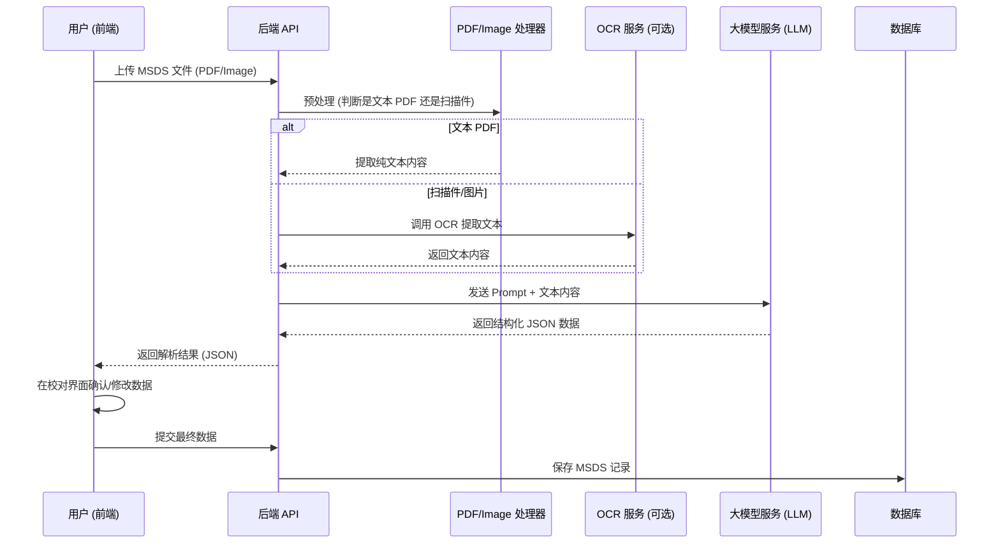

# AI 智能 MSDS 解析与录入技术方案 (AI MSDS Parser)

**文档编号**: TECH-001  
**版本**: v1.1  
**作者**: MSDS 架构组  
**日期**: 2026-03-18  
**关联 PRD**: [PRD.md](../PRD.md) 第 13.1 节

---

## 1. 背景与目标
为了解决实验室管理员手动录入 MSDS（化学品安全技术说明书）耗时费力且易出错的问题，引入 AI 大模型技术实现 MSDS 的智能化解析。

**核心目标**:
1.  **多格式支持**: 支持 PDF（文本/扫描件）、图片（JPG/PNG）。
2.  **高精度提取**: 自动提取 CAS 号、中文名、英文名、GHS 分类、危险性说明、急救措施等 20+ 个关键字段。
3.  **交互友好**: 提供“左图右表”的校对界面，高亮置信度低的字段供人工确认。
4.  **架构解耦**: OCR 服务与 LLM 服务接口化，支持切换不同供应商（如 Tesseract/百度 OCR + OpenAI/Azure/通义千问）。

## 2. 总体架构设计

### 2.1 业务流程图


### 2.2 核心模块设计

#### 2.2.1 后端模块 (Spring Boot)
在 `ruoyi-system` 模块中新增 `com.ruoyi.msds.ai` 包。

1.  **`MsdsFileProcessor`**:
    *   职责：处理文件上传，识别文件类型。
    *   依赖：`Apache PDFBox` (已存在) 用于提取文本 PDF 内容。
    *   扩展：若为图片/扫描件，调用 `OcrService`。

2.  **`OcrService` (Interface)**:
    *   定义：`String extractText(File file);`
    *   实现 1 (Local): 基于 `Tess4J` (需引入) 或调用本地 Python 脚本。
    *   实现 2 (Cloud): 调用百度/腾讯/Azure OCR API。
    *   *MVP 阶段策略*: 优先支持文本型 PDF，暂不引入重型 OCR，扫描件提示“建议使用文本型 PDF 或手动录入”。

3.  **`LlmService` (Interface)**:
    *   定义：`MsdsStructure parseMsds(String rawText);`
    *   实现：`OpenAiLlmService` (适配 OpenAI 协议)。
    *   Prompt 模板管理：存储在配置文件或数据库中，用于指导 LLM 提取特定字段。

4.  **`MsdsParserController`**:
    *   API: `POST /msds/ai/parse`
    *   入参：`MultipartFile file`
    *   出参：`AjaxResult<MsdsParseVo>` (包含解析出的字段及置信度)。

#### 2.2.2 前端模块 (React)
在 `react-ui/src/pages/Msds/Upload` 下新增组件。

1.  **`SmartUploadModal`**:
    *   弹窗组件，支持拖拽上传。
    *   上传中显示“AI 正在解析...”。

2.  **`MsdsVerifyForm`**:
    *   左侧：`PDF Previewer` (使用 `react-pdf` 或 iframe)。
    *   右侧：`ProForm` 表单，自动填充解析结果。
    *   交互：点击表单字段，左侧 PDF 自动跳转到对应页（需后端返回页码坐标，高级特性，MVP 可暂缓）。

## 3. 数据模型设计

### 3.1 解析结果 VO (`MsdsParseVo`)
```java
public class MsdsParseVo {
    // 基础信息
    private String chemicalNameCn;
    private String chemicalNameEn;
    private String casNo;
    private String unNo;
    private String formula; // 分子式
    
    // 厂商信息
    private String supplierName;
    private String emergencyPhone;
    
    // GHS 分类 (JSON 数组)
    private List<String> hazardCategories; 
    
    // 危险性说明 (H-Statement)
    private List<String> hazardStatements;
    
    // 防范说明 (P-Statement)
    private List<String> precautionaryStatements;
    
    // 象形图 (根据分类自动推导或 LLM 返回)
    private List<String> pictograms; 
}
```

## 4. 关键技术实现细节

### 4.1 Prompt 设计 (System Prompt)
```text
你是一个专业的化学品安全专家。我将提供一份 MSDS（化学品安全技术说明书）的文本内容。
请从中提取以下信息，并以严格的 JSON 格式返回，不要包含 Markdown 标记：

1. chemicalNameCn: 化学品中文名
2. chemicalNameEn: 化学品英文名
3. casNo: CAS 号
4. supplierName: 供应商名称
5. emergencyPhone: 应急电话
6. ghsCategory: GHS 危险性分类列表
7. hazardStatement: 危险性说明 (H码及内容)
8. precautionaryStatement: 防范说明 (P码及内容)

如果某项信息未找到，请返回 null。
文本内容如下：
{{text}}
```

### 4.2 PDF 文本提取 (Java 示例)
利用现有的 `pdfbox` 依赖：
```java
try (PDDocument document = PDDocument.load(file)) {
    if (!document.isEncrypted()) {
        PDFTextStripper stripper = new PDFTextStripper();
        String text = stripper.getText(document);
        // 限制文本长度，避免超出 LLM Token 限制 (截取前 3000 字符通常包含关键信息)
        return text.length() > 3000 ? text.substring(0, 3000) : text;
    }
}
```

## 5. 实施计划 (MVP)

### 阶段一：基础框架 (Day 1-2)
1.  后端：实现 `MsdsFileProcessor`，仅支持文本 PDF 提取。
2.  后端：实现 `LlmService` 桩代码 (Mock)，返回固定 JSON 用于前端调试。
3.  前端：完成上传与校对界面 UI。

### 阶段二：接入 LLM (Day 3-4)
1.  后端：实现 `OpenAiLlmService`，对接真实大模型接口。
2.  调试 Prompt，优化提取准确率。

### 阶段三：完善交互 (Day 5)
1.  前端：实现数据回填与表单验证。
2.  后端：实现解析结果入库逻辑。

---
**附录**: 
- 推荐 LLM 模型: GPT-3.5-Turbo / GPT-4o / Qwen-Turbo (通义千问，成本较低)。
- 推荐 OCR 方案 (后续): 百度 AI 开放平台通用文字识别 (每天有免费额度)。
