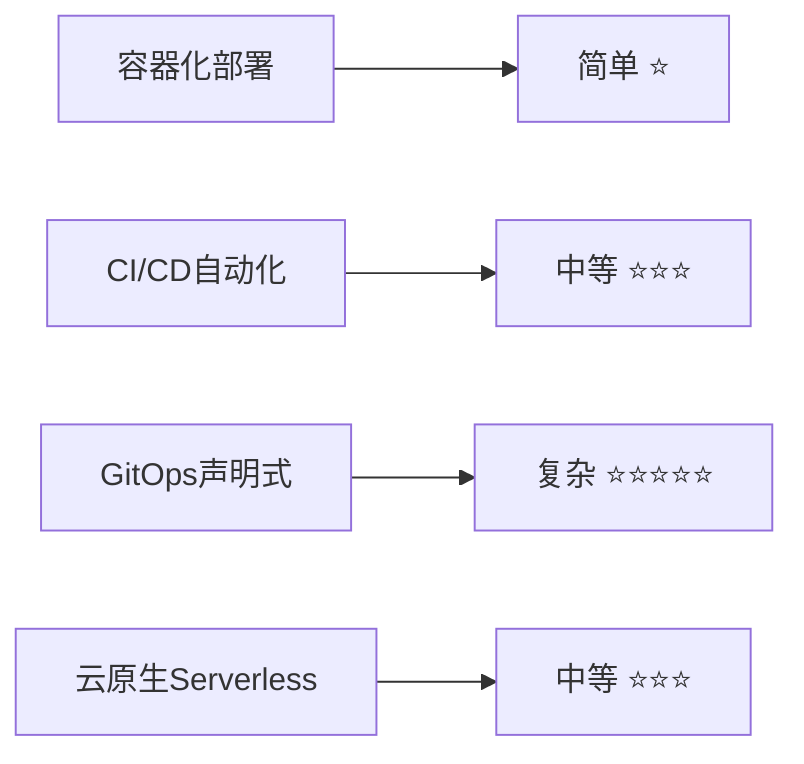
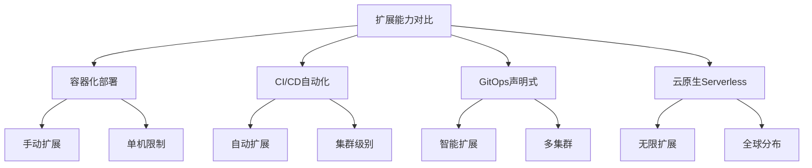
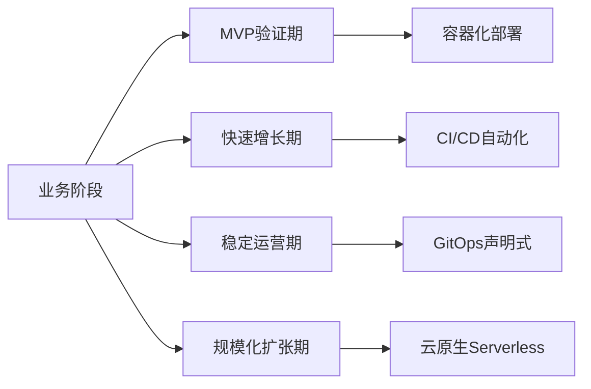
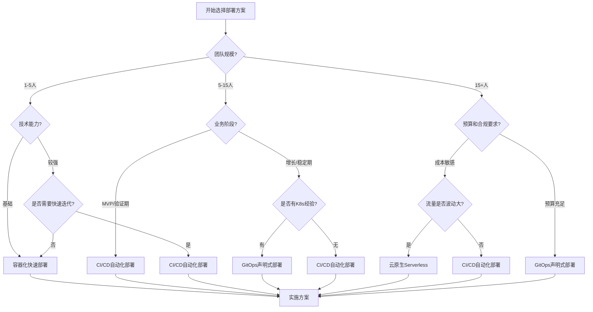
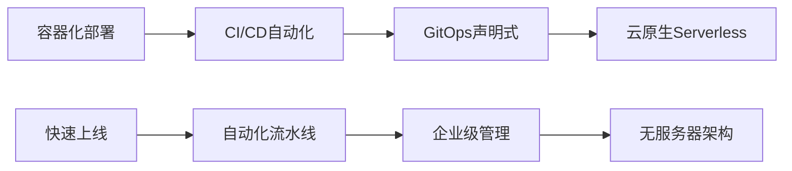
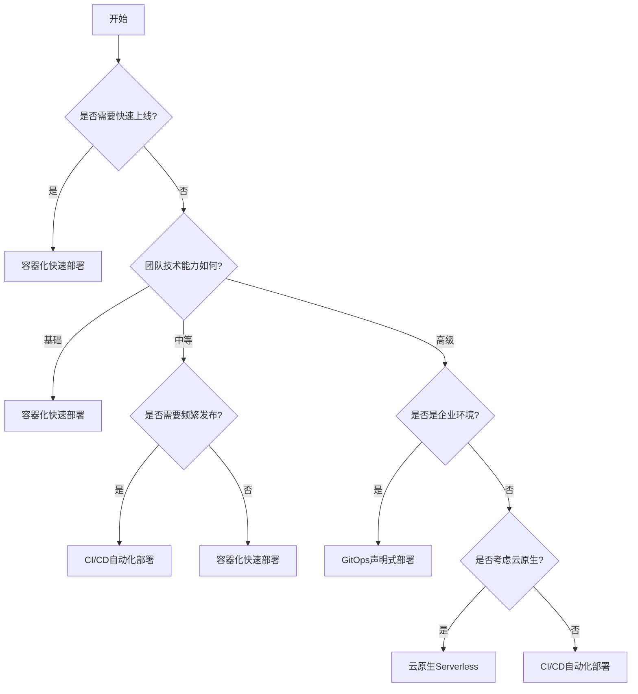

# MSDS实验室管理系统 - 部署方案对比和选择指南

## 文档信息

- **版本**: v1.0
- **更新日期**: 2025-01-27
- **适用范围**: MSDS实验室管理系统部署方案选择
- **维护者**: 架构团队

---

## 1. 方案概览

### 1.1 四种部署方案

本指南为MSDS实验室管理系统提供四种不同的部署方案，每种方案都有其独特的优势和适用场景：

| 方案 | 文档 | 核心特点 | 适用场景 |
|------|------|----------|----------|
| **容器化快速部署** | [01_容器化快速部署方案.md](./01_容器化快速部署方案.md) | 快速上线、简单运维 | 快速验证、小团队 |
| **CI/CD自动化部署** | [02_CICD自动化部署方案.md](./02_CICD自动化部署方案.md) | 自动化流水线、零停机 | 中型团队、频繁发布 |
| **GitOps声明式部署** | [03_GitOps声明式部署方案.md](./03_GitOps声明式部署方案.md) | 声明式配置、企业级 | 大型团队、多环境 |
| **云原生Serverless** | [04_云原生Serverless部署方案.md](./04_云原生Serverless部署方案.md) | 无服务器、按需付费 | 弹性负载、全球化 |

### 1.2 技术栈对比

| 技术组件 | 容器化部署 | CI/CD自动化 | GitOps声明式 | 云原生Serverless |
|----------|------------|-------------|--------------|------------------|
| **容器编排** | Docker Compose | Docker + K8s | Kubernetes | AWS Lambda/ECS |
| **CI/CD工具** | 手动/脚本 | GitHub Actions | ArgoCD + GitHub | GitHub Actions |
| **配置管理** | 环境变量 | Helm Charts | Helm + Kustomize | CloudFormation |
| **监控方案** | 基础监控 | Prometheus + Grafana | 企业级监控 | CloudWatch |
| **数据库** | MySQL容器 | MySQL/PostgreSQL | 云数据库 | Aurora Serverless |
| **存储方案** | 本地存储 | 持久化卷 | 云存储 | S3/OSS |

---

## 2. 详细对比分析

### 2.1 部署复杂度对比

#### 2.1.1 初始部署复杂度



#### 2.1.2 学习成本

| 方案 | 学习成本 | 所需技能 | 培训时间 |
|------|----------|----------|----------|
| **容器化部署** | 低 | Docker基础 | 1-2周 |
| **CI/CD自动化** | 中 | Docker + CI/CD + K8s | 4-6周 |
| **GitOps声明式** | 高 | K8s + GitOps + Helm | 8-12周 |
| **云原生Serverless** | 中 | 云服务 + Serverless | 6-8周 |

### 2.2 运维成本对比

#### 2.2.1 人力成本

```yaml
运维人力需求:
  容器化部署:
    - 运维工程师: 1人
    - 技能要求: Docker, Linux基础
    - 工作量: 中等
    
  CI/CD自动化:
    - DevOps工程师: 1-2人
    - 技能要求: K8s, CI/CD, 监控
    - 工作量: 中等
    
  GitOps声明式:
    - 平台工程师: 2-3人
    - 技能要求: K8s专家, GitOps, 企业级运维
    - 工作量: 较低（自动化程度高）
    
  云原生Serverless:
    - 云架构师: 1人
    - 技能要求: 云服务, Serverless, 成本优化
    - 工作量: 低（托管服务）
```

#### 2.2.2 基础设施成本

| 方案 | 服务器成本 | 软件许可 | 云服务费用 | 总成本评估 |
|------|------------|----------|------------|------------|
| **容器化部署** | 固定成本 | 开源免费 | 无 | 低-中 |
| **CI/CD自动化** | 固定成本 | 开源免费 | 少量 | 中 |
| **GitOps声明式** | 弹性成本 | 开源免费 | 中等 | 中-高 |
| **云原生Serverless** | 按需付费 | 无 | 按使用量 | 低-高（取决于使用量） |

### 2.3 性能和可扩展性对比

#### 2.3.1 性能指标

| 指标 | 容器化部署 | CI/CD自动化 | GitOps声明式 | 云原生Serverless |
|------|------------|-------------|--------------|------------------|
| **响应时间** | 100-300ms | 100-300ms | 100-300ms | 200-500ms（冷启动） |
| **并发处理** | 中等 | 高 | 很高 | 极高 |
| **可用性** | 95-99% | 99-99.5% | 99.5-99.9% | 99.9%+ |
| **扩展速度** | 分钟级 | 秒级 | 秒级 | 毫秒级 |

#### 2.3.2 扩展能力



### 2.4 安全性对比

#### 2.4.1 安全特性

| 安全维度 | 容器化部署 | CI/CD自动化 | GitOps声明式 | 云原生Serverless |
|----------|------------|-------------|--------------|------------------|
| **网络安全** | 基础防护 | 网络策略 | 微分段 | 云原生安全 |
| **访问控制** | 基础RBAC | RBAC + ABAC | 细粒度RBAC | IAM + 细粒度权限 |
| **数据加密** | 传输加密 | 存储+传输加密 | 端到端加密 | 全链路加密 |
| **合规性** | 基础合规 | 中等合规 | 企业级合规 | 云厂商合规 |
| **漏洞扫描** | 手动扫描 | 自动化扫描 | 持续扫描 | 托管扫描 |

#### 2.4.2 安全风险评估

```yaml
安全风险等级:
  容器化部署:
    - 风险等级: 中等
    - 主要风险: 配置错误, 手动操作
    - 缓解措施: 安全基线, 定期审计
    
  CI/CD自动化:
    - 风险等级: 中低
    - 主要风险: 流水线安全, 密钥管理
    - 缓解措施: 安全扫描, 密钥轮换
    
  GitOps声明式:
    - 风险等级: 低
    - 主要风险: Git仓库安全, 配置漂移
    - 缓解措施: 签名验证, 策略即代码
    
  云原生Serverless:
    - 风险等级: 低
    - 主要风险: 云服务配置, 权限过度授予
    - 缓解措施: 最小权限, 自动化合规检查
```

---

## 3. 选择决策框架

### 3.1 决策矩阵

#### 3.1.1 团队规模维度

| 团队规模 | 推荐方案 | 理由 |
|----------|----------|------|
| **1-5人** | 容器化快速部署 | 简单易用，快速上线 |
| **5-15人** | CI/CD自动化部署 | 自动化提升效率 |
| **15-50人** | GitOps声明式部署 | 企业级管理，多团队协作 |
| **任意规模** | 云原生Serverless | 专注业务，无运维负担 |

#### 3.1.2 业务阶段维度



#### 3.1.3 技术能力维度

| 技术能力 | 容器化 | CI/CD | GitOps | Serverless |
|----------|--------|-------|--------|------------|
| **Docker基础** | ✅ 必需 | ✅ 必需 | ✅ 必需 | ⚠️ 可选 |
| **Kubernetes** | ❌ 不需要 | ✅ 必需 | ✅ 必需 | ❌ 不需要 |
| **CI/CD工具** | ⚠️ 可选 | ✅ 必需 | ✅ 必需 | ✅ 必需 |
| **云服务经验** | ❌ 不需要 | ⚠️ 可选 | ⚠️ 可选 | ✅ 必需 |
| **GitOps理念** | ❌ 不需要 | ⚠️ 可选 | ✅ 必需 | ⚠️ 可选 |

### 3.2 决策流程图



### 3.3 评分模型

#### 3.3.1 评分标准

使用1-5分评分系统，5分为最优：

| 评估维度 | 权重 | 容器化 | CI/CD | GitOps | Serverless |
|----------|------|--------|-------|--------|------------|
| **部署速度** | 20% | 5 | 3 | 2 | 4 |
| **运维成本** | 25% | 4 | 3 | 2 | 5 |
| **可扩展性** | 20% | 2 | 4 | 5 | 5 |
| **技术门槛** | 15% | 5 | 3 | 1 | 3 |
| **长期维护** | 20% | 2 | 4 | 5 | 4 |

#### 3.3.2 加权得分计算

```python
# 评分计算示例
def calculate_score(deployment_type, weights, scores):
    total_score = 0
    for dimension, weight in weights.items():
        total_score += scores[deployment_type][dimension] * weight
    return total_score

weights = {
    'deployment_speed': 0.20,
    'operation_cost': 0.25,
    'scalability': 0.20,
    'technical_barrier': 0.15,
    'long_term_maintenance': 0.20
}

scores = {
    'containerized': {
        'deployment_speed': 5,
        'operation_cost': 4,
        'scalability': 2,
        'technical_barrier': 5,
        'long_term_maintenance': 2
    },
    'cicd': {
        'deployment_speed': 3,
        'operation_cost': 3,
        'scalability': 4,
        'technical_barrier': 3,
        'long_term_maintenance': 4
    },
    'gitops': {
        'deployment_speed': 2,
        'operation_cost': 2,
        'scalability': 5,
        'technical_barrier': 1,
        'long_term_maintenance': 5
    },
    'serverless': {
        'deployment_speed': 4,
        'operation_cost': 5,
        'scalability': 5,
        'technical_barrier': 3,
        'long_term_maintenance': 4
    }
}

# 计算结果
for deployment_type in scores:
    score = calculate_score(deployment_type, weights, scores)
    print(f"{deployment_type}: {score:.2f}")
```

**计算结果**：
- 容器化部署: 3.60
- CI/CD自动化: 3.40
- GitOps声明式: 3.00
- 云原生Serverless: 4.20

---

## 4. 实施路径规划

### 4.1 渐进式演进路径

#### 4.1.1 推荐演进路径



#### 4.1.2 演进时间规划

| 阶段 | 持续时间 | 主要工作 | 成功标准 |
|------|----------|----------|----------|
| **阶段1: 容器化** | 2-4周 | Docker化、基础部署 | 系统稳定运行 |
| **阶段2: CI/CD** | 4-8周 | 流水线建设、自动化 | 自动化部署率>80% |
| **阶段3: GitOps** | 8-12周 | K8s迁移、GitOps实施 | 声明式管理100% |
| **阶段4: Serverless** | 12-16周 | 微服务拆分、云原生 | 无服务器比例>70% |

### 4.2 快速现代化路径

适用于有经验团队，直接跳跃到目标架构：

#### 4.2.1 直达CI/CD路径

```yaml
适用条件:
  - 团队有Docker和K8s经验
  - 业务需要频繁发布
  - 有DevOps文化基础

实施步骤:
  1. 环境准备 (1周)
  2. CI/CD流水线搭建 (2周)
  3. 监控告警配置 (1周)
  4. 生产环境部署 (1周)
  
总时间: 5周
```

#### 4.2.2 直达GitOps路径

```yaml
适用条件:
  - 大型团队或企业环境
  - 有K8s和GitOps经验
  - 需要企业级管理能力

实施步骤:
  1. K8s集群搭建 (2周)
  2. GitOps工具配置 (2周)
  3. 应用配置迁移 (3周)
  4. 监控和安全配置 (2周)
  5. 生产环境切换 (1周)
  
总时间: 10周
```

#### 4.2.3 直达Serverless路径

```yaml
适用条件:
  - 新项目或可重构项目
  - 团队有云服务经验
  - 业务负载波动大

实施步骤:
  1. 架构设计和拆分 (3周)
  2. 核心服务Serverless化 (4周)
  3. 数据层迁移 (2周)
  4. 前端CDN部署 (1周)
  5. 监控和优化 (2周)
  
总时间: 12周
```

### 4.3 混合部署策略

#### 4.3.1 核心业务 + 边缘功能

```yaml
混合架构设计:
  核心业务:
    - 部署方式: GitOps声明式部署
    - 特点: 稳定可靠、企业级管理
    - 适用: 用户管理、权限控制、核心API
    
  边缘功能:
    - 部署方式: 云原生Serverless
    - 特点: 弹性扩展、按需付费
    - 适用: 文件处理、报表生成、通知服务
    
  数据处理:
    - 部署方式: CI/CD自动化部署
    - 特点: 批处理优化、资源可控
    - 适用: MSDS解析、数据导入、定时任务
```

#### 4.3.2 多环境策略

| 环境 | 推荐方案 | 理由 |
|------|----------|------|
| **开发环境** | 容器化部署 | 快速搭建、成本低 |
| **测试环境** | CI/CD自动化 | 自动化测试、环境一致性 |
| **预生产环境** | GitOps声明式 | 生产环境镜像、配置管理 |
| **生产环境** | 根据业务选择 | 综合考虑各种因素 |

---

## 5. 风险评估和缓解

### 5.1 技术风险

#### 5.1.1 风险识别

| 风险类型 | 容器化 | CI/CD | GitOps | Serverless |
|----------|--------|-------|--------|------------|
| **技术复杂度** | 低 | 中 | 高 | 中 |
| **学习曲线** | 平缓 | 中等 | 陡峭 | 中等 |
| **供应商锁定** | 无 | 低 | 低 | 高 |
| **性能风险** | 低 | 低 | 低 | 中（冷启动） |
| **数据迁移** | 简单 | 中等 | 复杂 | 复杂 |

#### 5.1.2 缓解策略

```yaml
风险缓解措施:
  技术复杂度:
    - 分阶段实施，逐步提升
    - 充分的技术培训和文档
    - 建立技术专家团队
    
  学习曲线:
    - 制定详细的学习计划
    - 内部技术分享和培训
    - 外部专家咨询和指导
    
  供应商锁定:
    - 优先选择开源和标准化技术
    - 设计可移植的架构
    - 建立多云策略
    
  性能风险:
    - 充分的性能测试
    - 建立性能监控体系
    - 准备性能优化方案
    
  数据迁移:
    - 详细的迁移计划和测试
    - 数据备份和回滚策略
    - 分批次渐进式迁移
```

### 5.2 业务风险

#### 5.2.1 业务连续性风险

| 风险场景 | 影响程度 | 发生概率 | 缓解措施 |
|----------|----------|----------|----------|
| **部署失败** | 高 | 中 | 蓝绿部署、快速回滚 |
| **数据丢失** | 极高 | 低 | 多重备份、实时同步 |
| **服务中断** | 高 | 中 | 高可用架构、故障转移 |
| **性能下降** | 中 | 中 | 性能监控、自动扩容 |
| **安全漏洞** | 高 | 低 | 安全扫描、及时更新 |

#### 5.2.2 成本风险

```yaml
成本风险控制:
  预算超支:
    - 建立成本监控和告警
    - 定期成本审查和优化
    - 设置成本上限和控制策略
    
  资源浪费:
    - 实施资源标签和分类
    - 定期清理无用资源
    - 建立资源使用报告
    
  技术债务:
    - 定期技术债务评估
    - 制定技术债务偿还计划
    - 平衡新功能和技术优化
```

---

## 6. 成功案例和最佳实践

### 6.1 不同规模企业案例

#### 6.1.1 小型企业案例

**案例背景**：
- 团队规模：5人
- 业务阶段：MVP验证期
- 技术能力：Docker基础

**选择方案**：容器化快速部署

**实施效果**：
- 部署时间：从2天缩短到2小时
- 运维成本：降低60%
- 系统稳定性：99.5%可用性

**关键成功因素**：
- 简化的架构设计
- 完善的文档和培训
- 渐进式的功能迭代

#### 6.1.2 中型企业案例

**案例背景**：
- 团队规模：15人
- 业务阶段：快速增长期
- 技术能力：DevOps基础

**选择方案**：CI/CD自动化部署

**实施效果**：
- 发布频率：从月发布到日发布
- 部署成功率：提升到99.8%
- 开发效率：提升40%

**关键成功因素**：
- 完善的自动化流水线
- 全面的测试覆盖
- 有效的监控和告警

#### 6.1.3 大型企业案例

**案例背景**：
- 团队规模：50+人
- 业务阶段：稳定运营期
- 技术能力：企业级DevOps

**选择方案**：GitOps声明式部署

**实施效果**：
- 配置管理：100%声明式
- 合规性：满足企业级要求
- 多环境管理：统一标准化

**关键成功因素**：
- 强大的平台工程团队
- 完善的治理体系
- 持续的技术投入

### 6.2 最佳实践总结

#### 6.2.1 通用最佳实践

```yaml
部署最佳实践:
  规划阶段:
    - 充分的需求分析和技术评估
    - 明确的目标和成功标准
    - 详细的实施计划和时间表
    
  实施阶段:
    - 分阶段渐进式实施
    - 充分的测试和验证
    - 及时的问题反馈和调整
    
  运维阶段:
    - 完善的监控和告警体系
    - 定期的性能优化和安全更新
    - 持续的团队培训和知识分享
```

#### 6.2.2 特定方案最佳实践

**容器化部署最佳实践**：
- 使用多阶段构建优化镜像大小
- 实施健康检查和优雅关闭
- 合理配置资源限制和请求

**CI/CD自动化最佳实践**：
- 建立完善的分支策略
- 实施自动化测试和质量门禁
- 配置蓝绿部署和快速回滚

**GitOps声明式最佳实践**：
- 采用Git作为唯一真实来源
- 实施配置即代码和策略即代码
- 建立完善的审计和合规体系

**云原生Serverless最佳实践**：
- 合理设计函数粒度和边界
- 实施冷启动优化和性能监控
- 建立成本监控和优化机制

---

## 7. 总结和建议

### 7.1 方案选择建议

#### 7.1.1 快速决策指南



#### 7.1.2 综合推荐

基于MSDS实验室管理系统的特点，我们的综合推荐如下：

**第一优先级**：CI/CD自动化部署
- 理由：平衡了复杂度和功能性，适合大多数团队
- 适用：中小型团队，有一定技术基础

**第二优先级**：容器化快速部署
- 理由：简单易用，快速上线
- 适用：小团队，快速验证需求

**第三优先级**：云原生Serverless
- 理由：未来趋势，适合弹性负载
- 适用：有云服务经验，成本敏感

**第四优先级**：GitOps声明式部署
- 理由：企业级功能，但复杂度较高
- 适用：大型团队，企业环境

### 7.2 实施建议

#### 7.2.1 立即行动建议

1. **评估当前状态**
   - 团队技术能力评估
   - 业务需求分析
   - 资源和预算评估

2. **选择初始方案**
   - 基于评估结果选择合适方案
   - 制定详细实施计划
   - 准备必要的资源和培训

3. **开始实施**
   - 从最简单的方案开始
   - 建立监控和反馈机制
   - 持续优化和改进

#### 7.2.2 长期规划建议

1. **技术演进路径**
   - 制定3-5年技术发展规划
   - 建立技术能力提升计划
   - 关注行业技术发展趋势

2. **团队能力建设**
   - 持续的技术培训和认证
   - 建立技术专家团队
   - 培养DevOps文化

3. **平台化建设**
   - 逐步建设内部技术平台
   - 标准化开发和部署流程
   - 提升整体技术效率

### 7.3 后续支持

#### 7.3.1 技术支持

- **文档维护**：持续更新和完善部署文档
- **技术咨询**：提供技术选型和实施咨询
- **问题解决**：协助解决实施过程中的技术问题

#### 7.3.2 培训支持

- **基础培训**：Docker、K8s、CI/CD基础培训
- **高级培训**：GitOps、云原生、Serverless专项培训
- **实战演练**：基于真实项目的实战培训

#### 7.3.3 持续改进

- **定期评估**：定期评估部署方案的效果
- **优化建议**：基于实际使用情况提供优化建议
- **版本更新**：跟踪技术发展，更新部署方案

---

## 附录

### A. 相关文档

- [容器化快速部署方案](./01_容器化快速部署方案.md)
- [CI/CD自动化部署方案](./02_CICD自动化部署方案.md)
- [GitOps声明式部署方案](./03_GitOps声明式部署方案.md)
- [云原生Serverless部署方案](./04_云原生Serverless部署方案.md)

### B. 工具和资源

#### B.1 开源工具

- **容器化**: Docker, Docker Compose
- **CI/CD**: GitHub Actions, Jenkins, GitLab CI
- **GitOps**: ArgoCD, Flux, Tekton
- **监控**: Prometheus, Grafana, ELK Stack
- **安全**: Trivy, Falco, OPA

#### B.2 云服务

- **AWS**: ECS, EKS, Lambda, Aurora
- **阿里云**: ACK, ECI, 函数计算, PolarDB
- **Azure**: AKS, Container Instances, Functions
- **Google Cloud**: GKE, Cloud Run, Cloud Functions

### C. 联系信息

- **架构团队**: architecture@flymsds.cn
- **技术支持**: support@flymsds.cn
- **文档反馈**: docs@flymsds.cn

---

*本指南将根据技术发展和实践经验持续更新，请关注最新版本。*