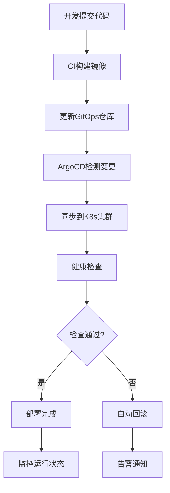

# MSDS实验室管理系统 - GitOps声明式部署方案

## 文档信息

- **版本**: v1.0
- **更新日期**: 2025-01-27
- **适用范围**: MSDS实验室管理系统GitOps部署
- **维护者**: DevOps团队

## 1. 方案概述

### 1.1 GitOps核心理念

GitOps是一种现代化的部署和运维方法论，将Git作为唯一的真实来源（Single Source of Truth），通过声明式配置和自动化同步实现应用的部署和管理。

#### 核心特点

- **声明式配置**: 所有基础设施和应用配置都以声明式方式定义
- **Git驱动**: 所有变更都通过Git仓库进行管理和追踪
- **自动同步**: 自动检测配置变更并同步到目标环境
- **可观测性**: 完整的部署历史和状态可视化
- **安全可靠**: 基于Pull模式的安全部署机制

### 1.2 技术架构

```
┌─────────────────┐    ┌─────────────────┐    ┌─────────────────┐
│   开发团队       │    │   GitOps仓库     │    │   Kubernetes    │
│                │    │                │    │     集群        │
│ ┌─────────────┐ │    │ ┌─────────────┐ │    │ ┌─────────────┐ │
│ │  应用代码    │ │    │ │  Helm Charts │ │    │ │   ArgoCD    │ │
│ │  Dockerfile │ │────▶│ │  Kustomize  │ │◀───│ │   Flux      │ │
│ │  CI Pipeline│ │    │ │  YAML配置   │ │    │ │   Operator  │ │
│ └─────────────┘ │    │ └─────────────┘ │    │ └─────────────┘ │
└─────────────────┘    └─────────────────┘    └─────────────────┘
        │                       │                       │
        │                       │                       │
        ▼                       ▼                       ▼
┌─────────────────┐    ┌─────────────────┐    ┌─────────────────┐
│   镜像仓库       │    │   配置管理       │    │   应用部署       │
│                │    │                │    │                │
│ • Docker Hub   │    │ • 环境配置      │    │ • 自动同步      │
│ • 阿里云ACR    │    │ • 密钥管理      │    │ • 健康检查      │
│ • Harbor       │    │ • 版本控制      │    │ • 回滚机制      │
└─────────────────┘    └─────────────────┘    └─────────────────┘
```

### 1.3 部署流程



## 2. 环境要求

### 2.1 基础设施要求

#### Kubernetes集群

```yaml
# 集群规格要求
cluster:
  version: ">=1.24"
  nodes:
    master: 3
    worker: 3
  resources:
    cpu: "16 cores"
    memory: "32GB"
    storage: "500GB SSD"
  
# 网络要求
network:
  cni: "Calico/Flannel"
  ingress: "Nginx Ingress Controller"
  service_mesh: "Istio (可选)"
```

#### 存储要求

```yaml
storage:
  # 持久化存储
  persistent_volumes:
    - name: "mysql-data"
      size: "100GB"
      type: "SSD"
      access_mode: "ReadWriteOnce"
    
    - name: "redis-data"
      size: "20GB"
      type: "SSD"
      access_mode: "ReadWriteOnce"
  
  # 共享存储
  shared_storage:
    - name: "msds-files"
      size: "200GB"
      type: "NFS/CephFS"
      access_mode: "ReadWriteMany"
```

### 2.2 工具链要求

#### GitOps工具

```yaml
gitops_tools:
  # ArgoCD (推荐)
  argocd:
    version: ">=2.8"
    features:
      - "Application Sets"
      - "Multi-cluster Support"
      - "RBAC"
      - "SSO Integration"
  
  # Flux (备选)
  flux:
    version: ">=2.0"
    components:
      - "Source Controller"
      - "Kustomize Controller"
      - "Helm Controller"
      - "Notification Controller"
```

#### 配置管理工具

```yaml
config_management:
  # Helm
  helm:
    version: ">=3.10"
    features:
      - "Chart Templates"
      - "Values Override"
      - "Hooks"
  
  # Kustomize
  kustomize:
    version: ">=4.5"
    features:
      - "Base/Overlay Pattern"
      - "Strategic Merge"
      - "JSON Patch"
```

## 3. GitOps仓库结构

### 3.1 仓库组织结构

```
msds-gitops/
├── README.md
├── .gitignore
├── .argocd/                    # ArgoCD配置
│   ├── applications/           # 应用定义
│   ├── projects/              # 项目配置
│   └── repositories/          # 仓库配置
├── environments/              # 环境配置
│   ├── dev/                   # 开发环境
│   │   ├── kustomization.yaml
│   │   ├── namespace.yaml
│   │   ├── configmap.yaml
│   │   └── secrets.yaml
│   ├── staging/               # 测试环境
│   │   ├── kustomization.yaml
│   │   ├── namespace.yaml
│   │   ├── configmap.yaml
│   │   └── secrets.yaml
│   └── production/            # 生产环境
│       ├── kustomization.yaml
│       ├── namespace.yaml
│       ├── configmap.yaml
│       └── secrets.yaml
├── applications/              # 应用配置
│   ├── msds-backend/          # 后端应用
│   │   ├── base/              # 基础配置
│   │   │   ├── kustomization.yaml
│   │   │   ├── deployment.yaml
│   │   │   ├── service.yaml
│   │   │   ├── configmap.yaml
│   │   │   └── hpa.yaml
│   │   └── overlays/          # 环境覆盖
│   │       ├── dev/
│   │       ├── staging/
│   │       └── production/
│   ├── msds-frontend/         # 前端应用
│   │   ├── base/
│   │   └── overlays/
│   ├── msds-mysql/            # 数据库
│   │   ├── base/
│   │   └── overlays/
│   └── msds-redis/            # 缓存
│       ├── base/
│       └── overlays/
├── infrastructure/            # 基础设施
│   ├── ingress/               # 入口控制器
│   ├── monitoring/            # 监控系统
│   ├── logging/               # 日志系统
│   └── security/              # 安全组件
├── helm-charts/               # Helm图表
│   ├── msds-app/              # 应用图表
│   │   ├── Chart.yaml
│   │   ├── values.yaml
│   │   ├── values-dev.yaml
│   │   ├── values-staging.yaml
│   │   ├── values-production.yaml
│   │   └── templates/
│   └── msds-infrastructure/   # 基础设施图表
└── scripts/                   # 自动化脚本
    ├── setup-cluster.sh       # 集群初始化
    ├── install-argocd.sh      # ArgoCD安装
    ├── bootstrap.sh           # 引导脚本
    └── backup-restore.sh      # 备份恢复
```

### 3.2 应用配置示例

#### 后端应用基础配置

```yaml
# applications/msds-backend/base/deployment.yaml
apiVersion: apps/v1
kind: Deployment
metadata:
  name: msds-backend
  labels:
    app: msds-backend
    component: backend
spec:
  replicas: 2
  selector:
    matchLabels:
      app: msds-backend
  template:
    metadata:
      labels:
        app: msds-backend
        component: backend
    spec:
      containers:
      - name: backend
        image: registry.cn-beijing.aliyuncs.com/msds/backend:latest
        ports:
        - containerPort: 8080
          name: http
        env:
        - name: SPRING_PROFILES_ACTIVE
          value: "kubernetes"
        - name: SPRING_DATASOURCE_URL
          valueFrom:
            configMapKeyRef:
              name: msds-config
              key: database.url
        - name: SPRING_DATASOURCE_USERNAME
          valueFrom:
            secretKeyRef:
              name: msds-secrets
              key: database.username
        - name: SPRING_DATASOURCE_PASSWORD
          valueFrom:
            secretKeyRef:
              name: msds-secrets
              key: database.password
        - name: SPRING_REDIS_HOST
          valueFrom:
            configMapKeyRef:
              name: msds-config
              key: redis.host
        resources:
          requests:
            memory: "512Mi"
            cpu: "250m"
          limits:
            memory: "1Gi"
            cpu: "500m"
        livenessProbe:
          httpGet:
            path: /actuator/health
            port: 8080
          initialDelaySeconds: 60
          periodSeconds: 30
        readinessProbe:
          httpGet:
            path: /actuator/health/readiness
            port: 8080
          initialDelaySeconds: 30
          periodSeconds: 10
        volumeMounts:
        - name: config-volume
          mountPath: /app/config
        - name: logs-volume
          mountPath: /app/logs
      volumes:
      - name: config-volume
        configMap:
          name: msds-backend-config
      - name: logs-volume
        emptyDir: {}
      imagePullSecrets:
      - name: registry-secret
```

#### 服务配置

```yaml
# applications/msds-backend/base/service.yaml
apiVersion: v1
kind: Service
metadata:
  name: msds-backend-service
  labels:
    app: msds-backend
spec:
  selector:
    app: msds-backend
  ports:
  - name: http
    port: 8080
    targetPort: 8080
    protocol: TCP
  type: ClusterIP
```

#### HPA配置

```yaml
# applications/msds-backend/base/hpa.yaml
apiVersion: autoscaling/v2
kind: HorizontalPodAutoscaler
metadata:
  name: msds-backend-hpa
spec:
  scaleTargetRef:
    apiVersion: apps/v1
    kind: Deployment
    name: msds-backend
  minReplicas: 2
  maxReplicas: 10
  metrics:
  - type: Resource
    resource:
      name: cpu
      target:
        type: Utilization
        averageUtilization: 70
  - type: Resource
    resource:
      name: memory
      target:
        type: Utilization
        averageUtilization: 80
  behavior:
    scaleDown:
      stabilizationWindowSeconds: 300
      policies:
      - type: Percent
        value: 50
        periodSeconds: 60
    scaleUp:
      stabilizationWindowSeconds: 60
      policies:
      - type: Percent
        value: 100
        periodSeconds: 60
```

### 3.3 环境覆盖配置

#### 生产环境覆盖

```yaml
# applications/msds-backend/overlays/production/kustomization.yaml
apiVersion: kustomize.config.k8s.io/v1beta1
kind: Kustomization

namespace: msds-production

resources:
- ../../base

patchesStrategicMerge:
- deployment-patch.yaml
- hpa-patch.yaml

configMapGenerator:
- name: msds-backend-config
  files:
  - application-production.yml

secretGenerator:
- name: msds-secrets
  envs:
  - secrets.env

images:
- name: registry.cn-beijing.aliyuncs.com/msds/backend
  newTag: v1.2.3

replicas:
- name: msds-backend
  count: 5
```

#### 生产环境部署补丁

```yaml
# applications/msds-backend/overlays/production/deployment-patch.yaml
apiVersion: apps/v1
kind: Deployment
metadata:
  name: msds-backend
spec:
  template:
    spec:
      containers:
      - name: backend
        resources:
          requests:
            memory: "1Gi"
            cpu: "500m"
          limits:
            memory: "2Gi"
            cpu: "1000m"
        env:
        - name: JAVA_OPTS
          value: "-Xms1g -Xmx1g -XX:+UseG1GC"
        - name: SPRING_PROFILES_ACTIVE
          value: "production,kubernetes"
      nodeSelector:
        node-type: "application"
      tolerations:
      - key: "application"
        operator: "Equal"
        value: "true"
        effect: "NoSchedule"
      affinity:
        podAntiAffinity:
          preferredDuringSchedulingIgnoredDuringExecution:
          - weight: 100
            podAffinityTerm:
              labelSelector:
                matchExpressions:
                - key: app
                  operator: In
                  values:
                  - msds-backend
              topologyKey: kubernetes.io/hostname
```

## 4. ArgoCD配置

### 4.1 ArgoCD安装配置

#### 安装脚本

```bash
#!/bin/bash
# scripts/install-argocd.sh

set -e

NAMESPACE="argocd"
VERSION="v2.8.4"

echo "安装ArgoCD ${VERSION}..."

# 创建命名空间
kubectl create namespace $NAMESPACE --dry-run=client -o yaml | kubectl apply -f -

# 安装ArgoCD
kubectl apply -n $NAMESPACE -f https://raw.githubusercontent.com/argoproj/argo-cd/${VERSION}/manifests/install.yaml

# 等待ArgoCD启动
echo "等待ArgoCD启动..."
kubectl wait --for=condition=available --timeout=600s deployment/argocd-server -n $NAMESPACE

# 获取初始密码
echo "获取ArgoCD初始密码..."
INITIAL_PASSWORD=$(kubectl -n $NAMESPACE get secret argocd-initial-admin-secret -o jsonpath="{.data.password}" | base64 -d)
echo "ArgoCD初始密码: $INITIAL_PASSWORD"

# 配置Ingress
cat <<EOF | kubectl apply -f -
apiVersion: networking.k8s.io/v1
kind: Ingress
metadata:
  name: argocd-server-ingress
  namespace: $NAMESPACE
  annotations:
    nginx.ingress.kubernetes.io/ssl-redirect: "true"
    nginx.ingress.kubernetes.io/backend-protocol: "GRPC"
    nginx.ingress.kubernetes.io/grpc-backend: "true"
spec:
  tls:
  - hosts:
    - argocd.flymsds.cn
    secretName: argocd-tls
  rules:
  - host: argocd.flymsds.cn
    http:
      paths:
      - path: /
        pathType: Prefix
        backend:
          service:
            name: argocd-server
            port:
              number: 443
EOF

echo "ArgoCD安装完成！"
echo "访问地址: https://argocd.flymsds.cn"
echo "用户名: admin"
echo "密码: $INITIAL_PASSWORD"
```

### 4.2 ArgoCD应用配置

#### 主应用配置

```yaml
# .argocd/applications/msds-app.yaml
apiVersion: argoproj.io/v1alpha1
kind: Application
metadata:
  name: msds-app
  namespace: argocd
  labels:
    app: msds
    environment: production
spec:
  project: msds-project
  source:
    repoURL: https://github.com/your-org/msds-gitops.git
    targetRevision: main
    path: applications
  destination:
    server: https://kubernetes.default.svc
    namespace: msds-production
  syncPolicy:
    automated:
      prune: true
      selfHeal: true
      allowEmpty: false
    syncOptions:
    - CreateNamespace=true
    - PrunePropagationPolicy=foreground
    - PruneLast=true
    retry:
      limit: 5
      backoff:
        duration: 5s
        factor: 2
        maxDuration: 3m
  revisionHistoryLimit: 10
  ignoreDifferences:
  - group: apps
    kind: Deployment
    jsonPointers:
    - /spec/replicas
  info:
  - name: 'Description'
    value: 'MSDS实验室管理系统主应用'
  - name: 'Owner'
    value: 'DevOps团队'
```

#### 应用集配置

```yaml
# .argocd/applications/msds-appset.yaml
apiVersion: argoproj.io/v1alpha1
kind: ApplicationSet
metadata:
  name: msds-environments
  namespace: argocd
spec:
  generators:
  - list:
      elements:
      - environment: dev
        namespace: msds-dev
        replicaCount: "1"
        resources: "small"
      - environment: staging
        namespace: msds-staging
        replicaCount: "2"
        resources: "medium"
      - environment: production
        namespace: msds-production
        replicaCount: "5"
        resources: "large"
  template:
    metadata:
      name: 'msds-{{environment}}'
      labels:
        environment: '{{environment}}'
    spec:
      project: msds-project
      source:
        repoURL: https://github.com/your-org/msds-gitops.git
        targetRevision: main
        path: 'environments/{{environment}}'
      destination:
        server: https://kubernetes.default.svc
        namespace: '{{namespace}}'
      syncPolicy:
        automated:
          prune: true
          selfHeal: true
        syncOptions:
        - CreateNamespace=true
```

### 4.3 项目配置

```yaml
# .argocd/projects/msds-project.yaml
apiVersion: argoproj.io/v1alpha1
kind: AppProject
metadata:
  name: msds-project
  namespace: argocd
spec:
  description: "MSDS实验室管理系统项目"
  
  # 源仓库白名单
  sourceRepos:
  - 'https://github.com/your-org/msds-gitops.git'
  - 'https://charts.bitnami.com/bitnami'
  - 'https://kubernetes-charts.storage.googleapis.com'
  
  # 目标集群和命名空间
  destinations:
  - namespace: 'msds-*'
    server: https://kubernetes.default.svc
  - namespace: 'monitoring'
    server: https://kubernetes.default.svc
  
  # 集群资源白名单
  clusterResourceWhitelist:
  - group: ''
    kind: Namespace
  - group: 'rbac.authorization.k8s.io'
    kind: ClusterRole
  - group: 'rbac.authorization.k8s.io'
    kind: ClusterRoleBinding
  
  # 命名空间资源白名单
  namespaceResourceWhitelist:
  - group: ''
    kind: ConfigMap
  - group: ''
    kind: Secret
  - group: ''
    kind: Service
  - group: ''
    kind: ServiceAccount
  - group: 'apps'
    kind: Deployment
  - group: 'apps'
    kind: StatefulSet
  - group: 'networking.k8s.io'
    kind: Ingress
  - group: 'autoscaling'
    kind: HorizontalPodAutoscaler
  
  # RBAC配置
  roles:
  - name: developer
    description: "开发人员角色"
    policies:
    - p, proj:msds-project:developer, applications, get, msds-project/*, allow
    - p, proj:msds-project:developer, applications, sync, msds-project/msds-dev, allow
    - p, proj:msds-project:developer, applications, sync, msds-project/msds-staging, allow
    groups:
    - msds-developers
  
  - name: operator
    description: "运维人员角色"
    policies:
    - p, proj:msds-project:operator, applications, *, msds-project/*, allow
    - p, proj:msds-project:operator, repositories, *, *, allow
    groups:
    - msds-operators
  
  # 同步窗口
  syncWindows:
  - kind: allow
    schedule: '0 9-17 * * 1-5'  # 工作日9-17点
    duration: 8h
    applications:
    - 'msds-dev'
    - 'msds-staging'
    manualSync: true
  
  - kind: deny
    schedule: '0 18-8 * * *'    # 非工作时间
    duration: 14h
    applications:
    - 'msds-production'
    manualSync: false
```

## 5. Helm Charts配置

### 5.1 应用Chart结构

```yaml
# helm-charts/msds-app/Chart.yaml
apiVersion: v2
name: msds-app
description: MSDS实验室管理系统Helm Chart
type: application
version: 1.0.0
appVersion: "1.2.3"
keywords:
  - msds
  - laboratory
  - management
home: https://github.com/your-org/msdsfullstack
sources:
  - https://github.com/your-org/msdsfullstack
maintainers:
  - name: DevOps Team
    email: devops@flymsds.cn
dependencies:
  - name: mysql
    version: 9.4.6
    repository: https://charts.bitnami.com/bitnami
    condition: mysql.enabled
  - name: redis
    version: 17.3.7
    repository: https://charts.bitnami.com/bitnami
    condition: redis.enabled
```

### 5.2 默认配置

```yaml
# helm-charts/msds-app/values.yaml
# 全局配置
global:
  imageRegistry: "registry.cn-beijing.aliyuncs.com"
  imagePullSecrets:
    - name: "registry-secret"
  storageClass: "fast-ssd"

# 后端应用配置
backend:
  enabled: true
  replicaCount: 2
  image:
    repository: msds/backend
    tag: "latest"
    pullPolicy: IfNotPresent
  
  service:
    type: ClusterIP
    port: 8080
  
  resources:
    requests:
      memory: "512Mi"
      cpu: "250m"
    limits:
      memory: "1Gi"
      cpu: "500m"
  
  autoscaling:
    enabled: true
    minReplicas: 2
    maxReplicas: 10
    targetCPUUtilizationPercentage: 70
    targetMemoryUtilizationPercentage: 80
  
  config:
    spring:
      profiles:
        active: "kubernetes"
      datasource:
        url: "jdbc:mysql://msds-mysql:3306/msds"
        username: "msds_user"
      redis:
        host: "msds-redis-master"
        port: 6379
  
  secrets:
    database:
      password: ""
    redis:
      password: ""

# 前端应用配置
frontend:
  enabled: true
  replicaCount: 2
  image:
    repository: msds/frontend
    tag: "latest"
    pullPolicy: IfNotPresent
  
  service:
    type: ClusterIP
    port: 80
  
  resources:
    requests:
      memory: "128Mi"
      cpu: "100m"
    limits:
      memory: "256Mi"
      cpu: "200m"
  
  config:
    apiBaseUrl: "/api"
    environment: "production"

# MySQL配置
mysql:
  enabled: true
  auth:
    rootPassword: ""
    database: "msds"
    username: "msds_user"
    password: ""
  
  primary:
    persistence:
      enabled: true
      size: 100Gi
      storageClass: "fast-ssd"
    
    resources:
      requests:
        memory: "1Gi"
        cpu: "500m"
      limits:
        memory: "2Gi"
        cpu: "1000m"
  
  metrics:
    enabled: true
    serviceMonitor:
      enabled: true

# Redis配置
redis:
  enabled: true
  auth:
    enabled: true
    password: ""
  
  master:
    persistence:
      enabled: true
      size: 20Gi
      storageClass: "fast-ssd"
    
    resources:
      requests:
        memory: "256Mi"
        cpu: "100m"
      limits:
        memory: "512Mi"
        cpu: "200m"
  
  replica:
    replicaCount: 1
    persistence:
      enabled: true
      size: 20Gi
  
  metrics:
    enabled: true
    serviceMonitor:
      enabled: true

# Ingress配置
ingress:
  enabled: true
  className: "nginx"
  annotations:
    nginx.ingress.kubernetes.io/ssl-redirect: "true"
    nginx.ingress.kubernetes.io/use-regex: "true"
    cert-manager.io/cluster-issuer: "letsencrypt-prod"
  
  hosts:
    - host: flymsds.cn
      paths:
        - path: /
          pathType: Prefix
          service: frontend
        - path: /api
          pathType: Prefix
          service: backend
  
  tls:
    - secretName: msds-tls
      hosts:
        - flymsds.cn

# 监控配置
monitoring:
  enabled: true
  serviceMonitor:
    enabled: true
    namespace: monitoring
    labels:
      app: msds
  
  prometheusRule:
    enabled: true
    namespace: monitoring
    rules:
      - alert: MSdsBackendDown
        expr: up{job="msds-backend"} == 0
        for: 1m
        labels:
          severity: critical
        annotations:
          summary: "MSDS后端服务下线"
```

### 5.3 环境特定配置

#### 生产环境配置

```yaml
# helm-charts/msds-app/values-production.yaml
# 生产环境特定配置
global:
  environment: production

backend:
  replicaCount: 5
  image:
    tag: "v1.2.3"
  
  resources:
    requests:
      memory: "1Gi"
      cpu: "500m"
    limits:
      memory: "2Gi"
      cpu: "1000m"
  
  autoscaling:
    minReplicas: 5
    maxReplicas: 20
  
  nodeSelector:
    node-type: "application"
  
  tolerations:
    - key: "application"
      operator: "Equal"
      value: "true"
      effect: "NoSchedule"
  
  affinity:
    podAntiAffinity:
      preferredDuringSchedulingIgnoredDuringExecution:
      - weight: 100
        podAffinityTerm:
          labelSelector:
            matchExpressions:
            - key: app
              operator: In
              values:
              - msds-backend
          topologyKey: kubernetes.io/hostname

frontend:
  replicaCount: 3
  image:
    tag: "v1.2.3"
  
  resources:
    requests:
      memory: "256Mi"
      cpu: "200m"
    limits:
      memory: "512Mi"
      cpu: "400m"

mysql:
  primary:
    persistence:
      size: 500Gi
    
    resources:
      requests:
        memory: "4Gi"
        cpu: "2000m"
      limits:
        memory: "8Gi"
        cpu: "4000m"
    
    nodeSelector:
      node-type: "database"

redis:
  master:
    persistence:
      size: 100Gi
    
    resources:
      requests:
        memory: "1Gi"
        cpu: "500m"
      limits:
        memory: "2Gi"
        cpu: "1000m"
  
  replica:
    replicaCount: 2
```

## 6. 监控和可观测性

### 6.1 Prometheus监控配置

```yaml
# infrastructure/monitoring/prometheus.yaml
apiVersion: v1
kind: ConfigMap
metadata:
  name: prometheus-config
  namespace: monitoring
data:
  prometheus.yml: |
    global:
      scrape_interval: 15s
      evaluation_interval: 15s
    
    rule_files:
      - "/etc/prometheus/rules/*.yml"
    
    alerting:
      alertmanagers:
        - static_configs:
            - targets:
              - alertmanager:9093
    
    scrape_configs:
      # Kubernetes API Server
      - job_name: 'kubernetes-apiservers'
        kubernetes_sd_configs:
        - role: endpoints
        scheme: https
        tls_config:
          ca_file: /var/run/secrets/kubernetes.io/serviceaccount/ca.crt
        bearer_token_file: /var/run/secrets/kubernetes.io/serviceaccount/token
        relabel_configs:
        - source_labels: [__meta_kubernetes_namespace, __meta_kubernetes_service_name, __meta_kubernetes_endpoint_port_name]
          action: keep
          regex: default;kubernetes;https
      
      # MSDS应用监控
      - job_name: 'msds-backend'
        kubernetes_sd_configs:
        - role: endpoints
        relabel_configs:
        - source_labels: [__meta_kubernetes_service_label_app]
          action: keep
          regex: msds-backend
        - source_labels: [__meta_kubernetes_endpoint_port_name]
          action: keep
          regex: metrics
      
      - job_name: 'msds-mysql'
        kubernetes_sd_configs:
        - role: endpoints
        relabel_configs:
        - source_labels: [__meta_kubernetes_service_label_app_kubernetes_io_name]
          action: keep
          regex: mysql
        - source_labels: [__meta_kubernetes_endpoint_port_name]
          action: keep
          regex: metrics
      
      - job_name: 'msds-redis'
        kubernetes_sd_configs:
        - role: endpoints
        relabel_configs:
        - source_labels: [__meta_kubernetes_service_label_app_kubernetes_io_name]
          action: keep
          regex: redis
        - source_labels: [__meta_kubernetes_endpoint_port_name]
          action: keep
          regex: metrics
```

### 6.2 Grafana仪表板

```json
{
  "dashboard": {
    "id": null,
    "title": "MSDS系统监控仪表板",
    "tags": ["msds", "kubernetes"],
    "timezone": "Asia/Shanghai",
    "panels": [
      {
        "id": 1,
        "title": "应用状态概览",
        "type": "stat",
        "targets": [
          {
            "expr": "up{job=\"msds-backend\"}",
            "legendFormat": "后端服务"
          },
          {
            "expr": "up{job=\"msds-mysql\"}",
            "legendFormat": "数据库"
          },
          {
            "expr": "up{job=\"msds-redis\"}",
            "legendFormat": "缓存"
          }
        ]
      },
      {
        "id": 2,
        "title": "请求QPS",
        "type": "graph",
        "targets": [
          {
            "expr": "rate(http_requests_total{job=\"msds-backend\"}[5m])",
            "legendFormat": "{{method}} {{uri}}"
          }
        ]
      },
      {
        "id": 3,
        "title": "响应时间",
        "type": "graph",
        "targets": [
          {
            "expr": "histogram_quantile(0.95, rate(http_request_duration_seconds_bucket{job=\"msds-backend\"}[5m]))",
            "legendFormat": "95th percentile"
          },
          {
            "expr": "histogram_quantile(0.50, rate(http_request_duration_seconds_bucket{job=\"msds-backend\"}[5m]))",
            "legendFormat": "50th percentile"
          }
        ]
      },
      {
        "id": 4,
        "title": "资源使用率",
        "type": "graph",
        "targets": [
          {
            "expr": "rate(container_cpu_usage_seconds_total{pod=~\"msds-backend-.*\"}[5m]) * 100",
            "legendFormat": "CPU使用率"
          },
          {
            "expr": "container_memory_usage_bytes{pod=~\"msds-backend-.*\"} / container_spec_memory_limit_bytes * 100",
            "legendFormat": "内存使用率"
          }
        ]
      }
    ]
  }
}
```

## 7. 安全配置

### 7.1 RBAC配置

```yaml
# infrastructure/security/rbac.yaml
apiVersion: v1
kind: ServiceAccount
metadata:
  name: msds-backend
  namespace: msds-production
---
apiVersion: rbac.authorization.k8s.io/v1
kind: Role
metadata:
  namespace: msds-production
  name: msds-backend-role
rules:
- apiGroups: [""]
  resources: ["configmaps", "secrets"]
  verbs: ["get", "list", "watch"]
- apiGroups: [""]
  resources: ["pods"]
  verbs: ["get", "list"]
---
apiVersion: rbac.authorization.k8s.io/v1
kind: RoleBinding
metadata:
  name: msds-backend-binding
  namespace: msds-production
subjects:
- kind: ServiceAccount
  name: msds-backend
  namespace: msds-production
roleRef:
  kind: Role
  name: msds-backend-role
  apiGroup: rbac.authorization.k8s.io
```

### 7.2 网络策略

```yaml
# infrastructure/security/network-policy.yaml
apiVersion: networking.k8s.io/v1
kind: NetworkPolicy
metadata:
  name: msds-backend-netpol
  namespace: msds-production
spec:
  podSelector:
    matchLabels:
      app: msds-backend
  policyTypes:
  - Ingress
  - Egress
  ingress:
  - from:
    - podSelector:
        matchLabels:
          app: msds-frontend
    - podSelector:
        matchLabels:
          app: nginx-ingress
    ports:
    - protocol: TCP
      port: 8080
  egress:
  - to:
    - podSelector:
        matchLabels:
          app.kubernetes.io/name: mysql
    ports:
    - protocol: TCP
      port: 3306
  - to:
    - podSelector:
        matchLabels:
          app.kubernetes.io/name: redis
    ports:
    - protocol: TCP
      port: 6379
  - to: []
    ports:
    - protocol: TCP
      port: 53
    - protocol: UDP
      port: 53
```

### 7.3 Pod安全策略

```yaml
# infrastructure/security/pod-security-policy.yaml
apiVersion: policy/v1beta1
kind: PodSecurityPolicy
metadata:
  name: msds-psp
spec:
  privileged: false
  allowPrivilegeEscalation: false
  requiredDropCapabilities:
    - ALL
  volumes:
    - 'configMap'
    - 'emptyDir'
    - 'projected'
    - 'secret'
    - 'downwardAPI'
    - 'persistentVolumeClaim'
  runAsUser:
    rule: 'MustRunAsNonRoot'
  seLinux:
    rule: 'RunAsAny'
  fsGroup:
    rule: 'RunAsAny'
  readOnlyRootFilesystem: true
  securityContext:
    runAsNonRoot: true
    runAsUser: 1000
    fsGroup: 1000
```

## 8. 部署流程

### 8.1 集群初始化

```bash
#!/bin/bash
# scripts/setup-cluster.sh

set -e

echo "初始化Kubernetes集群..."

# 1. 安装必要的组件
echo "安装Ingress Controller..."
kubectl apply -f https://raw.githubusercontent.com/kubernetes/ingress-nginx/controller-v1.8.2/deploy/static/provider/cloud/deploy.yaml

# 2. 安装Cert-Manager
echo "安装Cert-Manager..."
kubectl apply -f https://github.com/cert-manager/cert-manager/releases/download/v1.13.1/cert-manager.yaml

# 3. 创建命名空间
echo "创建命名空间..."
kubectl create namespace msds-dev --dry-run=client -o yaml | kubectl apply -f -
kubectl create namespace msds-staging --dry-run=client -o yaml | kubectl apply -f -
kubectl create namespace msds-production --dry-run=client -o yaml | kubectl apply -f -
kubectl create namespace monitoring --dry-run=client -o yaml | kubectl apply -f -

# 4. 创建镜像拉取密钥
echo "创建镜像拉取密钥..."
kubectl create secret docker-registry registry-secret \
  --docker-server=registry.cn-beijing.aliyuncs.com \
  --docker-username=${REGISTRY_USERNAME} \
  --docker-password=${REGISTRY_PASSWORD} \
  --namespace=msds-production

# 5. 安装监控组件
echo "安装Prometheus Operator..."
kubectl apply -f https://raw.githubusercontent.com/prometheus-operator/prometheus-operator/v0.68.0/bundle.yaml

echo "集群初始化完成！"
```

### 8.2 GitOps引导

```bash
#!/bin/bash
# scripts/bootstrap.sh

set -e

GITOPS_REPO="https://github.com/your-org/msds-gitops.git"
ARGOCD_NAMESPACE="argocd"

echo "开始GitOps引导..."

# 1. 安装ArgoCD
./install-argocd.sh

# 2. 配置GitOps仓库
echo "配置GitOps仓库..."
kubectl apply -f - <<EOF
apiVersion: v1
kind: Secret
metadata:
  name: msds-gitops-repo
  namespace: $ARGOCD_NAMESPACE
  labels:
    argocd.argoproj.io/secret-type: repository
type: Opaque
stringData:
  type: git
  url: $GITOPS_REPO
  password: $GITHUB_TOKEN
  username: not-used
EOF

# 3. 创建根应用
echo "创建根应用..."
kubectl apply -f - <<EOF
apiVersion: argoproj.io/v1alpha1
kind: Application
metadata:
  name: msds-root
  namespace: $ARGOCD_NAMESPACE
spec:
  project: default
  source:
    repoURL: $GITOPS_REPO
    targetRevision: main
    path: .argocd/applications
  destination:
    server: https://kubernetes.default.svc
    namespace: $ARGOCD_NAMESPACE
  syncPolicy:
    automated:
      prune: true
      selfHeal: true
    syncOptions:
    - CreateNamespace=true
EOF

echo "GitOps引导完成！"
echo "访问ArgoCD: https://argocd.flymsds.cn"
```

### 8.3 应用部署

```bash
#!/bin/bash
# scripts/deploy-app.sh

set -e

ENVIRONMENT=${1:-production}
VERSION=${2:-latest}

echo "部署MSDS应用到 $ENVIRONMENT 环境，版本: $VERSION"

# 1. 更新镜像版本
if [ "$VERSION" != "latest" ]; then
    echo "更新镜像版本到 $VERSION..."
    
    # 更新Kustomize配置
    cd applications/msds-backend/overlays/$ENVIRONMENT
    kustomize edit set image registry.cn-beijing.aliyuncs.com/msds/backend:$VERSION
    
    cd ../../../msds-frontend/overlays/$ENVIRONMENT
    kustomize edit set image registry.cn-beijing.aliyuncs.com/msds/frontend:$VERSION
    
    cd ../../../../
fi

# 2. 提交变更
echo "提交配置变更..."
git add .
git commit -m "deploy: 部署版本 $VERSION 到 $ENVIRONMENT 环境"
git push origin main

# 3. 等待ArgoCD同步
echo "等待ArgoCD同步..."
argocd app sync msds-$ENVIRONMENT
argocd app wait msds-$ENVIRONMENT --timeout 600

echo "部署完成！"
```

## 9. 故障排查

### 9.1 常见问题诊断

#### ArgoCD同步失败

```bash
# 检查应用状态
argocd app get msds-production

# 查看同步历史
argocd app history msds-production

# 手动同步
argocd app sync msds-production --prune

# 查看详细日志
kubectl logs -n argocd deployment/argocd-application-controller
```

#### 应用启动失败

```bash
# 检查Pod状态
kubectl get pods -n msds-production

# 查看Pod日志
kubectl logs -n msds-production deployment/msds-backend

# 检查事件
kubectl get events -n msds-production --sort-by='.lastTimestamp'

# 检查配置
kubectl describe configmap msds-config -n msds-production
kubectl describe secret msds-secrets -n msds-production
```

#### 网络连接问题

```bash
# 测试服务连接
kubectl exec -it -n msds-production deployment/msds-backend -- curl http://msds-mysql:3306

# 检查网络策略
kubectl get networkpolicy -n msds-production

# 检查DNS解析
kubectl exec -it -n msds-production deployment/msds-backend -- nslookup msds-mysql
```

### 9.2 回滚操作

```bash
# 查看部署历史
argocd app history msds-production

# 回滚到指定版本
argocd app rollback msds-production 5

# 或者通过Git回滚
git revert HEAD
git push origin main
```

## 10. 最佳实践

### 10.1 配置管理最佳实践

1. **分离配置和密钥**
   - 使用ConfigMap存储非敏感配置
   - 使用Secret存储敏感信息
   - 使用External Secrets Operator管理外部密钥

2. **环境隔离**
   - 每个环境使用独立的命名空间
   - 使用Kustomize进行环境特定配置
   - 实施严格的RBAC控制

3. **版本管理**
   - 使用语义化版本控制
   - 标记稳定版本
   - 保持配置仓库的清洁

### 10.2 安全最佳实践

1. **最小权限原则**
   - 为每个组件配置最小必要权限
   - 使用ServiceAccount进行身份认证
   - 实施网络策略限制流量

2. **镜像安全**
   - 使用非root用户运行容器
   - 定期扫描镜像漏洞
   - 使用私有镜像仓库

3. **密钥管理**
   - 使用Kubernetes Secrets或外部密钥管理系统
   - 定期轮换密钥
   - 避免在配置文件中硬编码密钥

### 10.3 监控最佳实践

1. **全面监控**
   - 应用性能监控
   - 基础设施监控
   - 业务指标监控

2. **告警策略**
   - 设置合理的告警阈值
   - 避免告警疲劳
   - 建立告警升级机制

3. **可观测性**
   - 结构化日志
   - 分布式追踪
   - 指标收集

## 11. 方案总结

### 11.1 方案优势

- **声明式管理**: 所有配置以声明式方式管理，状态可预测
- **版本控制**: 完整的变更历史和回滚能力
- **自动化同步**: 自动检测和同步配置变更
- **多环境支持**: 统一管理多个环境的部署
- **安全可靠**: 基于Pull模式的安全部署机制
- **可扩展性**: 支持大规模集群和应用管理

### 11.2 适用场景

- **云原生应用**: 基于Kubernetes的现代化应用
- **多环境管理**: 需要管理多个环境的复杂项目
- **团队协作**: 大型团队需要规范化的部署流程
- **合规要求**: 需要完整审计追踪的企业环境
- **高可用要求**: 对系统稳定性要求极高的生产环境

### 11.3 实施建议

1. **渐进式迁移**: 从简单应用开始，逐步迁移复杂系统
2. **团队培训**: 确保团队掌握GitOps理念和工具使用
3. **监控完善**: 建立完善的监控和告警体系
4. **文档维护**: 保持配置文档的及时更新
5. **定期审查**: 定期审查和优化GitOps流程

---

*本方案提供了完整的GitOps声明式部署解决方案，可根据实际需求进行调整和优化。*