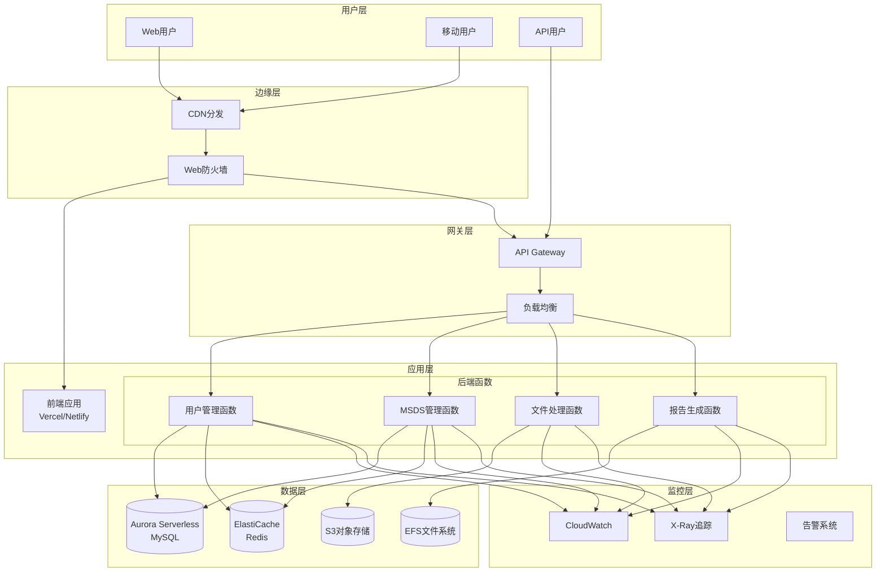

# MSDS实验室管理系统 - 云原生Serverless部署方案

## 文档信息

- **版本**: v1.0
- **更新日期**: 2025-01-27
- **适用范围**: MSDS实验室管理系统Serverless部署
- **维护者**: 云架构团队

## 1. 方案概述

### 1.1 Serverless核心理念

Serverless（无服务器）架构是一种云原生的计算模式，开发者无需管理服务器基础设施，只需关注业务逻辑的实现。云服务提供商负责服务器的管理、扩展和维护。

#### 核心特点

- **按需付费**: 只为实际使用的计算资源付费
- **自动扩缩容**: 根据负载自动调整资源
- **零运维**: 无需管理服务器和基础设施
- **高可用**: 内置容错和灾难恢复机制
- **快速部署**: 极速的部署和更新能力

### 1.2 技术架构

```
┌─────────────────────────────────────────────────────────────────┐
│                        用户访问层                                │
├─────────────────────────────────────────────────────────────────┤
│  CDN (CloudFlare/阿里云CDN)  │  API Gateway (AWS/阿里云)        │
└─────────────────┬───────────────────────┬───────────────────────┘
                  │                       │
┌─────────────────▼───────────────────────▼───────────────────────┐
│                        应用服务层                                │
├─────────────────────────────────────────────────────────────────┤
│  前端 (Vercel/Netlify)      │  后端 (AWS Lambda/阿里云函数)    │
│  • React SPA               │  • Spring Boot Native           │
│  • 静态资源托管             │  • 函数计算                     │
│  • 边缘计算                │  • API网关集成                  │
└─────────────────┬───────────────────────┬───────────────────────┘
                  │                       │
┌─────────────────▼───────────────────────▼───────────────────────┐
│                        数据服务层                                │
├─────────────────────────────────────────────────────────────────┤
│  数据库 (AWS RDS Serverless) │  缓存 (AWS ElastiCache)        │
│  • MySQL Aurora Serverless  │  • Redis Serverless            │
│  • 自动扩缩容               │  • 按需计费                     │
│  • 备份恢复                │  • 高可用                       │
└─────────────────┬───────────────────────┬───────────────────────┘
                  │                       │
┌─────────────────▼───────────────────────▼───────────────────────┐
│                        存储服务层                                │
├─────────────────────────────────────────────────────────────────┤
│  对象存储 (AWS S3/阿里云OSS) │  文件系统 (AWS EFS)            │
│  • MSDS文件存储             │  • 共享文件系统                 │
│  • 静态资源                │  • 自动备份                     │
│  • 生命周期管理             │  • 版本控制                     │
└─────────────────────────────────────────────────────────────────┘
```

### 1.3 服务架构图



## 2. 云服务选型

### 2.1 AWS云服务方案

#### 计算服务

```yaml
compute_services:
  # Lambda函数
  lambda:
    runtime: "java17"
    memory: "1024MB"
    timeout: "30s"
    concurrent_executions: 1000
    features:
      - "VPC支持"
      - "环境变量"
      - "层管理"
      - "版本控制"
  
  # Fargate容器
  fargate:
    cpu: "0.5 vCPU"
    memory: "1GB"
    platform_version: "1.4.0"
    features:
      - "无服务器容器"
      - "自动扩缩容"
      - "VPC集成"
```

#### 数据库服务

```yaml
database_services:
  # Aurora Serverless v2
  aurora_serverless:
    engine: "mysql"
    version: "8.0"
    capacity:
      min: 0.5
      max: 16
    features:
      - "自动扩缩容"
      - "按秒计费"
      - "数据API"
      - "自动备份"
  
  # DynamoDB
  dynamodb:
    billing_mode: "ON_DEMAND"
    features:
      - "无服务器NoSQL"
      - "毫秒级延迟"
      - "自动扩缩容"
      - "全球表"
```

#### 存储服务

```yaml
storage_services:
  # S3对象存储
  s3:
    storage_class: "STANDARD"
    features:
      - "无限容量"
      - "11个9的持久性"
      - "生命周期管理"
      - "版本控制"
  
  # EFS文件系统
  efs:
    performance_mode: "general_purpose"
    throughput_mode: "provisioned"
    features:
      - "完全托管"
      - "自动扩缩容"
      - "POSIX兼容"
      - "多AZ访问"
```

### 2.2 阿里云服务方案

#### 计算服务

```yaml
compute_services:
  # 函数计算
  function_compute:
    runtime: "java17"
    memory: "1024MB"
    timeout: "30s"
    instance_concurrency: 100
    features:
      - "VPC支持"
      - "环境变量"
      - "层管理"
      - "预留实例"
  
  # Serverless Kubernetes
  ask:
    pod_spec:
      cpu: "0.5 Core"
      memory: "1GB"
    features:
      - "无服务器K8s"
      - "按Pod计费"
      - "自动扩缩容"
```

#### 数据库服务

```yaml
database_services:
  # PolarDB Serverless
  polardb_serverless:
    engine: "mysql"
    version: "8.0"
    capacity:
      min: 0.5
      max: 32
    features:
      - "秒级扩缩容"
      - "按使用量计费"
      - "读写分离"
      - "自动备份"
  
  # 表格存储
  tablestore:
    billing_mode: "按量付费"
    features:
      - "NoSQL数据库"
      - "无限扩展"
      - "多模型"
      - "全文检索"
```

## 3. 应用架构设计

### 3.1 前端架构

#### React应用配置

```json
{
  "name": "msds-frontend-serverless",
  "version": "1.0.0",
  "scripts": {
    "build": "react-scripts build",
    "deploy:vercel": "vercel --prod",
    "deploy:netlify": "netlify deploy --prod --dir=build"
  },
  "dependencies": {
    "react": "^18.2.0",
    "react-dom": "^18.2.0",
    "react-router-dom": "^6.8.0",
    "axios": "^1.3.0",
    "@aws-amplify/ui-react": "^4.6.0",
    "aws-amplify": "^5.0.0"
  },
  "devDependencies": {
    "@types/react": "^18.0.0",
    "typescript": "^4.9.0",
    "tailwindcss": "^3.2.0"
  }
}
```

#### Vercel部署配置

```json
{
  "version": 2,
  "name": "msds-frontend",
  "builds": [
    {
      "src": "package.json",
      "use": "@vercel/static-build",
      "config": {
        "distDir": "build"
      }
    }
  ],
  "routes": [
    {
      "src": "/api/(.*)",
      "dest": "https://api.flymsds.cn/$1"
    },
    {
      "src": "/(.*)",
      "dest": "/index.html"
    }
  ],
  "env": {
    "REACT_APP_API_URL": "https://api.flymsds.cn",
    "REACT_APP_ENV": "production"
  },
  "functions": {
    "app/api/health.js": {
      "maxDuration": 10
    }
  }
}
```

### 3.2 后端架构

#### Spring Boot Native配置

```xml
<!-- pom.xml -->
<project>
    <groupId>com.ruoyi</groupId>
    <artifactId>msds-serverless</artifactId>
    <version>1.0.0</version>
    <packaging>jar</packaging>
    
    <properties>
        <java.version>17</java.version>
        <spring-boot.version>3.2.0</spring-boot.version>
        <spring-cloud.version>2023.0.0</spring-cloud.version>
        <graalvm.version>22.3.0</graalvm.version>
    </properties>
    
    <dependencies>
        <!-- Spring Boot Starter -->
        <dependency>
            <groupId>org.springframework.boot</groupId>
            <artifactId>spring-boot-starter-web</artifactId>
        </dependency>
        
        <!-- Spring Cloud Function -->
        <dependency>
            <groupId>org.springframework.cloud</groupId>
            <artifactId>spring-cloud-function-adapter-aws</artifactId>
        </dependency>
        
        <!-- AWS SDK -->
        <dependency>
            <groupId>software.amazon.awssdk</groupId>
            <artifactId>rds-data</artifactId>
        </dependency>
        
        <!-- GraalVM Native -->
        <dependency>
            <groupId>org.springframework.experimental</groupId>
            <artifactId>spring-native</artifactId>
        </dependency>
    </dependencies>
    
    <build>
        <plugins>
            <!-- Native Build Plugin -->
            <plugin>
                <groupId>org.graalvm.buildtools</groupId>
                <artifactId>native-maven-plugin</artifactId>
            </plugin>
            
            <!-- Spring Boot Plugin -->
            <plugin>
                <groupId>org.springframework.boot</groupId>
                <artifactId>spring-boot-maven-plugin</artifactId>
                <configuration>
                    <classifier>exec</classifier>
                </configuration>
            </plugin>
        </plugins>
    </build>
</project>
```

#### Lambda函数配置

```java
// MsdsLambdaHandler.java
@Component
public class MsdsLambdaHandler implements RequestHandler<APIGatewayProxyRequestEvent, APIGatewayProxyResponseEvent> {
    
    @Autowired
    private MsdsService msdsService;
    
    @Override
    public APIGatewayProxyResponseEvent handleRequest(APIGatewayProxyRequestEvent input, Context context) {
        try {
            String path = input.getPath();
            String method = input.getHttpMethod();
            String body = input.getBody();
            
            // 路由处理
            Object result = routeRequest(path, method, body);
            
            return APIGatewayProxyResponseEvent.builder()
                .statusCode(200)
                .headers(Map.of(
                    "Content-Type", "application/json",
                    "Access-Control-Allow-Origin", "*"
                ))
                .body(JsonUtils.toJson(result))
                .build();
                
        } catch (Exception e) {
            context.getLogger().log("Error: " + e.getMessage());
            
            return APIGatewayProxyResponseEvent.builder()
                .statusCode(500)
                .body("{\"error\":\"" + e.getMessage() + "\"}")
                .build();
        }
    }
    
    private Object routeRequest(String path, String method, String body) {
        // 实现路由逻辑
        if (path.startsWith("/api/msds")) {
            return msdsService.handleRequest(method, path, body);
        } else if (path.startsWith("/api/users")) {
            return userService.handleRequest(method, path, body);
        }
        throw new IllegalArgumentException("Unknown path: " + path);
    }
}
```

#### 数据访问层配置

```java
// ServerlessDataConfig.java
@Configuration
@EnableJpaRepositories
public class ServerlessDataConfig {
    
    @Bean
    @Primary
    public DataSource dataSource() {
        return DataSourceBuilder.create()
            .driverClassName("software.aws.rds.jdbc.mysql.Driver")
            .url("jdbc:mysql:aws://msds-aurora-cluster.cluster-xxx.rds.amazonaws.com:3306/msds")
            .username("${aws.rds.username}")
            .password("${aws.rds.password}")
            .build();
    }
    
    @Bean
    public RedisTemplate<String, Object> redisTemplate() {
        RedisTemplate<String, Object> template = new RedisTemplate<>();
        template.setConnectionFactory(jedisConnectionFactory());
        template.setDefaultSerializer(new GenericJackson2JsonRedisSerializer());
        return template;
    }
    
    @Bean
    public JedisConnectionFactory jedisConnectionFactory() {
        RedisStandaloneConfiguration config = new RedisStandaloneConfiguration();
        config.setHostName("${aws.elasticache.endpoint}");
        config.setPort(6379);
        return new JedisConnectionFactory(config);
    }
}
```

### 3.3 微服务拆分

#### 用户管理服务

```yaml
# serverless.yml - 用户管理服务
service: msds-user-service

provider:
  name: aws
  runtime: java17
  region: ap-northeast-1
  stage: ${opt:stage, 'dev'}
  
  environment:
    STAGE: ${self:provider.stage}
    DB_ENDPOINT: ${cf:msds-infrastructure-${self:provider.stage}.DatabaseEndpoint}
    REDIS_ENDPOINT: ${cf:msds-infrastructure-${self:provider.stage}.RedisEndpoint}
  
  iamRoleStatements:
    - Effect: Allow
      Action:
        - rds-data:*
        - elasticache:*
      Resource: "*"

functions:
  userApi:
    handler: com.ruoyi.msds.user.UserLambdaHandler
    memorySize: 1024
    timeout: 30
    events:
      - http:
          path: /users/{proxy+}
          method: ANY
          cors: true
    
  userAuth:
    handler: com.ruoyi.msds.user.AuthLambdaHandler
    memorySize: 512
    timeout: 10
    events:
      - http:
          path: /auth/{proxy+}
          method: ANY
          cors: true

resources:
  Resources:
    UserTable:
      Type: AWS::DynamoDB::Table
      Properties:
        TableName: ${self:service}-users-${self:provider.stage}
        BillingMode: PAY_PER_REQUEST
        AttributeDefinitions:
          - AttributeName: userId
            AttributeType: S
        KeySchema:
          - AttributeName: userId
            KeyType: HASH
```

#### MSDS管理服务

```yaml
# serverless.yml - MSDS管理服务
service: msds-document-service

provider:
  name: aws
  runtime: java17
  region: ap-northeast-1
  stage: ${opt:stage, 'dev'}

functions:
  msdsApi:
    handler: com.ruoyi.msds.document.MsdsLambdaHandler
    memorySize: 2048
    timeout: 60
    events:
      - http:
          path: /msds/{proxy+}
          method: ANY
          cors: true
    
  fileProcessor:
    handler: com.ruoyi.msds.document.FileProcessorHandler
    memorySize: 3008
    timeout: 300
    events:
      - s3:
          bucket: msds-documents-${self:provider.stage}
          event: s3:ObjectCreated:*
          rules:
            - suffix: .pdf
    
  reportGenerator:
    handler: com.ruoyi.msds.document.ReportGeneratorHandler
    memorySize: 2048
    timeout: 180
    events:
      - schedule: rate(1 hour)

resources:
  Resources:
    MsdsDocumentsBucket:
      Type: AWS::S3::Bucket
      Properties:
        BucketName: msds-documents-${self:provider.stage}
        VersioningConfiguration:
          Status: Enabled
        LifecycleConfiguration:
          Rules:
            - Status: Enabled
              Transitions:
                - TransitionInDays: 30
                  StorageClass: STANDARD_IA
                - TransitionInDays: 90
                  StorageClass: GLACIER
```

## 4. 基础设施即代码

### 4.1 AWS CloudFormation模板

```yaml
# infrastructure/cloudformation/msds-infrastructure.yml
AWSTemplateFormatVersion: '2010-09-09'
Description: 'MSDS系统Serverless基础设施'

Parameters:
  Environment:
    Type: String
    Default: 'dev'
    AllowedValues: ['dev', 'staging', 'production']
  
  DatabaseUsername:
    Type: String
    Default: 'msds_admin'
    NoEcho: true
  
  DatabasePassword:
    Type: String
    NoEcho: true
    MinLength: 8

Resources:
  # VPC配置
  VPC:
    Type: AWS::EC2::VPC
    Properties:
      CidrBlock: 10.0.0.0/16
      EnableDnsHostnames: true
      EnableDnsSupport: true
      Tags:
        - Key: Name
          Value: !Sub 'msds-vpc-${Environment}'
  
  # 私有子网
  PrivateSubnet1:
    Type: AWS::EC2::Subnet
    Properties:
      VpcId: !Ref VPC
      CidrBlock: 10.0.1.0/24
      AvailabilityZone: !Select [0, !GetAZs '']
      Tags:
        - Key: Name
          Value: !Sub 'msds-private-subnet-1-${Environment}'
  
  PrivateSubnet2:
    Type: AWS::EC2::Subnet
    Properties:
      VpcId: !Ref VPC
      CidrBlock: 10.0.2.0/24
      AvailabilityZone: !Select [1, !GetAZs '']
      Tags:
        - Key: Name
          Value: !Sub 'msds-private-subnet-2-${Environment}'
  
  # Aurora Serverless集群
  DatabaseSubnetGroup:
    Type: AWS::RDS::DBSubnetGroup
    Properties:
      DBSubnetGroupDescription: 'Subnet group for Aurora Serverless'
      SubnetIds:
        - !Ref PrivateSubnet1
        - !Ref PrivateSubnet2
      Tags:
        - Key: Name
          Value: !Sub 'msds-db-subnet-group-${Environment}'
  
  DatabaseCluster:
    Type: AWS::RDS::DBCluster
    Properties:
      DBClusterIdentifier: !Sub 'msds-aurora-${Environment}'
      Engine: aurora-mysql
      EngineMode: serverless
      EngineVersion: '8.0.mysql_aurora.3.02.0'
      DatabaseName: 'msds'
      MasterUsername: !Ref DatabaseUsername
      MasterUserPassword: !Ref DatabasePassword
      DBSubnetGroupName: !Ref DatabaseSubnetGroup
      VpcSecurityGroupIds:
        - !Ref DatabaseSecurityGroup
      ScalingConfiguration:
        AutoPause: true
        MinCapacity: 1
        MaxCapacity: 16
        SecondsUntilAutoPause: 300
      BackupRetentionPeriod: 7
      DeletionProtection: !If [IsProduction, true, false]
      Tags:
        - Key: Name
          Value: !Sub 'msds-aurora-${Environment}'
  
  # ElastiCache Redis
  RedisSubnetGroup:
    Type: AWS::ElastiCache::SubnetGroup
    Properties:
      Description: 'Subnet group for Redis'
      SubnetIds:
        - !Ref PrivateSubnet1
        - !Ref PrivateSubnet2
  
  RedisCluster:
    Type: AWS::ElastiCache::ReplicationGroup
    Properties:
      ReplicationGroupId: !Sub 'msds-redis-${Environment}'
      Description: 'Redis cluster for MSDS'
      NodeType: cache.t3.micro
      Engine: redis
      EngineVersion: '7.0'
      NumCacheClusters: 2
      Port: 6379
      CacheSubnetGroupName: !Ref RedisSubnetGroup
      SecurityGroupIds:
        - !Ref RedisSecurityGroup
      AtRestEncryptionEnabled: true
      TransitEncryptionEnabled: true
      AutomaticFailoverEnabled: true
      MultiAZEnabled: true
  
  # S3存储桶
  DocumentsBucket:
    Type: AWS::S3::Bucket
    Properties:
      BucketName: !Sub 'msds-documents-${Environment}-${AWS::AccountId}'
      VersioningConfiguration:
        Status: Enabled
      LifecycleConfiguration:
        Rules:
          - Status: Enabled
            Transitions:
              - TransitionInDays: 30
                StorageClass: STANDARD_IA
              - TransitionInDays: 90
                StorageClass: GLACIER
      PublicAccessBlockConfiguration:
        BlockPublicAcls: true
        BlockPublicPolicy: true
        IgnorePublicAcls: true
        RestrictPublicBuckets: true
      NotificationConfiguration:
        LambdaConfigurations:
          - Event: s3:ObjectCreated:*
            Function: !GetAtt FileProcessorFunction.Arn
            Filter:
              S3Key:
                Rules:
                  - Name: suffix
                    Value: .pdf
  
  # API Gateway
  ApiGateway:
    Type: AWS::ApiGateway::RestApi
    Properties:
      Name: !Sub 'msds-api-${Environment}'
      Description: 'MSDS系统API网关'
      EndpointConfiguration:
        Types:
          - REGIONAL
      Policy:
        Version: '2012-10-17'
        Statement:
          - Effect: Allow
            Principal: '*'
            Action: 'execute-api:Invoke'
            Resource: '*'
  
  # Lambda执行角色
  LambdaExecutionRole:
    Type: AWS::IAM::Role
    Properties:
      RoleName: !Sub 'msds-lambda-role-${Environment}'
      AssumeRolePolicyDocument:
        Version: '2012-10-17'
        Statement:
          - Effect: Allow
            Principal:
              Service: lambda.amazonaws.com
            Action: sts:AssumeRole
      ManagedPolicyArns:
        - arn:aws:iam::aws:policy/service-role/AWSLambdaVPCAccessExecutionRole
      Policies:
        - PolicyName: MsdsLambdaPolicy
          PolicyDocument:
            Version: '2012-10-17'
            Statement:
              - Effect: Allow
                Action:
                  - rds-data:*
                  - elasticache:*
                  - s3:GetObject
                  - s3:PutObject
                  - s3:DeleteObject
                Resource: '*'

Conditions:
  IsProduction: !Equals [!Ref Environment, 'production']

Outputs:
  VPCId:
    Description: 'VPC ID'
    Value: !Ref VPC
    Export:
      Name: !Sub '${AWS::StackName}-VPC-ID'
  
  DatabaseEndpoint:
    Description: 'Aurora Serverless endpoint'
    Value: !GetAtt DatabaseCluster.Endpoint.Address
    Export:
      Name: !Sub '${AWS::StackName}-Database-Endpoint'
  
  RedisEndpoint:
    Description: 'Redis cluster endpoint'
    Value: !GetAtt RedisCluster.RedisEndpoint.Address
    Export:
      Name: !Sub '${AWS::StackName}-Redis-Endpoint'
  
  DocumentsBucketName:
    Description: 'S3 documents bucket name'
    Value: !Ref DocumentsBucket
    Export:
      Name: !Sub '${AWS::StackName}-Documents-Bucket'
  
  ApiGatewayId:
    Description: 'API Gateway ID'
    Value: !Ref ApiGateway
    Export:
      Name: !Sub '${AWS::StackName}-ApiGateway-ID'
```

### 4.2 Terraform配置

```hcl
# infrastructure/terraform/main.tf
terraform {
  required_version = ">= 1.0"
  required_providers {
    aws = {
      source  = "hashicorp/aws"
      version = "~> 5.0"
    }
  }
  
  backend "s3" {
    bucket = "msds-terraform-state"
    key    = "serverless/terraform.tfstate"
    region = "ap-northeast-1"
  }
}

provider "aws" {
  region = var.aws_region
  
  default_tags {
    tags = {
      Project     = "MSDS"
      Environment = var.environment
      ManagedBy   = "Terraform"
    }
  }
}

# 变量定义
variable "environment" {
  description = "Environment name"
  type        = string
  default     = "dev"
}

variable "aws_region" {
  description = "AWS region"
  type        = string
  default     = "ap-northeast-1"
}

variable "database_password" {
  description = "Database password"
  type        = string
  sensitive   = true
}

# VPC模块
module "vpc" {
  source = "./modules/vpc"
  
  environment = var.environment
  cidr_block  = "10.0.0.0/16"
}

# Aurora Serverless模块
module "aurora" {
  source = "./modules/aurora"
  
  environment       = var.environment
  vpc_id           = module.vpc.vpc_id
  subnet_ids       = module.vpc.private_subnet_ids
  database_password = var.database_password
}

# ElastiCache模块
module "elasticache" {
  source = "./modules/elasticache"
  
  environment = var.environment
  vpc_id     = module.vpc.vpc_id
  subnet_ids = module.vpc.private_subnet_ids
}

# S3模块
module "s3" {
  source = "./modules/s3"
  
  environment = var.environment
}

# Lambda模块
module "lambda" {
  source = "./modules/lambda"
  
  environment    = var.environment
  vpc_id        = module.vpc.vpc_id
  subnet_ids    = module.vpc.private_subnet_ids
  database_endpoint = module.aurora.endpoint
  redis_endpoint    = module.elasticache.endpoint
  s3_bucket_name    = module.s3.documents_bucket_name
}

# API Gateway模块
module "api_gateway" {
  source = "./modules/api_gateway"
  
  environment     = var.environment
  lambda_functions = module.lambda.function_arns
}

# 输出
output "api_gateway_url" {
  description = "API Gateway URL"
  value       = module.api_gateway.api_url
}

output "database_endpoint" {
  description = "Aurora Serverless endpoint"
  value       = module.aurora.endpoint
  sensitive   = true
}
```

## 5. CI/CD流水线

### 5.1 GitHub Actions配置

```yaml
# .github/workflows/serverless-deploy.yml
name: Serverless部署流水线

on:
  push:
    branches: [main, develop]
  pull_request:
    branches: [main]

env:
  AWS_REGION: ap-northeast-1
  NODE_VERSION: 18
  JAVA_VERSION: 17

jobs:
  test:
    name: 测试
    runs-on: ubuntu-latest
    steps:
      - name: 检出代码
        uses: actions/checkout@v4
      
      - name: 设置Java环境
        uses: actions/setup-java@v3
        with:
          java-version: ${{ env.JAVA_VERSION }}
          distribution: 'corretto'
      
      - name: 缓存Maven依赖
        uses: actions/cache@v3
        with:
          path: ~/.m2
          key: ${{ runner.os }}-m2-${{ hashFiles('**/pom.xml') }}
      
      - name: 运行单元测试
        run: |
          cd backend
          mvn clean test
      
      - name: 运行集成测试
        run: |
          cd backend
          mvn verify -P integration-test
      
      - name: 代码覆盖率报告
        uses: codecov/codecov-action@v3
        with:
          file: ./backend/target/site/jacoco/jacoco.xml

  build-backend:
    name: 构建后端
    runs-on: ubuntu-latest
    needs: test
    steps:
      - name: 检出代码
        uses: actions/checkout@v4
      
      - name: 设置GraalVM
        uses: graalvm/setup-graalvm@v1
        with:
          version: '22.3.0'
          java-version: ${{ env.JAVA_VERSION }}
          components: 'native-image'
      
      - name: 构建Native镜像
        run: |
          cd backend
          mvn clean package -Pnative
      
      - name: 上传构建产物
        uses: actions/upload-artifact@v3
        with:
          name: backend-native
          path: backend/target/msds-serverless

  build-frontend:
    name: 构建前端
    runs-on: ubuntu-latest
    steps:
      - name: 检出代码
        uses: actions/checkout@v4
      
      - name: 设置Node.js环境
        uses: actions/setup-node@v3
        with:
          node-version: ${{ env.NODE_VERSION }}
          cache: 'npm'
          cache-dependency-path: frontend/package-lock.json
      
      - name: 安装依赖
        run: |
          cd frontend
          npm ci
      
      - name: 运行Lint检查
        run: |
          cd frontend
          npm run lint
      
      - name: 运行测试
        run: |
          cd frontend
          npm run test:ci
      
      - name: 构建生产版本
        run: |
          cd frontend
          npm run build
        env:
          REACT_APP_API_URL: ${{ secrets.API_URL }}
          REACT_APP_ENV: production
      
      - name: 上传构建产物
        uses: actions/upload-artifact@v3
        with:
          name: frontend-build
          path: frontend/build

  deploy-infrastructure:
    name: 部署基础设施
    runs-on: ubuntu-latest
    if: github.ref == 'refs/heads/main'
    steps:
      - name: 检出代码
        uses: actions/checkout@v4
      
      - name: 配置AWS凭证
        uses: aws-actions/configure-aws-credentials@v2
        with:
          aws-access-key-id: ${{ secrets.AWS_ACCESS_KEY_ID }}
          aws-secret-access-key: ${{ secrets.AWS_SECRET_ACCESS_KEY }}
          aws-region: ${{ env.AWS_REGION }}
      
      - name: 设置Terraform
        uses: hashicorp/setup-terraform@v2
        with:
          terraform_version: 1.5.0
      
      - name: Terraform初始化
        run: |
          cd infrastructure/terraform
          terraform init
      
      - name: Terraform计划
        run: |
          cd infrastructure/terraform
          terraform plan -var="database_password=${{ secrets.DATABASE_PASSWORD }}"
      
      - name: Terraform应用
        run: |
          cd infrastructure/terraform
          terraform apply -auto-approve -var="database_password=${{ secrets.DATABASE_PASSWORD }}"

  deploy-backend:
    name: 部署后端
    runs-on: ubuntu-latest
    needs: [build-backend, deploy-infrastructure]
    if: github.ref == 'refs/heads/main'
    steps:
      - name: 检出代码
        uses: actions/checkout@v4
      
      - name: 下载构建产物
        uses: actions/download-artifact@v3
        with:
          name: backend-native
          path: backend/target/
      
      - name: 配置AWS凭证
        uses: aws-actions/configure-aws-credentials@v2
        with:
          aws-access-key-id: ${{ secrets.AWS_ACCESS_KEY_ID }}
          aws-secret-access-key: ${{ secrets.AWS_SECRET_ACCESS_KEY }}
          aws-region: ${{ env.AWS_REGION }}
      
      - name: 安装Serverless Framework
        run: npm install -g serverless
      
      - name: 部署Lambda函数
        run: |
          cd backend
          serverless deploy --stage production
        env:
          DATABASE_ENDPOINT: ${{ secrets.DATABASE_ENDPOINT }}
          REDIS_ENDPOINT: ${{ secrets.REDIS_ENDPOINT }}

  deploy-frontend:
    name: 部署前端
    runs-on: ubuntu-latest
    needs: build-frontend
    if: github.ref == 'refs/heads/main'
    steps:
      - name: 检出代码
        uses: actions/checkout@v4
      
      - name: 下载构建产物
        uses: actions/download-artifact@v3
        with:
          name: frontend-build
          path: frontend/build
      
      - name: 部署到Vercel
        uses: amondnet/vercel-action@v25
        with:
          vercel-token: ${{ secrets.VERCEL_TOKEN }}
          vercel-org-id: ${{ secrets.VERCEL_ORG_ID }}
          vercel-project-id: ${{ secrets.VERCEL_PROJECT_ID }}
          working-directory: frontend
          vercel-args: '--prod'

  smoke-test:
    name: 冒烟测试
    runs-on: ubuntu-latest
    needs: [deploy-backend, deploy-frontend]
    steps:
      - name: 检出代码
        uses: actions/checkout@v4
      
      - name: 运行冒烟测试
        run: |
          cd tests
          npm install
          npm run smoke-test
        env:
          API_URL: ${{ secrets.API_URL }}
          FRONTEND_URL: ${{ secrets.FRONTEND_URL }}
```

### 5.2 部署脚本

```bash
#!/bin/bash
# scripts/deploy-serverless.sh

set -e

ENVIRONMENT=${1:-production}
AWS_REGION=${2:-ap-northeast-1}

echo "开始部署MSDS Serverless应用到 $ENVIRONMENT 环境..."

# 1. 检查依赖
echo "检查部署依赖..."
command -v aws >/dev/null 2>&1 || { echo "AWS CLI未安装"; exit 1; }
command -v terraform >/dev/null 2>&1 || { echo "Terraform未安装"; exit 1; }
command -v serverless >/dev/null 2>&1 || { echo "Serverless Framework未安装"; exit 1; }

# 2. 部署基础设施
echo "部署基础设施..."
cd infrastructure/terraform
terraform init
terraform workspace select $ENVIRONMENT || terraform workspace new $ENVIRONMENT
terraform plan -var="environment=$ENVIRONMENT"
terraform apply -auto-approve -var="environment=$ENVIRONMENT"

# 获取基础设施输出
DATABASE_ENDPOINT=$(terraform output -raw database_endpoint)
REDIS_ENDPOINT=$(terraform output -raw redis_endpoint)
S3_BUCKET=$(terraform output -raw documents_bucket_name)

# 3. 构建后端应用
echo "构建后端应用..."
cd ../../backend
mvn clean package -Pnative -DskipTests

# 4. 部署Lambda函数
echo "部署Lambda函数..."
export DATABASE_ENDPOINT=$DATABASE_ENDPOINT
export REDIS_ENDPOINT=$REDIS_ENDPOINT
export S3_BUCKET=$S3_BUCKET

serverless deploy --stage $ENVIRONMENT --region $AWS_REGION

# 5. 构建前端应用
echo "构建前端应用..."
cd ../frontend
npm install
npm run build

# 6. 部署前端到Vercel
echo "部署前端应用..."
vercel --prod --token $VERCEL_TOKEN

# 7. 运行部署后验证
echo "运行部署后验证..."
cd ../tests
npm install
npm run smoke-test

echo "部署完成！"
echo "API Gateway URL: $(cd ../infrastructure/terraform && terraform output -raw api_gateway_url)"
echo "前端URL: https://flymsds.cn"
```

## 6. 监控和可观测性

### 6.1 CloudWatch监控配置

```yaml
# monitoring/cloudwatch-dashboard.yml
AWSTemplateFormatVersion: '2010-09-09'
Description: 'MSDS Serverless监控仪表板'

Resources:
  MsdsDashboard:
    Type: AWS::CloudWatch::Dashboard
    Properties:
      DashboardName: 'MSDS-Serverless-Dashboard'
      DashboardBody: !Sub |
        {
          "widgets": [
            {
              "type": "metric",
              "x": 0,
              "y": 0,
              "width": 12,
              "height": 6,
              "properties": {
                "metrics": [
                  ["AWS/Lambda", "Invocations", "FunctionName", "msds-user-service-${Environment}"],
                  [".", "Duration", ".", "."],
                  [".", "Errors", ".", "."],
                  [".", "Throttles", ".", "."]
                ],
                "period": 300,
                "stat": "Sum",
                "region": "${AWS::Region}",
                "title": "Lambda函数指标"
              }
            },
            {
              "type": "metric",
              "x": 12,
              "y": 0,
              "width": 12,
              "height": 6,
              "properties": {
                "metrics": [
                  ["AWS/RDS", "DatabaseConnections", "DBClusterIdentifier", "msds-aurora-${Environment}"],
                  [".", "CPUUtilization", ".", "."],
                  [".", "ACUUtilization", ".", "."]
                ],
                "period": 300,
                "stat": "Average",
                "region": "${AWS::Region}",
                "title": "Aurora Serverless指标"
              }
            },
            {
              "type": "metric",
              "x": 0,
              "y": 6,
              "width": 12,
              "height": 6,
              "properties": {
                "metrics": [
                  ["AWS/ElastiCache", "CPUUtilization", "CacheClusterId", "msds-redis-${Environment}"],
                  [".", "NetworkBytesIn", ".", "."],
                  [".", "NetworkBytesOut", ".", "."],
                  [".", "CurrConnections", ".", "."]
                ],
                "period": 300,
                "stat": "Average",
                "region": "${AWS::Region}",
                "title": "ElastiCache指标"
              }
            },
            {
              "type": "metric",
              "x": 12,
              "y": 6,
              "width": 12,
              "height": 6,
              "properties": {
                "metrics": [
                  ["AWS/ApiGateway", "Count", "ApiName", "msds-api-${Environment}"],
                  [".", "Latency", ".", "."],
                  [".", "4XXError", ".", "."],
                  [".", "5XXError", ".", "."]
                ],
                "period": 300,
                "stat": "Sum",
                "region": "${AWS::Region}",
                "title": "API Gateway指标"
              }
            }
          ]
        }

  # 告警配置
  LambdaErrorAlarm:
    Type: AWS::CloudWatch::Alarm
    Properties:
      AlarmName: !Sub 'MSDS-Lambda-Errors-${Environment}'
      AlarmDescription: 'Lambda函数错误率过高'
      MetricName: Errors
      Namespace: AWS/Lambda
      Statistic: Sum
      Period: 300
      EvaluationPeriods: 2
      Threshold: 10
      ComparisonOperator: GreaterThanThreshold
      Dimensions:
        - Name: FunctionName
          Value: !Sub 'msds-user-service-${Environment}'
      AlarmActions:
        - !Ref SnsTopicArn

  DatabaseConnectionAlarm:
    Type: AWS::CloudWatch::Alarm
    Properties:
      AlarmName: !Sub 'MSDS-Database-Connections-${Environment}'
      AlarmDescription: 'Aurora数据库连接数过高'
      MetricName: DatabaseConnections
      Namespace: AWS/RDS
      Statistic: Average
      Period: 300
      EvaluationPeriods: 2
      Threshold: 80
      ComparisonOperator: GreaterThanThreshold
      Dimensions:
        - Name: DBClusterIdentifier
          Value: !Sub 'msds-aurora-${Environment}'
      AlarmActions:
        - !Ref SnsTopicArn
```

### 6.2 X-Ray分布式追踪

```java
// XRayConfig.java
@Configuration
@EnableXRay
public class XRayConfig {
    
    @Bean
    public Filter TracingFilter() {
        return new AWSXRayServletFilter("MSDS-Serverless");
    }
    
    @Bean
    public XRayInterceptor xrayInterceptor() {
        return new XRayInterceptor();
    }
    
    @Bean
    public WebMvcConfigurer xrayWebConfig(XRayInterceptor xrayInterceptor) {
        return new WebMvcConfigurer() {
            @Override
            public void addInterceptors(InterceptorRegistry registry) {
                registry.addInterceptor(xrayInterceptor);
            }
        };
    }
}

// 服务层追踪
@Service
@XRayEnabled
public class MsdsService {
    
    @Autowired
    private MsdsRepository msdsRepository;
    
    @XRayTrace
    public List<MsdsDocument> getAllDocuments() {
        Subsegment subsegment = AWSXRay.beginSubsegment("get-all-documents");
        try {
            subsegment.putAnnotation("operation", "getAllDocuments");
            List<MsdsDocument> documents = msdsRepository.findAll();
            subsegment.putMetadata("result_count", documents.size());
            return documents;
        } catch (Exception e) {
            subsegment.addException(e);
            throw e;
        } finally {
            AWSXRay.endSubsegment();
        }
    }
}
```

### 6.3 自定义指标收集

```java
// MetricsService.java
@Service
public class MetricsService {
    
    private final CloudWatchAsyncClient cloudWatchClient;
    
    public MetricsService() {
        this.cloudWatchClient = CloudWatchAsyncClient.builder()
            .region(Region.AP_NORTHEAST_1)
            .build();
    }
    
    public void recordBusinessMetric(String metricName, double value, String unit) {
        MetricDatum datum = MetricDatum.builder()
            .metricName(metricName)
            .value(value)
            .unit(unit)
            .timestamp(Instant.now())
            .dimensions(
                Dimension.builder()
                    .name("Environment")
                    .value(System.getenv("STAGE"))
                    .build(),
                Dimension.builder()
                    .name("Service")
                    .value("MSDS")
                    .build()
            )
            .build();
        
        PutMetricDataRequest request = PutMetricDataRequest.builder()
            .namespace("MSDS/Business")
            .metricData(datum)
            .build();
        
        cloudWatchClient.putMetricData(request);
    }
    
    public void recordDocumentProcessed() {
        recordBusinessMetric("DocumentsProcessed", 1.0, "Count");
    }
    
    public void recordUserLogin() {
        recordBusinessMetric("UserLogins", 1.0, "Count");
    }
    
    public void recordApiLatency(long latencyMs) {
        recordBusinessMetric("ApiLatency", latencyMs, "Milliseconds");
    }
}
```

## 7. 成本优化

### 7.1 成本分析

#### 预估成本结构

```yaml
# 月度成本预估 (生产环境)
cost_estimation:
  compute:
    lambda:
      requests: 10000000  # 1000万次请求
      duration: 500       # 平均500ms
      memory: 1024        # 1GB内存
      cost: "$200"
    
    fargate:
      vcpu_hours: 720     # 1个vCPU * 24小时 * 30天
      memory_gb_hours: 1440 # 2GB * 24小时 * 30天
      cost: "$50"
  
  storage:
    s3:
      standard: "100GB"
      requests: 1000000
      cost: "$25"
    
    efs:
      storage: "50GB"
      throughput: "100MB/s"
      cost: "$15"
  
  database:
    aurora_serverless:
      acu_hours: 2160     # 平均3 ACU * 24小时 * 30天
      storage: "100GB"
      cost: "$150"
  
  cache:
    elasticache:
      node_hours: 720     # t3.micro * 24小时 * 30天
      cost: "$15"
  
  network:
    data_transfer: "500GB"
    cost: "$45"
  
  total_monthly_cost: "$500"
```

### 7.2 成本优化策略

#### Lambda优化配置

```yaml
# serverless.yml - 成本优化配置
functions:
  userApi:
    handler: com.ruoyi.msds.user.UserLambdaHandler
    memorySize: 1024      # 根据实际需求调整
    timeout: 30           # 避免过长超时
    reservedConcurrency: 100  # 控制并发数
    provisionedConcurrency: 10  # 预留实例减少冷启动
    events:
      - http:
          path: /users/{proxy+}
          method: ANY
    
    # 环境变量优化
    environment:
      JAVA_TOOL_OPTIONS: "-XX:+TieredCompilation -XX:TieredStopAtLevel=1"
      
    # VPC配置优化
    vpc:
      securityGroupIds:
        - ${self:custom.securityGroupId}
      subnetIds:
        - ${self:custom.privateSubnetId1}
        - ${self:custom.privateSubnetId2}

# 自定义配置
custom:
  # 根据环境调整配置
  stage: ${opt:stage, 'dev'}
  
  # 开发环境成本优化
  dev:
    lambdaMemory: 512
    lambdaTimeout: 15
    auroraMinCapacity: 0.5
    auroraMaxCapacity: 2
  
  # 生产环境性能优化
  production:
    lambdaMemory: 1024
    lambdaTimeout: 30
    auroraMinCapacity: 2
    auroraMaxCapacity: 16
```

#### 数据库成本优化

```sql
-- Aurora Serverless优化配置
-- 1. 启用自动暂停
SET GLOBAL aurora_serverless_auto_pause = ON;
SET GLOBAL aurora_serverless_auto_pause_delay = 300; -- 5分钟

-- 2. 优化查询性能
-- 创建适当的索引
CREATE INDEX idx_msds_product_name ON msds_documents(product_name);
CREATE INDEX idx_msds_created_time ON msds_documents(created_time);
CREATE INDEX idx_user_login_time ON sys_user(login_date);

-- 3. 数据归档策略
-- 创建归档表
CREATE TABLE msds_documents_archive LIKE msds_documents;

-- 归档旧数据
INSERT INTO msds_documents_archive 
SELECT * FROM msds_documents 
WHERE created_time < DATE_SUB(NOW(), INTERVAL 1 YEAR);

DELETE FROM msds_documents 
WHERE created_time < DATE_SUB(NOW(), INTERVAL 1 YEAR);
```

### 7.3 成本监控

```yaml
# monitoring/cost-monitoring.yml
AWSTemplateFormatVersion: '2010-09-09'
Description: 'MSDS成本监控配置'

Resources:
  # 成本预算
  MsdsBudget:
    Type: AWS::Budgets::Budget
    Properties:
      Budget:
        BudgetName: 'MSDS-Monthly-Budget'
        BudgetLimit:
          Amount: 1000
          Unit: USD
        TimeUnit: MONTHLY
        BudgetType: COST
        CostFilters:
          TagKey:
            - Project
          TagValue:
            - MSDS
      NotificationsWithSubscribers:
        - Notification:
            NotificationType: ACTUAL
            ComparisonOperator: GREATER_THAN
            Threshold: 80
          Subscribers:
            - SubscriptionType: EMAIL
              Address: devops@flymsds.cn
        - Notification:
            NotificationType: FORECASTED
            ComparisonOperator: GREATER_THAN
            Threshold: 100
          Subscribers:
            - SubscriptionType: EMAIL
              Address: devops@flymsds.cn

  # 成本异常检测
  CostAnomalyDetector:
    Type: AWS::CE::AnomalyDetector
    Properties:
      AnomalyDetectorName: 'MSDS-Cost-Anomaly-Detector'
      MonitorType: DIMENSIONAL
      MonitorSpecification:
        DimensionKey: SERVICE
        MatchOptions:
          - EQUALS
        Values:
          - Amazon Elastic Compute Cloud - Compute
          - AWS Lambda
          - Amazon Relational Database Service
```

## 8. 安全配置

### 8.1 IAM权限配置

```json
{
  "Version": "2012-10-17",
  "Statement": [
    {
      "Sid": "LambdaBasicExecution",
      "Effect": "Allow",
      "Action": [
        "logs:CreateLogGroup",
        "logs:CreateLogStream",
        "logs:PutLogEvents"
      ],
      "Resource": "arn:aws:logs:*:*:*"
    },
    {
      "Sid": "VPCAccess",
      "Effect": "Allow",
      "Action": [
        "ec2:CreateNetworkInterface",
        "ec2:DescribeNetworkInterfaces",
        "ec2:DeleteNetworkInterface"
      ],
      "Resource": "*"
    },
    {
      "Sid": "RDSDataAccess",
      "Effect": "Allow",
      "Action": [
        "rds-data:BatchExecuteStatement",
        "rds-data:BeginTransaction",
        "rds-data:CommitTransaction",
        "rds-data:ExecuteStatement",
        "rds-data:RollbackTransaction"
      ],
      "Resource": "arn:aws:rds:*:*:cluster:msds-aurora-*"
    },
    {
      "Sid": "S3Access",
      "Effect": "Allow",
      "Action": [
        "s3:GetObject",
        "s3:PutObject",
        "s3:DeleteObject"
      ],
      "Resource": "arn:aws:s3:::msds-documents-*/*"
    },
    {
      "Sid": "ElastiCacheAccess",
      "Effect": "Allow",
      "Action": [
        "elasticache:Describe*"
      ],
      "Resource": "*"
    },
    {
      "Sid": "XRayAccess",
      "Effect": "Allow",
      "Action": [
        "xray:PutTraceSegments",
        "xray:PutTelemetryRecords"
      ],
      "Resource": "*"
    }
  ]
}
```

### 8.2 API Gateway安全配置

```yaml
# API Gateway安全配置
api_gateway_security:
  # API密钥
  api_keys:
    - name: "msds-api-key"
      description: "MSDS API访问密钥"
      enabled: true
  
  # 使用计划
  usage_plans:
    - name: "msds-basic-plan"
      description: "基础使用计划"
      throttle:
        rate_limit: 1000
        burst_limit: 2000
      quota:
        limit: 100000
        period: MONTH
  
  # 资源策略
  resource_policy:
    Version: "2012-10-17"
    Statement:
      - Effect: "Allow"
        Principal: "*"
        Action: "execute-api:Invoke"
        Resource: "*"
        Condition:
          IpAddress:
            aws:SourceIp:
              - "203.0.113.0/24"  # 允许的IP范围
      
      - Effect: "Deny"
        Principal: "*"
        Action: "execute-api:Invoke"
        Resource: "*"
        Condition:
          StringNotEquals:
            aws:RequestedRegion: "ap-northeast-1"

  # WAF配置
  waf_rules:
    - name: "RateLimitRule"
      priority: 1
      action: "BLOCK"
      rate_limit: 2000
    
    - name: "SQLInjectionRule"
      priority: 2
      action: "BLOCK"
      managed_rule_group: "AWSManagedRulesSQLiRuleSet"
    
    - name: "XSSRule"
      priority: 3
      action: "BLOCK"
      managed_rule_group: "AWSManagedRulesCommonRuleSet"
```

### 8.3 数据加密配置

```yaml
# 数据加密配置
encryption:
  # 传输加密
  in_transit:
    api_gateway:
      ssl_certificate: "*.flymsds.cn"
      min_tls_version: "1.2"
    
    aurora:
      ssl_mode: "REQUIRED"
      ssl_ca: "rds-ca-2019-root.pem"
    
    elasticache:
      transit_encryption: true
      auth_token: "${random_password}"
  
  # 静态加密
  at_rest:
    s3:
      encryption: "AES256"
      kms_key: "alias/msds-s3-key"
    
    aurora:
      encryption: true
      kms_key: "alias/msds-rds-key"
    
    elasticache:
      encryption: true
      kms_key: "alias/msds-cache-key"
    
    lambda:
      environment_variables:
        kms_key: "alias/msds-lambda-key"
```

## 9. 灾难恢复

### 9.1 备份策略

```yaml
# 备份配置
backup_strategy:
  # Aurora自动备份
  aurora:
    backup_retention_period: 7  # 保留7天
    backup_window: "03:00-04:00"  # UTC时间
    copy_tags_to_snapshot: true
    deletion_protection: true
    
    # 跨区域备份
    cross_region_backup:
      destination_region: "ap-southeast-1"
      retention_period: 30
  
  # S3备份
  s3:
    versioning: true
    lifecycle_policy:
      - transition_to_ia: 30  # 30天后转为IA
      - transition_to_glacier: 90  # 90天后转为Glacier
      - expiration: 2555  # 7年后删除
    
    # 跨区域复制
    cross_region_replication:
      destination_bucket: "msds-documents-backup-ap-southeast-1"
      storage_class: "STANDARD_IA"
  
  # Lambda代码备份
  lambda:
    versioning: true
    alias_management: true
    code_backup_to_s3: true
```

### 9.2 恢复流程

```bash
#!/bin/bash
# scripts/disaster-recovery.sh

set -e

RECOVERY_TYPE=${1:-"partial"}  # partial, full
BACKUP_DATE=${2:-$(date -d "yesterday" +%Y-%m-%d)}
TARGET_REGION=${3:-"ap-northeast-1"}

echo "开始灾难恢复流程..."
echo "恢复类型: $RECOVERY_TYPE"
echo "备份日期: $BACKUP_DATE"
echo "目标区域: $TARGET_REGION"

# 1. 恢复Aurora数据库
if [[ "$RECOVERY_TYPE" == "full" || "$RECOVERY_TYPE" == "database" ]]; then
    echo "恢复Aurora数据库..."
    
    # 查找最新的快照
    SNAPSHOT_ID=$(aws rds describe-db-cluster-snapshots \
        --db-cluster-identifier msds-aurora-production \
        --snapshot-type automated \
        --query 'DBClusterSnapshots[0].DBClusterSnapshotIdentifier' \
        --output text)
    
    # 从快照恢复集群
    aws rds restore-db-cluster-from-snapshot \
        --db-cluster-identifier msds-aurora-recovery \
        --snapshot-identifier $SNAPSHOT_ID \
        --engine aurora-mysql \
        --engine-mode serverless
fi

# 2. 恢复S3数据
if [[ "$RECOVERY_TYPE" == "full" || "$RECOVERY_TYPE" == "storage" ]]; then
    echo "恢复S3数据..."
    
    # 从备份区域同步数据
    aws s3 sync s3://msds-documents-backup-ap-southeast-1/ \
        s3://msds-documents-production-recovery/ \
        --region $TARGET_REGION
fi

# 3. 重新部署Lambda函数
if [[ "$RECOVERY_TYPE" == "full" || "$RECOVERY_TYPE" == "application" ]]; then
    echo "重新部署Lambda函数..."
    
    cd ../backend
    serverless deploy --stage recovery --region $TARGET_REGION
fi

echo "灾难恢复完成！"
```

## 10. 性能优化

### 10.1 冷启动优化

#### Lambda预热策略

```yaml
# serverless.yml - 预热配置
functions:
  userApi:
    handler: com.ruoyi.msds.user.UserLambdaHandler
    memorySize: 1024
    timeout: 30
    
    # 预留并发
    reservedConcurrency: 50
    provisionedConcurrency: 10
    
    # 预热事件
    events:
      - schedule:
          rate: rate(5 minutes)
          input:
            warmer: true
            concurrency: 5

  # 预热函数
  warmer:
    handler: com.ruoyi.msds.common.WarmerHandler
    memorySize: 128
    timeout: 10
    events:
      - schedule: rate(5 minutes)
```

#### GraalVM Native优化

```xml
<!-- pom.xml - Native配置 -->
<plugin>
    <groupId>org.graalvm.buildtools</groupId>
    <artifactId>native-maven-plugin</artifactId>
    <configuration>
        <buildArgs>
            <buildArg>--no-fallback</buildArg>
            <buildArg>--enable-http</buildArg>
            <buildArg>--enable-https</buildArg>
            <buildArg>--initialize-at-build-time=org.slf4j</buildArg>
            <buildArg>--initialize-at-run-time=io.netty</buildArg>
            <buildArg>-H:+ReportExceptionStackTraces</buildArg>
            <buildArg>-H:+AddAllCharsets</buildArg>
            <buildArg>-H:IncludeResources=.*\.properties$</buildArg>
        </buildArgs>
    </configuration>
</plugin>
```

### 10.2 数据库性能优化

```sql
-- Aurora Serverless性能优化
-- 1. 连接池配置
SET GLOBAL max_connections = 1000;
SET GLOBAL wait_timeout = 28800;
SET GLOBAL interactive_timeout = 28800;

-- 2. 查询缓存优化
SET GLOBAL query_cache_type = ON;
SET GLOBAL query_cache_size = 268435456; -- 256MB

-- 3. InnoDB优化
SET GLOBAL innodb_buffer_pool_size = 1073741824; -- 1GB
SET GLOBAL innodb_log_file_size = 268435456; -- 256MB
SET GLOBAL innodb_flush_log_at_trx_commit = 2;

-- 4. 索引优化建议
ANALYZE TABLE msds_documents;
ANALYZE TABLE sys_user;
ANALYZE TABLE sys_role;
```

### 10.3 缓存策略

```java
// CacheConfig.java
@Configuration
@EnableCaching
public class CacheConfig {
    
    @Bean
    public CacheManager cacheManager() {
        RedisCacheManager.Builder builder = RedisCacheManager
            .RedisCacheManagerBuilder
            .fromConnectionFactory(jedisConnectionFactory())
            .cacheDefaults(cacheConfiguration());
        
        return builder.build();
    }
    
    private RedisCacheConfiguration cacheConfiguration() {
        return RedisCacheConfiguration.defaultCacheConfig()
            .entryTtl(Duration.ofMinutes(30))
            .serializeKeysWith(RedisSerializationContext.SerializationPair
                .fromSerializer(new StringRedisSerializer()))
            .serializeValuesWith(RedisSerializationContext.SerializationPair
                .fromSerializer(new GenericJackson2JsonRedisSerializer()));
    }
}

// 缓存使用示例
@Service
public class MsdsService {
    
    @Cacheable(value = "msds", key = "#id")
    public MsdsDocument findById(Long id) {
        return msdsRepository.findById(id).orElse(null);
    }
    
    @CacheEvict(value = "msds", key = "#document.id")
    public void updateDocument(MsdsDocument document) {
        msdsRepository.save(document);
    }
    
    @Cacheable(value = "msds-list", key = "#page + '-' + #size")
    public Page<MsdsDocument> findAll(int page, int size) {
        return msdsRepository.findAll(PageRequest.of(page, size));
    }
}
```

## 11. 故障排查

### 11.1 常见问题

#### Lambda函数问题

```bash
# 1. 查看Lambda日志
aws logs describe-log-groups --log-group-name-prefix "/aws/lambda/msds"

# 2. 获取最新日志
aws logs get-log-events \
    --log-group-name "/aws/lambda/msds-user-service-production" \
    --log-stream-name "$(aws logs describe-log-streams \
        --log-group-name "/aws/lambda/msds-user-service-production" \
        --order-by LastEventTime \
        --descending \
        --max-items 1 \
        --query 'logStreams[0].logStreamName' \
        --output text)"

# 3. 检查函数配置
aws lambda get-function --function-name msds-user-service-production

# 4. 测试函数
aws lambda invoke \
    --function-name msds-user-service-production \
    --payload '{"httpMethod":"GET","path":"/users","headers":{}}' \
    response.json
```

#### Aurora Serverless问题

```sql
-- 1. 检查连接状态
SHOW PROCESSLIST;

-- 2. 检查慢查询
SELECT * FROM mysql.slow_log 
WHERE start_time > DATE_SUB(NOW(), INTERVAL 1 HOUR)
ORDER BY start_time DESC;

-- 3. 检查锁等待
SELECT * FROM information_schema.INNODB_LOCKS;
SELECT * FROM information_schema.INNODB_LOCK_WAITS;

-- 4. 检查表状态
SHOW TABLE STATUS LIKE 'msds_%';
```

### 11.2 监控告警

```yaml
# 告警规则配置
alerts:
  lambda_errors:
    metric: "AWS/Lambda.Errors"
    threshold: 10
    period: 300
    evaluation_periods: 2
    comparison: "GreaterThanThreshold"
    
  lambda_duration:
    metric: "AWS/Lambda.Duration"
    threshold: 25000  # 25秒
    period: 300
    evaluation_periods: 2
    comparison: "GreaterThanThreshold"
    
  aurora_cpu:
    metric: "AWS/RDS.CPUUtilization"
    threshold: 80
    period: 300
    evaluation_periods: 3
    comparison: "GreaterThanThreshold"
    
  api_gateway_latency:
    metric: "AWS/ApiGateway.Latency"
    threshold: 5000  # 5秒
    period: 300
    evaluation_periods: 2
    comparison: "GreaterThanThreshold"
```

## 12. 方案总结

### 12.1 方案优势

#### 技术优势

- **零运维**: 无需管理服务器基础设施
- **自动扩缩容**: 根据负载自动调整资源
- **高可用性**: 内置容错和灾难恢复
- **快速部署**: 极速的部署和更新能力
- **成本效益**: 按使用量付费，无闲置成本

#### 业务优势

- **快速上市**: 缩短产品上市时间
- **专注业务**: 开发团队专注业务逻辑
- **全球部署**: 轻松实现全球化部署
- **弹性伸缩**: 应对突发流量无压力
- **持续创新**: 快速试验和迭代新功能

### 12.2 适用场景

#### 最佳适用场景

- **初创企业**: 快速验证产品概念
- **中小企业**: 降低IT运维成本
- **全球化应用**: 需要多区域部署
- **流量波动大**: 业务负载不稳定
- **快速迭代**: 需要频繁发布更新

#### 不适用场景

- **长时间运行**: 需要持续运行的任务
- **大型单体**: 复杂的单体应用
- **特殊硬件**: 需要特定硬件支持
- **严格延迟**: 对延迟要求极高的应用
- **复杂事务**: 需要复杂分布式事务

### 12.3 实施建议

#### 分阶段实施

1. **第一阶段**: 核心API迁移到Lambda
2. **第二阶段**: 数据库迁移到Aurora Serverless
3. **第三阶段**: 前端部署到CDN
4. **第四阶段**: 完善监控和告警
5. **第五阶段**: 性能优化和成本控制

#### 团队准备

- **技能培训**: 云原生技术培训
- **工具熟悉**: Serverless开发工具
- **流程调整**: 适应新的开发流程
- **监控运维**: 建立新的运维体系

#### 风险控制

- **渐进迁移**: 逐步迁移降低风险
- **回滚计划**: 准备完整的回滚方案
- **性能测试**: 充分的性能和压力测试
- **成本监控**: 实时监控成本变化
- **安全审计**: 定期安全审计和评估

---

## 附录

### A. 相关资源

- [AWS Lambda开发指南](https://docs.aws.amazon.com/lambda/)
- [Aurora Serverless文档](https://docs.aws.amazon.com/AmazonRDS/latest/AuroraUserGuide/aurora-serverless.html)
- [Serverless Framework文档](https://www.serverless.com/framework/docs/)
- [Spring Cloud Function](https://spring.io/projects/spring-cloud-function)

### B. 成本计算器

- [AWS定价计算器](https://calculator.aws/)
- [阿里云价格计算器](https://www.aliyun.com/price/calculator)

### C. 联系信息

- **项目负责人**: 云架构团队
- **技术支持**: serverless@flymsds.cn
- **文档维护**: docs@flymsds.cn

---

*本文档将根据技术发展和项目需求持续更新。*