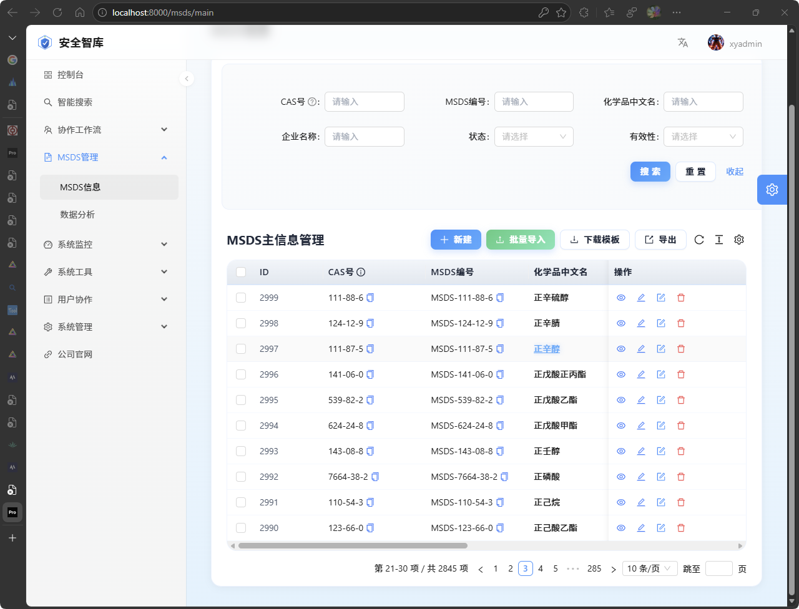
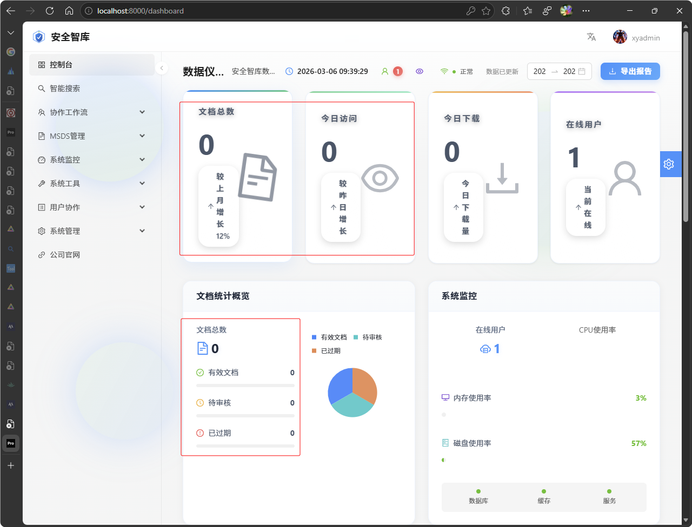
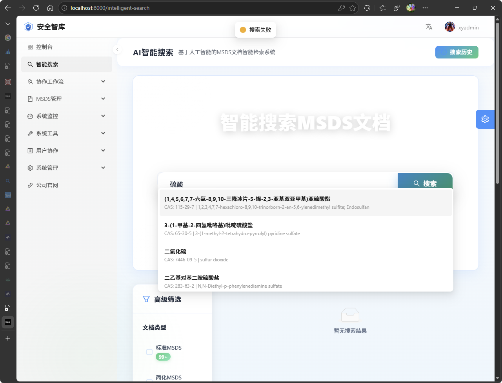
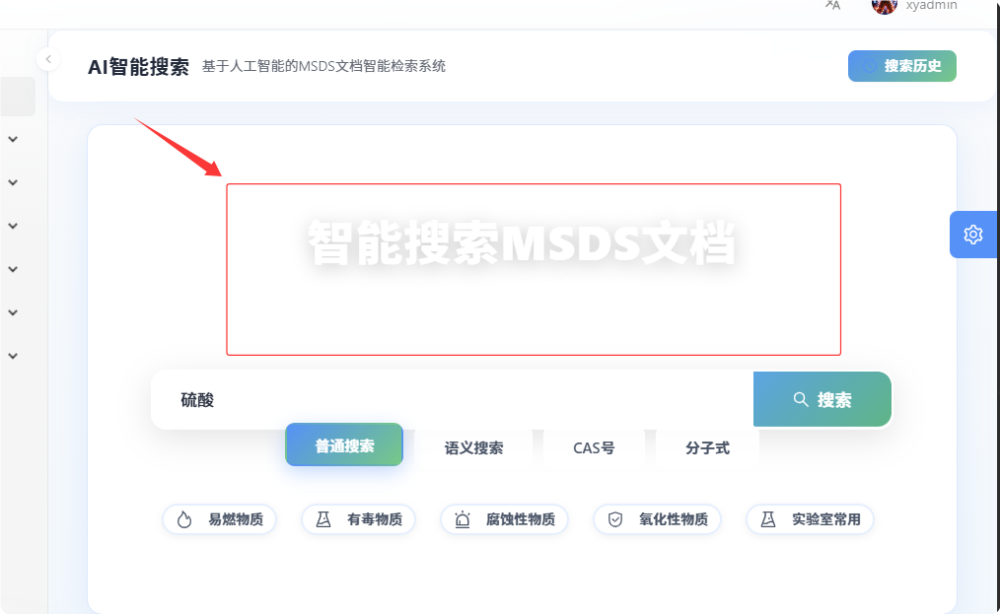
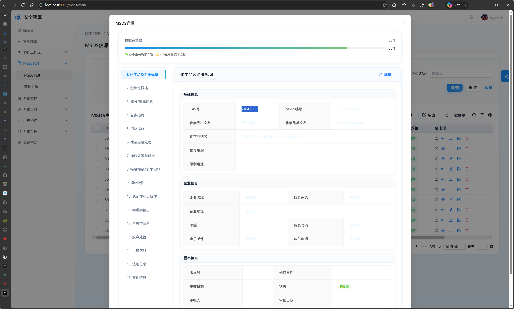

- 批量转换前字段完整性检查及修改  ✅
- 完善首页统计功能！ ✅ (2025-10-24)
- MSDS编辑表单数据加载功能实现 ✅ (2025-10-24)
- 更新项目进度文档！！！✅
- 更新数据库文档  ✅  ////这里没有再往数据库中做更新！
- 更新项目规则  ✅
- 
- 部署实施！！！  CICD之后验证&先使用编译包在服务器运行！
- 功能页面升级优化--添加完善页面，ui设计！##使用ui包继续优化项目
- 准备进行PC功能补充开发。。。。    ##新增功能中！
- 更新个人&项目规则 20251104 ✅
- 按原型设计图-更新登录页面！
- 智能搜索页面报错：修复完页面功能之后才能增加页面；
- 先设计图补全模块
- 添加了一个数据分析统计页面待验证 ✅
- 添加任务协同页面，完善及404错误修复测试。
- 使用JFKJ公司发布！

---

# 20251119

- msdsfullstack转换xml并对转换后的文档进行补全；【完全转换中。。。。】
  @(1R,2R,4R)-冰片-2-硫氰基醋酸酯、1,7,7-trimethylbicyclo(2,2,1)hept-2-yl thiocyanatoacetate、115-31-1.xml 帮我看下这个文件有需要补充完善的msds内容吗，有请帮我补充完善
- 测试重新导入之后补全剩余所有文档 依次

---

- 完善各个功能页面配置：✅
- 增加了多地址轮询访问！✅
- 正在增加pc端对于用户的反馈跟踪模块：常见问题！意见反馈！关于我们！（但是增加上了数据没有和app端同步！）✅
- 完成批量导入文档功能待测试？
  分子式，分子量等初三数添加

## 20260118

- 自动化构建项目
- 后面自动化上线几个监控服务！
- 

## 20260129

- 补全msds
- 修复：阿里云39.107.211.72: Redis 未授权访问漏洞。

## 20260130 准备美化下首页不要有ai味道！

- 登录页面完成美化 ✅
- 

## 20260214  完善首页统计功能！

- 完善登录及其它页面优化；✅
- 技能+mcp+工作流完善；✅
- 补全msds ✅

## 20260215 更新

- 准备进行msds文档不全检测及进一步优化，使用相关技能及mcp服务；

---

## 20260224 启动后开始完整导入msds文档！

1、启动项目报错解决后批量导入文档；

## 20260225

- 整体检查统一完善msds文档；///发现清单中缺少3个

---

## 20260228

- 检查下SSL是否过期！✅
- 上传文档资料msds ✅

## 20260303

- 完善msds文档完善！✅
- 控制台数据接口最新！✅

## 20260304

- msds信息管理不论是切换到哪个标切页，文档显示的内容都没有任何变化。✅

## 20260305

- 测试文档管理界面，页面切换正常了 ✅

---
## 20260306
电脑端：
### 1.导入文档一致问题：✅
    msds信息管理页面下原计划一次性导入的数据量为3045条数据，单只显示导入了2845条数据，你应该在导入的时候增加严格的校对，发现未导入成功的数据，或者导入失败的数据给用户在前端展示导入失败的问题数据的显示提示；导入中：  导入后的结果：

### 2. 完善msds信息管理页面增加一键删除功能：✅
    给一级菜单 msds管理 菜单下 msds信息  页面添加一个一键删除功能，并且这个权限仅限最高级管理员可以使用；

### 3.电脑端控制台页面优化：✅
    文档总数，今日访问量这些统计数据要准确 

### 4.AI智能搜索模块检索错误：
     智能搜索在进行检索的时候显示失败； 并且最上方这块的文字也看不清，请你使用前端设计相关技能帮我更新优化该页面。

## 5、msds详情页面每项的内容看不清
我框选内容是有的，现在请你帮我优化这块的显示效果 

