# MSDS微信小程序用户操作流程图

## 1. 整体流程概览

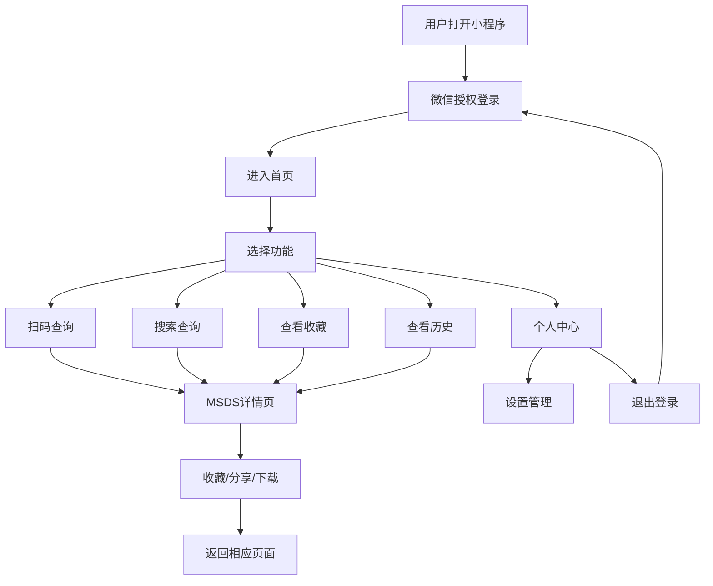

## 2. 详细操作流程

### 2.1 用户登录流程

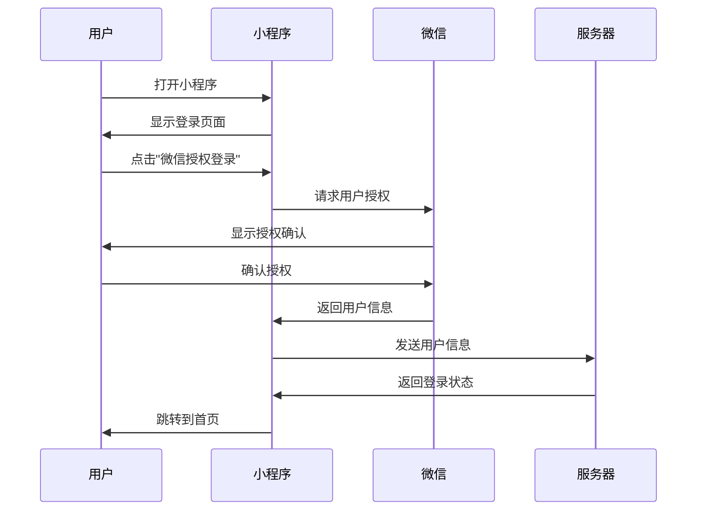

### 2.2 首页操作流程

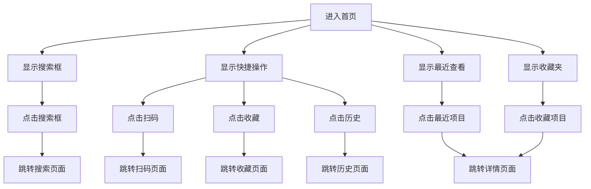

### 2.3 扫码查询流程

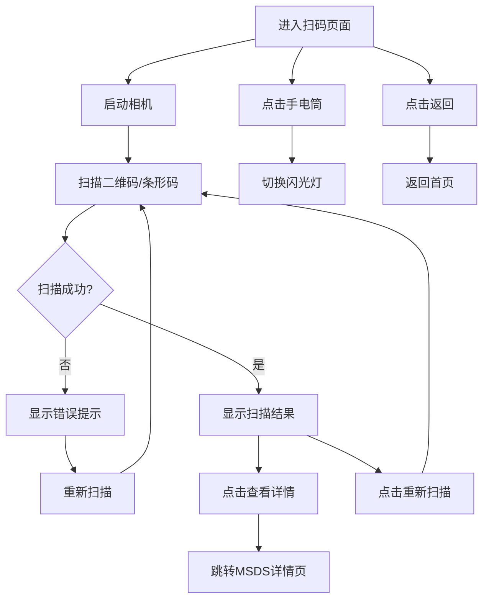

### 2.4 搜索查询流程

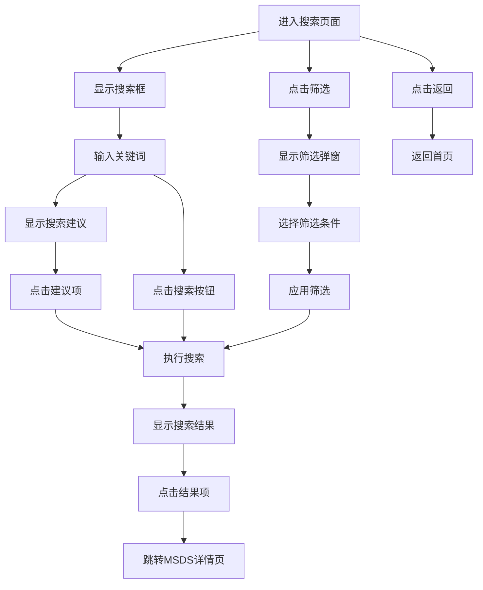

### 2.5 MSDS详情页流程

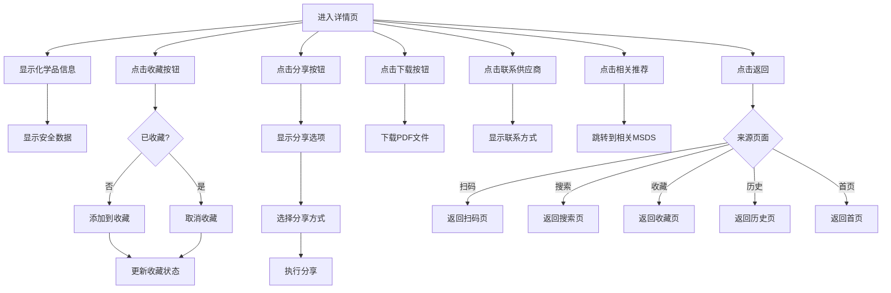

### 2.6 收藏管理流程

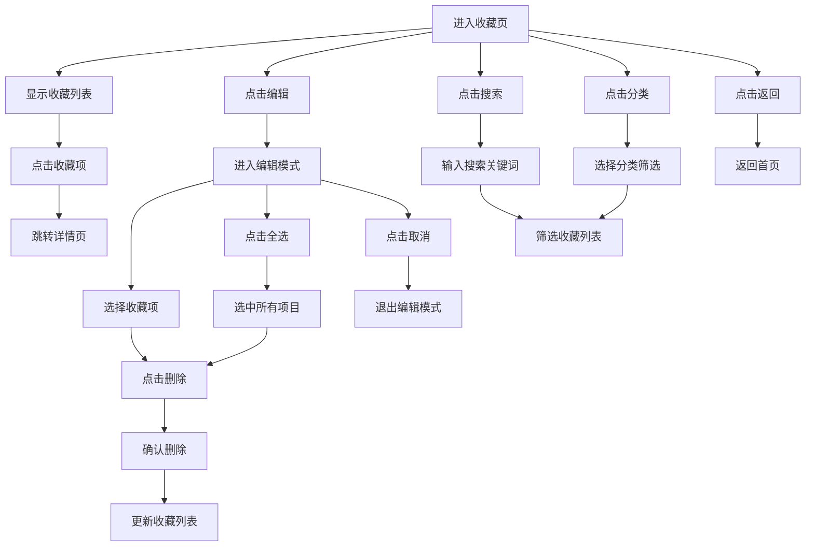

### 2.7 历史记录流程

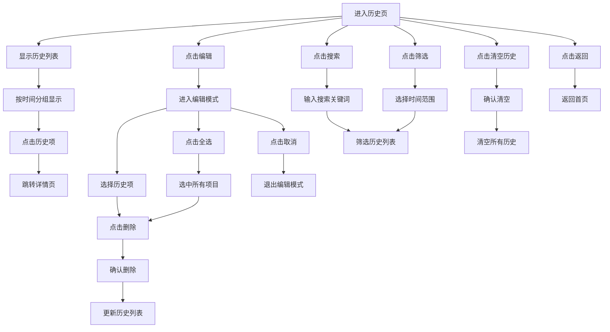

### 2.8 个人中心流程

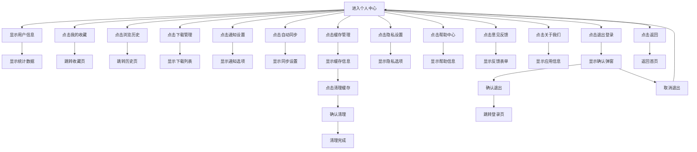

## 3. 底部导航流程

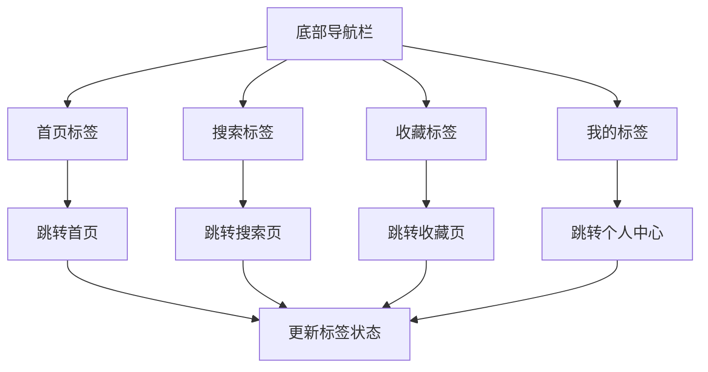

## 4. 错误处理流程

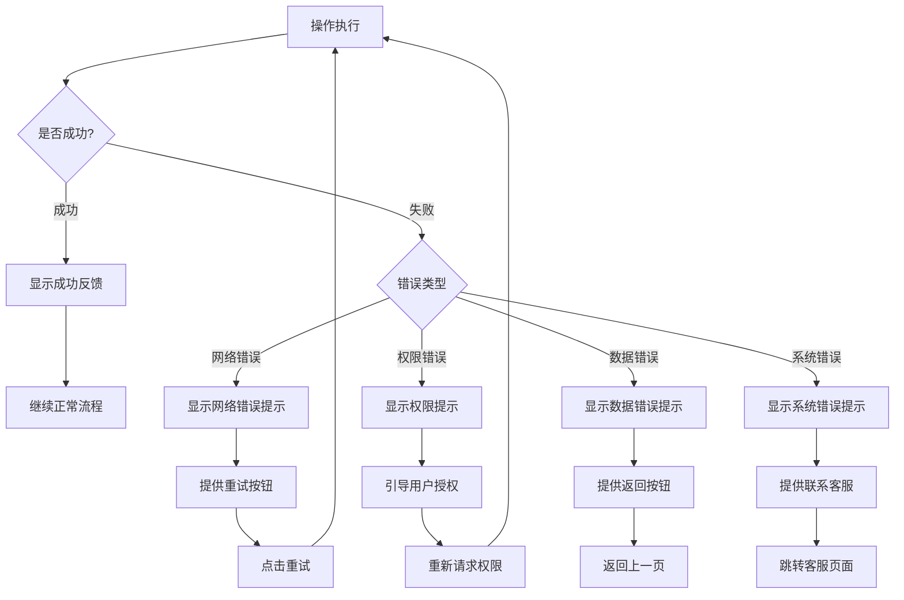

## 5. 数据同步流程

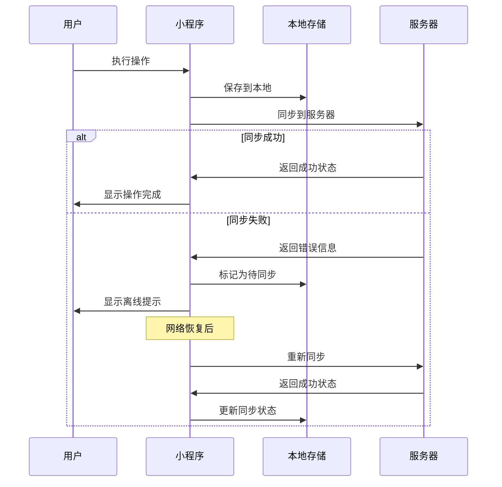

## 6. 页面跳转关系图

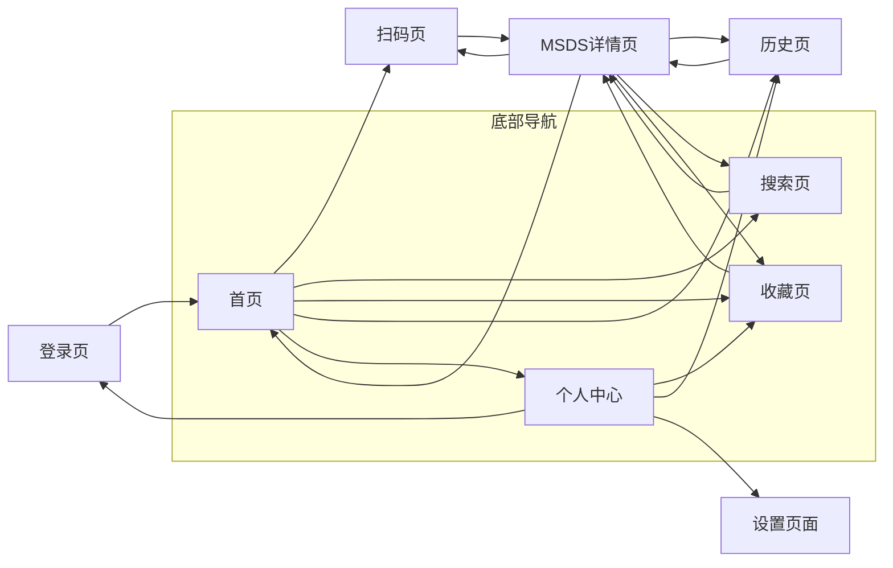

## 7. 用户权限流程

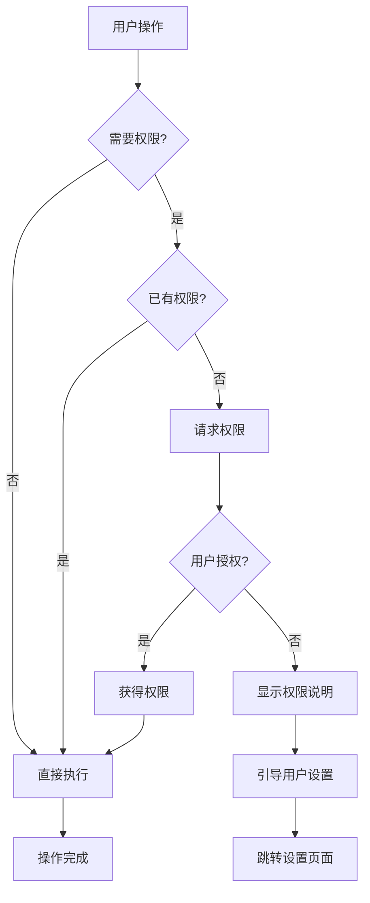

## 8. 缓存管理流程

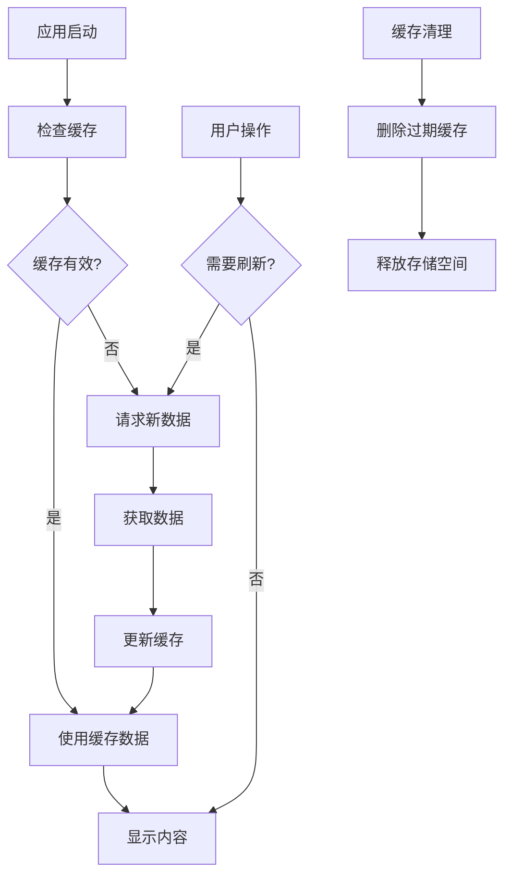

---

**流程图说明**:
- 本流程图使用Mermaid语法编写，可在支持Mermaid的Markdown编辑器中查看
- 流程图涵盖了微信小程序的主要用户操作路径
- 包含正常流程和异常处理流程
- 体现了页面间的跳转关系和数据流向

**版本信息**:
- 版本: v1.0
- 创建日期: 2024年1月
- 维护人员: UI/UX设计团队